= Tridash Tutorials =
Alexander Gutev <alex.gutev@gmail.com>
:compat-mode: 1

These set of tutorials cover the basics of the Tridash programming
language.

Prior programming experience is not strictly necessary however is
helpful.

TIP: The full source code for these tutorials is available in the
tutorials directory of the Tridash source:
https://github.com/alex-gutev/tridash/tree/master/tutorials.

[[tutorial1]]
== Hello Node ==

=== Nodes ===

A Tridash program is made up of a number of components called nodes,
which are loosely analogous to variables in other languages. Each node
holds a particular value, referred to as the node's state, at a given
moment in time.

Nodes are created the first time they are referenced, by their
identifiers. Node identifiers can consist of any sequence of
Unicode characters excluding whitespace, parenthesis `(`, `)`, braces
`{`, `}`, double quotes `"` and the following special characters: `;`,
`,`, `.`, `#`. A node identifier must consist of at least one
non-digit character otherwise it is interpreted as a number.

The following are examples of valid node identifiers:

- `name`
- `full-name`
- `node1`
- `1node`

TIP: There are few restrictions on the characters allowed in node
identifiers, meaning node identifiers may even contain symbols such as
`-`, `+`, `=`, `>`, `?`, etc.

A node can be bound to another node in which case its value is
automatically updated when the value of the node, to which it is
bound, changes.

The `->` operator establishes a binding between node on the left hand
side, referred to as the 'source', and the node on the right hand
side, referred to as the 'target'.

.Example
--------------------------------------------------
a -> b
--------------------------------------------------

IMPORTANT: The spaces between the node identifiers and the bind `->`
operator are mandatory since `a->b` is a valid node identifier and is
thus interpreted as a single node.

In this example a binding is established between node `a` and node
`b`. The result is that when the value of `a` changes, the value of
`b` is automatically updated to match the value of `a`. This kind of
binding is known as a simple binding since a node is simply set to the
value of another node. Node `a` is referred to as a 'dependency' node
of `b`, since `b`\'s value depends on the value of `a`, and `b` is
referred to as an 'observer' node of `a` since it actively observes
its value.

=== First Application ===

We'll use bindings to develop a simple application which asks for the
user's name and displays a greeting.

This tutorial targets the JavaScript backend and makes use of HTML for
the user interface.

NOTE: Some knowledge of the basics of HTML, i.e. what tags, elements
and attributes are, is necessary to complete this tutorial.

We'll start off by creating an HTML file, called `hello-ui.html`, with
the following contents:

.hello-ui.html
[source,html]
--------------------------------------------------
<?
 self.input-name.value -> name
 name -> self.span-name.textContent
?>

<!doctype html>
<html>
    <head>
        <title>Hello Node</title>
    </head>
    <body>
        <h1>Tutorial 1: Hello Node</h1>
        <label>Enter your name: <input id="input-name"/></label>
        
Hello 

    </body>
</html>
--------------------------------------------------

Most of the file is HTML boilerplate, the interesting part is within
the `<? ... ?>` tag. The content of this tag is interpreted as Tridash
code. Tridash code tags can be placed almost anywhere in the file,
we've just chosen to place it at the top.

The Tridash code consists of two explicit binding
declarations. Declarations are separated by a line break or a
semicolon `;`.

.Tridash Code
--------------------------------------------------
self.input-name.value -> name
name -> self.span-name.textContent
--------------------------------------------------

The declaration in the first line binds the `self.input-name.value`
node to the `name` node.

The node `self.input-name` is a special node that references the
`input` element, with id `input-name`, in the HTML file. HTML elements
can be referenced from within Tridash code, in the same HTML file,
using the expression `self.<id>` where `<id>` is substituted with the
id of the element.

TIP: The `.` operator is a special operator for referencing subnodes of
nodes, these will be explained in detail later. The subnode identifier
is the identifier which appears to the right of the operator. When a
subnode of a node, that references an HTML element, is referenced, the
HTML attribute, of the element, with the same name as the subnode
identifier is referenced. Referencing attributes of HTML elements,
from Tridash, allows the values of attributes to be bound to Tridash
nodes.

The node `self.input-name.value`, which references the `value`
attribute of the HTML element with ID `input-name`, is bound to the
node `name`. Thus whenever the value of `input-name.value` changes,
the value of `name` is set to it. In other words, whenever text is
entered in the input element, the value of `name` is automatically set
to the text entered.

In the second declaration, the `name` node is bound to the
`self.span-name.textContent` node. `self.span-name` references the
HTML `span` element with ID `span-name`, with the node
`self.span-name.textContent` referencing the `textContent` attribute,
i.e. the content, of the element. The result of this binding is that
whenever the value of the `name` node changes, its value is displayed
in the `span` element. As mentioned earlier, the value of the `name`
node is automatically set to the text entered in the `input` element,
thus the value entered in the `input` element is displayed in the
`span` element.

The application we've just written, simply prompts the user for
his/her name and displays ``Hello'' followed by the user's name
directly below the prompt. Let's try it out to see if it works.

==== Building ====

Run the following command to build the application:

--------------------------------------------------
tridashc hello-ui.html : node-name=ui -o hello.html -p type=html -p main-ui=ui
--------------------------------------------------

That looks complicated, let's simplify it a bit.

The `tridashc` executable compiles one or more Tridash source files,
generating an output file. The source files, in this case
`hello.html`, are listed after `tridashc`. The name of the output file
is given by the `-o` or `--output-file` option, in this case
`hello.html`.

The snippet `: node-name=ui` sets the `node-name` option, for
processing the source file `hello-ui.html`, to `ui`. This creates a
node `ui` with which the contents of the HTML file can be referenced.

TIP: The `self` node, when occurring within an HTML file is simply an
alias for the node name, given by the `node-name` option, which
references the contents of the HTML file.

The `-p option=value` command-line options sets various options
related to the compilation output. The first option `type` is set to
`html` which indicates that the output should be an HTML file with the
generated JavaScript code embedded in it. The `main-ui` option is set
to `ui`, which is the name of the node referencing the contents of the
`hello-ui.html` file. It is the contents of this file that are used to
generate the output HTML file.

If all went well a `hello.html` file should have been created in the
same directory, after running the command.

==== Running The Application ====

Open the `hello.html` file in a web-browser with JavaScript
enabled. You should see something similar to the following:

image::images/tutorial1/snap1.png["Enter your name: __, Hello", align="center"]

Try entering some text in the text field, and press enter afterwards:

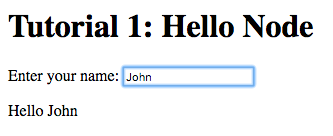

Notice that the text entered appears next to the ``Hello'' message
underneath the text field. This is due to the binding of the text
field to the `name` node and the binding of the `name` node to the
contents of the `span` element placed adjacent to the ``Hello'' text.

Now try changing the text entered in the text field:

image::images/tutorial1/snap3.png["Enter your name: John Doe, Hello John Doe", align="center"]

The text changes to match the contents of the text field. This
demonstrates the automatic updating of a node's state when the state
of its dependency nodes changes.

When the state (the value) of the text field changes:

1. The state of the `name` node is updated to the text entered in the
field.

2. The content of `span` element is updated to match the state of the
`name` node.

=== Inline Node Declarations ===

The previous application can be implemented much more succinctly using
implicit bindings and inline node declarations.

.hello-ui.html
[source,html]
--------------------------------------------------
<!doctype html>
<html>
    <head>
        <title>Hello Node</title>
    </head>
    <body>
        <h1>Tutorial 1: Hello Node</h1>
        <label>Enter your name: <input value="<?@ name ?>"/></label>
        
Hello <?@ name @>

    </body>
</html>
--------------------------------------------------

Implicit bindings between an HTML node and a Tridash node can be
established using the `<?@ declaration ?>` tag. This is similar to the
Tridash code tag, seen earlier, however an implicit binding is
established between the nodes appearing in the tag and the HTML node
in which the tag appears.

If the tag is placed within an attribute of an element, an implicit
two-way binding is established between the element's attribute and the
node, appearing in the tag. If the tag appears outside an attribute,
an HTML element is created in its place, and a binding is established
between the node appearing in the tag, and the content of the element
(referenced as `textContent` from Tridash).

With inline declarations it is not necessary to give the HTML elements
unique ID's unless they will be referenced from within Tridash
code. In this example they have been omitted.

=== Two-Way Bindings ===

The bindings we've seen so far are one-way bindings, as data only
flows in one direction, from the dependency node to the observer node.

.Example: One-Way Binding
--------------------------------------------------
a -> b
--------------------------------------------------

This is a one-way binding since the value of `b` is updated to the
value of `a` when it changes, however, `a` is not updated when the
value of `b` changes.

If a binding in the reverse direction is also established:

--------------------------------------------------
b -> a
--------------------------------------------------

the binding becomes a two-way binding since the value of each node is
updated when the value of the other node changes.

==== Example Application ====

The following simple application demonstrates two-way bindings:

.`ui.html`
[source,html]
--------------------------------------------------
<?
 a -> b
 b -> a
?>

<!doctype html>
<html>
  <head>
    <title>Two-Way Bindings</title>
  </head>
  <body>
    <h1>Two-Way Bindings</h1>
    
<label>A: <input value="<?@ a ?>"/></label>

    
<label>B: <input value="<?@ b ?>"/></label>

  </body>
</html>
--------------------------------------------------

The applications consists of two text input fields with the first
field bound to node `a` and the second field bound to `b`, using
inline node declarations.

In the Tridash code tag, a two-way binding between `a` and `b` is
established since a binding is declared in both directions:

- `a -> b`
- `b -> a`

Build the application using the following command, which is identical
to the previous build command with only the source and output file
names changed.

--------------------------------------------------
tridashc ui.html : node-name=ui -o app.html -p type=html -p main-ui=ui
--------------------------------------------------

Open the resulting `app.html` file in a web-browser, and enter a value
in the first text field:

image::images/tutorial1/snap4.png["A: 1, B: 1", align="center"]

Notice that the content of the second text field is automatically
updated to match the content of the first field.

Now change the value in the second field:

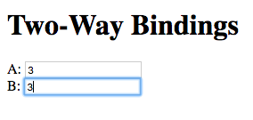

The value of the first field is updated to the value entered in the
second field.

== Functional Bindings ==

The bindings in the previous tutorial were pretty boring and
limited. Whatever was entered in the text field was simply displayed
below it, verbatim. In-fact, this functionality is already offered by
many web frameworks and GUI toolkits. The real power of the Tridash
language comes from the ability to specify arbitrary functions in
bindings which are dependent on the values of more than a single
node. Moreover these bindings can be established in Tridash itself
without having to implement "transformer" or "converter"
interfaces/subclasses in a lower-level language.

A functor node is a node which is bound to a function of the values of
one or more nodes. It consists of an expression comprising an operator
applied to one or more arguments.

.Functor Node Syntax
--------------------------------------------------
operator(argument1, argument2, ...)
--------------------------------------------------

A binding is established between the argument nodes and the functor
node. Whenever the value of one of the argument nodes changes, the
expression is reevaluated and the value of the functor node is
updated.

.Example: Functor of one argument
--------------------------------------------------
to-int(a)
--------------------------------------------------

The functor node is `to-int(a)` consisting of the function `to-int`,
which converts its argument to an integer, applied to the value of
node `a`. When the value of `a` changes, the value of `to-int(a)` is
updated to `a`'s value converted to an integer.

.Example: Functor of two arguments
--------------------------------------------------
a + b
--------------------------------------------------

This is a functor node of the function `+` which computes, you guessed
it, the sum of its arguments, in this case `a` and `b`. Whenever the value
of either `a` or `b` changes, the value of `a + b` is updated to the
sum of `a` and `b`.

NOTE: The `+` operator is registered as an infix operator, meaning it
can be placed between its two arguments (infix notation), instead of
being placed before its arguments (prefix notation). `a + b` is
transformed to prefix notation `+(a, b)`, when parsed. Both notations
are equivalent and either notation can be written in source code.

IMPORTANT: The spaces between an infix operator and its arguments are
mandatory since `a+b` is a valid node identifier and is thus
interpreted as a single node with identifier `a+b`, rather than a
functor node of the `+` operator.

Functor nodes can be bound to other nodes using the same `->` operator.

.Example: Binding functors to other nodes
--------------------------------------------------
a + b -> sum
--------------------------------------------------

In this example node `sum` is bound to `a + b` which is bound to the
sum of `a` and `b`.

=== Example Application: Adding Numbers ===

We'll build an application which computes the sum of two numbers,
entered by the user, and displays the result.

Let's focus on building the interface for now. Begin with the
following `ui.html` file:

.ui.html
[source, html]
--------------------------------------------------
<!doctype html>
<html>
    <head>
        <title>Adding Numbers</title>
    </head>
    <body>
      <h1>Adding Numbers</h1>
      
<label>A: <input value="<?@ a ?>"/></label>

      
<label>B: <input value="<?@ b ?>"/></label>

      

      
<strong>A + B = <?@ sum ?></strong>

    </body>
</html>
--------------------------------------------------

An interface consisting of two text input fields is created. The first
field is bound to node `a` and the second to node `b`. Underneath the
fields the node `sum` is bound to an unnamed HTML element located next
to ``A + B =''.

Nodes `a` and `b` are bound to the values of the two numbers. Node
`sum` is to be bound to the sum of `a` and `b`.

Before we begin writing the binding declarations we need to import the
nodes from the `core` module, _you'll learn more about modules in a
later tutorial_, which we'll be making use of in this application. The
following imports all nodes from the `core` module:

.Import all nodes from module `core`
--------------------------------------------------
/import(core)
--------------------------------------------------

Nodes `a` and `b` are bound to the contents of the text fields,
however the contents of the text fields are strings. We need to
convert `a` and `b` to integers in order to compute the sum. This is
achieved using the `to-int` operator.

The sum of the integer values of `a` and `b` is computed using the `+`
operator applied on the arguments `to-int(a)` and
`to-int(b)`.

.Computing Sum of `a` and `b`
--------------------------------------------------
to-int(a) + to-int(b)
--------------------------------------------------

Finally, we need to bind the sum to the node `sum` in order for it to
be displayed below the fields.

--------------------------------------------------
to-int(a) + to-int(b) -> sum
--------------------------------------------------

Adding the declarations, we've written so far, to a Tridash code tag
(somewhere in the file such as at the beginning), completes the
application.

.Tridash Code Tag
--------------------------------------------------
<?
 /import(core)

 to-int(a) + to-int(b) -> sum
?>
--------------------------------------------------

==== Build Configuration File ====

To simplify the build command, the build options are specified in a
build configuration file.

The build configuration file contains the list of sources, along with
the source-specific options, and the output options in YAML syntax
_(see <https://yaml.org> for details)_.

Create the following `build.yml` file:

.build.yml
--------------------------------------------------
sources:
  - path: ui.html
    node-name: ui

output:
  path: app.html
  type: html
  main-ui: ui
--------------------------------------------------

The outer structure of the file is a dictionary with two entries
`sources` and `output`.

The `sources` entry contains the list of source files either as a path
or as a dictionary with the path in the `path` entry and the
processing options in the remaining entries. In this application there
is one source file `ui.html` with one source processing option
`node-name` set to `ui`.

The `output` entry is a dictionary containing the path to the output
file in the path entry, in this case `app.html`, and the output
options in the remaining entries, in this case `type = html` and
`main-ui = ui` which are the same options as in the previous
tutorials.

To build from a build configuration file run the following command:

--------------------------------------------------
tridashc -b build.yml
--------------------------------------------------

The `-b` option specifies the path to the build configuration file
containing the build options. All other command line options are
ignored when this option is specified.

==== Running the Application ====

Open the `app.html` file in a web browser, and enter some
numbers in the text fields:

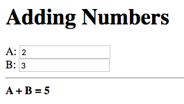

Notice that the sum of the numbers is automatically computed and
displayed below the fields.

NOTE: The sum will only be displayed once you have entered a valid
number in each field.

Now try changing the numbers (_remember to press enter afterwards_):

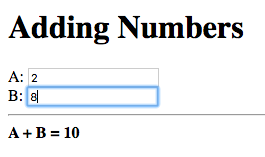

Notice that the sum is automatically recomputed and the new sum is
displayed.

=== Binding to Functor Nodes ===

The `to-int` operator is special in that a two-way binding is
established between its argument and the functor node. Thus the
declaration `to-int(a)` also establishes the binding `to-int(a) -> a`.
The binding in the reverse direction, from functor to argument, has
the same function as the binding from the argument to the
functor. Thus in `to-int(a) -> a`, `a` is bound to the value of
`to-int(a)` converted to an integer.

This allows a binding to be established with a `to-int` functor node
as the observer.

.Example: Binding with `to-int` as observer
--------------------------------------------------
x -> to-int(a)
--------------------------------------------------

In this example, `to-int(a)` is bound to `x`. Whenever the value of
`x` changes, the value of `to-int(a)` is set to it, and the value of
`a` is set to the value of `to-int(a)` converted to an integer.

With this functionality, the application in this tutorial can be
implemented more succinctly by moving the integer conversion from the
Tridash code tag to the inline node declarations.

Replace the declaration:

--------------------------------------------------
to-int(a) + to-int(b) -> sum
--------------------------------------------------

with:

--------------------------------------------------
a + b -> sum
--------------------------------------------------

Replace `<?@ a ?>` and `<?@ b ?>` with `<?@ to-int(a) ?>` and `<?@
to-int(b) ?>` respectively.

The benefit of this is that the value conversion logic is moved closer
to the point where the values are obtained, rather than being littered
throughout the core application logic. Nodes `a` and `b` can now be
used directly, without having to be converted first, since it is known
that they contain integer values.

To simplify the application further, the `sum` node can be omitted
entirely and `<?@ sum ?>` can be replaced with `<?@ a + b ?>`.

[source, html]
.Improved Application
--------------------------------------------------
<?
 /import(core)
?>
<!doctype html>
<html>
    <head>
        <title>Adding Numbers</title>
    </head>
    <body>
      <h1>Adding Numbers</h1>
      
<label>A: <input value="<?@ to-int(a) ?>"/></label>

      
<label>B: <input value="<?@ to-int(b) ?>"/></label>

      

      
<strong>A + B = <?@ a + b ?></strong>

    </body>
</html>
--------------------------------------------------

IMPORTANT: The `/import` declaration in the Tridash code tag has to be
retained as it is responsible for importing the nodes `to-int` and `+`
from the `core` module.

== Conditional Bindings ==

This tutorial introduces functionality for conditionally selecting the
value of a node.

=== Case Operator ===

The special `case` operator selects the value of the first node for
which the value of the corresponding condition node is true. The
`case` operator is special in that it has a special syntax to make it
more readable.

TIP: The `case` operator is actually a macro-node, implemented in
Tridash, which expands to a series of nested `if` functor
expressions. You can views its source in the `modules/core/macros.trd`
file of your Tridash installation.

.Syntax
--------------------------------------------------
case(
  condition-1 : value-1,
  condition-2 : value-2,
  ....
  default-value
)
--------------------------------------------------

Each argument is of the form `condition : value` where `condition` is
the condition node and `value` is the corresponding value node. The
last argument may also be of the form `value`, that is there is no
condition node, in which case it becomes the 'default' or 'else' value.

The `case` functor node evaluates to the value of the value node
corresponding to the first condition node which has a 'true' value
(equal to the value of the builtin node `True`), or the value of the
default node, if any, when all condition nodes have a 'false' (equal
to the value of the builtin node `False`) value.

.Example
--------------------------------------------------
case(
  a > b : a - b
  b > a : b - a
  0
)
--------------------------------------------------

If the node `a > b` evaluates to true, the `case` node evaluates to
the value of `a - b`, otherwise if `b > a` evaluates to true, the
`case` node evaluates to the value of `b - a`. If neither `a > b` nor
`b > a` evaluate to true, the `case` node evaluates to `0`.

If the default value node is omitted and no condition node evaluates
to true, the `case` node evaluates to a failure value (_you will learn
about failure values in a later tutorial which introduces error
handling_).

=== Example 1: Maximum of Two Numbers ===

Let's write a simple `case` expression which returns the maximum of
two numbers, `a` and `b`, and returns the string ``neither'' when
neither number is greater than the other.

The `case` expression should evaluate to:

. `a` if `a > b`
. `b` if `b > a`
. The string ``neither'' otherwise

These conditions are implemented by the following `case` expression:

--------------------------------------------------
case(
    a > b : a,
    b > a : b,
    "neither"    <1>
)
--------------------------------------------------

<1> This is the literal string ``neither''.

TIP: String constants are written in double quotes `"..."`.

Notice that the last argument does not have an associated
condition. The `case` node evaluates to this argument if none of the
conditions, of the previous arguments, evaluate to true.

We can incorporate this in a simple application, which displays the
maximum of two numbers entered by the user, using the following HTML
interface:

[source, html]
.`ui.html`
--------------------------------------------------
<?
 /import(core)

 maximum <-
     case (
         a > b : a,
         b > a : b,
         "neither"
     )
?>
<!doctype html>
<html>
    <head>
        <title>Maximum</title>
    </head>
    <body>
      <h1>Maximum</h1>
      
<label>A: <input value="<?@ to-int(a) ?>"/></label>

      
<label>B: <input value="<?@ to-int(b) ?>"/></label>

      

      
<strong>The maximum of <?@ a ?> and <?@ b ?> is <?@ maximum ?>.</strong>

    </body>
</html>
--------------------------------------------------

TIP: The `<-` operator is the same as the `->` operator however with
the arguments reversed, that is `b <- a` is equivalent to `a -> b`.

The interface consists of two text fields, the contents of which are
bound to nodes `a` and `b`. The `to-int` operator is used to convert
the string values to integers as in the previous tutorial.

The node `maximum` is bound to the value of the `case` functor, and
its value is displayed in an unnamed HTML element below the input
fields.

NOTE: The values of `a` and `b` are also displayed below the input
fields. This is to demonstrate that there is no limit to how many
nodes can be bound to a particular node.

Build and run the application, using the same build configuration file
and command from the previous tutorials.

Enter some numbers in the text fields:

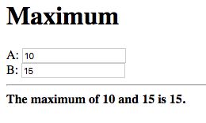

Notice that the maximum, 15 in this case, is displayed below the text
fields. Also notice that the values entered in the text fields are
also displayed as part of the message.

Now change the number, which is the maximum, to a different value
which is still greater than the other number:

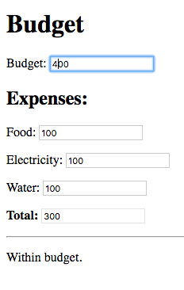

The new maximum is displayed. This demonstrates that if the values of
the value nodes, of the `case` expression change, the value of the
`case` expression is updated.

Change the maximum number such that it is smaller than the other
number:

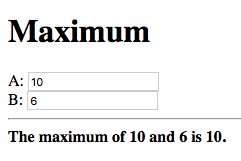

This shows that the value of the `case` expression is also updated if
the values of the condition nodes change.

Now finally change the numbers such that they are both equal:

image::images/tutorial3/snap4.png["A: 10, B: 10, The maximum of 10 and 10 is neither", align="center"]

The displayed maximum is ``neither'' which is the default value of the
case expression.

=== Example 2: Sum Limit ===

Let's extend the application developed during the previous tutorial by
adding the functionality for specifying a limit to the sum of the two
numbers. The application should inform the user of whether the limit
was exceeded.

Start with the following slightly modified code from the previous
tutorial.

--------------------------------------------------
<?
 /import(core)

 a + b -> sum
?>
<!doctype html>
<html>
    <head>
        <title>Sum Limit</title>
    </head>
    <body>
      <h1>Sum Limit</h1>
      
<label>Limit: <input value="<?@ to-int(limit) ?>"/></label>

      

      
<label>A: <input value="<?@ to-int(a) ?>"/></label>

      
<label>B: <input value="<?@ to-int(b) ?>"/></label>

      

      
<strong>A + B = <?@ sum ?></strong>

    </body>
</html>
--------------------------------------------------

A new text input field for the limit has been added, with its value
bound to the node `limit`.

NOTE: The sum `a + b` is bound to the node `sum` in order to
facilitate the implementation of the new features.

The message ``Within limit.'' should be displayed if the sum is less
than the limit (`sum < limit`), and ``Limit Exceeded!''
otherwise. This can be implemented using the following `case`
expression, which is bound directly to an unnamed element.

Add the following below the element where the sum is displayed.

[source, html]
--------------------------------------------------

  <?@
    case(
        sum < limit : "Within Limit.",
        "Limit Exceeded!"
    )
  ?>

--------------------------------------------------

NOTE: There is no difference in efficiency between using the `sum`
node or `a + b` directly. The value of a node is only computed once,
whenever one of its arguments changes, even if it is referenced in
more than one location. Moreover the value of a node is not computed
if it is not used anywhere.

Build and run the application, and enter some initial values for the
limit, `a` and `b`.

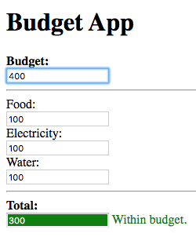

``Limit Exceeded!'' is displayed since the sum of 11 did indeed exceed
the limit of 10, with the numbers in the snapshot above.

Now try increasing the limit:

image::images/tutorial3/snap6.png["Limit: 20, A: 8, B: 3, A + B = 11, Within Limit.", align="center"]

The message changes to ``Within Limit.''.

=== Improvements ===

Whilst the application we've implemented so far demonstrates the power
of functional bindings, it is rather lacking in that whether the limit
has been exceeded or not is only indicated by text. The text has to be
read in full to determine whether the limit was exceeded, and changes
from 'Within Limit' to 'Limit Exceeded', and vice versa, are hard to
notice. Some visual indications, such as a change in the color of the
sum, when the limit is exceeded, would be helpful.

As an improvement, we would like the text color of the the sum, and
the status message, to be [red]#red# when the sum exceeds the limit,
and to be [green]#green# when it is within the limit.

Let's start off by giving an ID to the elements in which the sum and
status message are displayed, so that they can be referenced from
Tridash code. Surround `<?@ sum ?>` in a `span` element with ID `sum`
and assign the `div` element, containing the status message, the ID
`status`.

--------------------------------------------------

<strong>A + B = <?@ sum ?></strong>

  <?@
    case(
        sum < limit : "Within Limit.",
        "Limit Exceeded!"
    )
  ?>

--------------------------------------------------

Let's create a node `color` which will be bound to the text color in
which the sum and status message should be displayed. It should have
the value `"green"` when the sum is within the limit and the value
`"red"` when the sum exceeds the limit. This can be achieved by
binding to a `case` functor node.

NOTE: The values `"green"` and `"red"` are strings, representing CSS
color names.

Add the following to the Tridash code tag.

--------------------------------------------------
case(
  sum < limit : "green",
  "red"
) -> color
--------------------------------------------------

The value of the `case` functor node is `"green"` if `sum` is less
than `limit` and `"red"` otherwise. The case functor node is bound to
the `color` node.

The `color` node somehow has to be bound to the text color of the
`sum` and `status` elements. Text color is a style attribute of an
element. All style attributes are grouped under a single subnode
`style` of the HTML element node. The text color is controlled by the
`color` attribute, referenced using `style.color`.

The `color` node is bound to the style attributes of the elements with
the following (add to the Tridash code tag):

--------------------------------------------------
color -> self.sum.style.color
color -> self.status.style.color
--------------------------------------------------

Full `ui.html` code:

.ui.html
[source, html]
--------------------------------------------------
<?
 /import(core)

 a + b -> sum

 case (
     sum < limit : "green",
     "red"
 ) -> color

 color -> self.sum.style.color
 color -> self.status.style.color
?>
<!doctype html>
<html>
    <head>
        <title>Sum Limit</title>
    </head>
    <body>
      <h1>Sum Limit</h1>
      
<label>Limit: <input value="<?@ to-int(limit) ?>"/></label>

      

      
<label>A: <input value="<?@ to-int(a) ?>"/></label>

      
<label>B: <input value="<?@ to-int(b) ?>"/></label>

      

      
<strong>A + B = <?@ sum ?></strong>

      

        <?@
          case(
              sum < limit : "Within Limit.",
              "Limit Exceeded!"
          )
        ?>
      

    </body>
</html>
--------------------------------------------------

Build and run the application. Enter some values for `a`, `b` and the
limit such that the sum exceeds the limit.

image::images/tutorial3/snap7.png["Limit: 10, A: 2, B: 9, A + B = 11 (red), Limit Exceeded! (red)", align="center"]

The status message and sum are now shown in red which provides an
immediate visual indication that the limit has been exceeded.

Now increase the limit, or decrease the values of `a` and `b`:

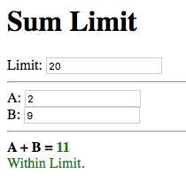

The color of the status message and sum is immediately changed to
green, which provides a noticeable indication that the limit has no
longer been exceeded.

[[functions]]
== Writing your own Functions ==

In this tutorial you'll learn how to create your own functions, which
can be used in functional bindings. Another feature which distinguishes
Tridash from frameworks/toolkits, which offer bindings, is that new
functions can be written in the same language, as the language in
which the bindings are declared, rather than having to be implemented
in a lower-level language.

NOTE: Only some of the example applications will be
demonstrated. Visit the source code for the tutorials to try out the
remaining applications.

=== Definition Operator ===

New functions, referred to as meta-nodes, are defined using the
special `:` operator, which has the following syntax:

--------------------------------------------------
function(arg1, arg2, ...) : {
   declarations...
}
--------------------------------------------------

The left-hand side contains the function name (`function`) followed by
the argument list in brackets, where each item (`arg1`, `arg2`, ...)
is the name of the local node to which the argument at that position
is bound.

The right-hand side, of the `:` operator, contains the declarations
making up the body of the function, which may consist of any Tridash
node declaration. The value of the last node in the `declarations`
list is returned by the function.

The meta-node can then be used as the operator of functor nodes, which
are referred to as instances of the meta-node, declared after its
definition.

TIP: The curly braces `{` and `}` are optional if the meta-node body
consists of a single declaration.

.Example Adding Two Numbers
--------------------------------------------------
# Add two numbers    <1>

add(x, y) : x + y
--------------------------------------------------

<1> This is a comment. Comments begin with a `#` character and extend
till the end of the line. All text within a comment is discarded.

In this example, an `add` meta-node is defined which takes two
arguments, `x` and `y`, and returns their sum.

Our sum application can thus be rewritten as follows:

--------------------------------------------------
<?
 /import(core)

 # Add two numbers

 add(x, y) : x + y
?>

...

<label>A: <input value="<?@ to-int(a) ?>"/></label>

<label>B: <input value="<?@ to-int(b) ?>"/></label>

A + B is <?@ add(a, b) ?>
...
--------------------------------------------------

=== Node `self` ===

When an explicit binding to the `self` node is established inside a
meta-node, the value of the `self` node is returned rather than the
value of the last node in the meta-node's body.

The following is an alternative implementation of the `add` meta-node.

--------------------------------------------------
add(x, y) : {
    x + y -> self
}
--------------------------------------------------

This is particularly useful when binding to subnodes of the `self`
node, which you'll learn about later.

=== Optional Arguments ===

Meta-node arguments can be designated as optional by giving the
argument a default value. An optional argument is of the form `arg :
value`, where `arg` is the argument node identifier and `value` is the
default value, to which it is bound, if it is not provided.

.Example
--------------------------------------------------
increment(n, delta : 1) : n + delta
--------------------------------------------------

In this example, the argument `delta` is optional and is given the
default value 1 if it is not provided.

.Examples
--------------------------------------------------
increment(n)    # delta defaults to 1
increment(n, 2) # delta = 2
--------------------------------------------------

Default values don't have to be constants, in-fact any node expression
can be used as a default value. In the case that the default value is
a node, then that node will be implicitly bound to all instances of
the meta-node, for which the argument is not provided.

.Example: Node Default Values
--------------------------------------------------
# Increment `n` by `d`

increment(n, d : delta) : n + d
--------------------------------------------------

In this example the default value for the delta `d` is the value of
the global node `delta`. A binding between `delta` and each instance
of `increment`, for which a value for `d` is not provided, will be
established.

The effect of this is demonstrated in the following example
application:

[source, html]
.`ui.html`
--------------------------------------------------
<?
 /import(core)

 # Increment `n` by `d`

 increment(n, d : delta) : n + d
?>
<!doctype html>
<html>
    <head>
        <title>Optional Argument Default Value</title>
    </head>
    <body>
      <h1>Optional Argument Default Value</h1>
      
<label>N:  <input value="<?@ to-int(n) ?>"/></label>

      
<label>Delta:  <input value="<?@ to-int(delta) ?>"/></label>

      

      
<strong>Increment(N): <?@ increment(n) ?></strong>

    </body>
</html>
--------------------------------------------------

Enter an initial value for 'N' and 'Delta':

image::images/tutorial4/snap1.png["N: 5, Delta: 1, Increment(N): 6", align="center"]

The value given to the delta (`d`) argument of `increment` is the
initial value given for 'Delta', which is `1`.

Now try changing 'Delta':

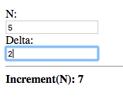

The value of the `increment(n)` node is updated, with the new value of
'Delta' given as the delta argument. This shows that a binding is
established rather than simply taking the value of the `delta` node.

=== Recursive Meta-Nodes ===

A recursive meta-node contains an instance of itself in its
definition.

The following are the classic examples of recursion:

.Example: Factorial
--------------------------------------------------
factorial(n) :
    case(
        n < 1 : 1,  # Ignoring the case: n < 0
        n * factorial(n - 1)
    )
--------------------------------------------------

.Example: Fibonacci Numbers
--------------------------------------------------
fib(n) :
    case(
        n <= 1 : 1,
        fib(n - 1) + fib(n - 2)
    )
--------------------------------------------------

Recursion is the means by which Tridash provides iteration. The
definition of `factorial`, above, will result in the stack space being
exhausted for large values of `n`. This is due to the fact that each
invocation of the meta-node consumes a certain amount of stack
space. Since the recursive call to `factorial` has to be evaluated
before the return value of the current call can be computed, the
meta-node consumes an amount of stack space proportional to the value
of `n`.

If the definition is rewritten such that it is tail recursive, that is
the return value of `factorial` is the return value of the recursive
call, a constant amount of stack space is consumed.

.Example: Tail-Recursive Factorial
--------------------------------------------------
factorial(n, acc : 1) :
    case(
        n < 1 : acc,  # Ignoring the case: n < 0
        factorial(n - 1, n * acc)
    )
--------------------------------------------------

This definition of `factorial` is tail recursive since the recursive
call appears directly as the default value of the `case` expression,
which is simply returned without any further operations performed on
it.

In the previous implementation, the multiplication was performed on
the result of the recursive call to `factorial`. In this
implementation, the multiplication is performed on an accumulator
argument, `acc` which is passed on to the recursive call and
eventually returned when `factorial` is called with `n < 1`.

NOTE: Tridash supports general 'tail call optimization' for mutually
recursive meta-nodes.

=== Nested Meta-Nodes ===

A meta-node may contain other meta-nodes inside its definition. These
meta-nodes may only be used within the body of the meta-node and
shadow meta-nodes, declared in the enclosing scope, with the same
identifiers.

With nested meta-nodes we can rewrite our previous tail-recursive
`factorial` meta-node without having to expose the accumulator
argument `acc`, which is an implementation detail.

.Example: Factorial with nested `iter` meta-node
--------------------------------------------------
factorial(n) : {
    iter(n, acc) : {
        case(
            n < 1 : acc,  # Ignoring the case: n < 0
            iter(n - 1, n * acc)
        )
    }

    iter(n, 1)
}
--------------------------------------------------

The computation of the factorial is implemented in the nested
tail-recursive meta-node `iter`. The `factorial` meta-node simply
calls this meta-node with the initial value for the accumulator.

=== Local Nodes ===

Nodes which appears as the 'target' (observer) of a binding, declared
within the body of a meta-node, are local to the meta-node's body and
may only be referenced within it. These may be used to store
intermediate results or to break up complex expression into multiple
nodes.

.Example: Average
--------------------------------------------------
average(a, b) : {
    sum <- a + b    <1>
    sum / 2
}
--------------------------------------------------

<1> Node `sum` is the binding 'target' in this declaration.

In this example a local node `sum` is created, since it is bound (as
the 'target') to the value of `a + b`. The value returned by `average`
is the value of `sum` divided by 2.

=== Referencing Outer Nodes ===

A meta-node may reference nodes declared in the global scope or the
enclosing scope(s) containing the meta-node definition. This creates a
binding between the referenced node and each instance of the
meta-node. The net result is that whenever the value of the referenced
node changes, the value of the instance is recomputed. In essence a
reference to an outer node can be thought of as an additional hidden
argument.

TIP: An outer node with the same identifier as a local node can be
referenced with the `..` operator, e.g. `..(x)`.

Outer node references can be demonstrated by changing the definition
of `increment`, in the 'Increment' Application developed earlier in
this tutorial, to the following:

.Increment with reference to `delta`
--------------------------------------------------
increment(n) : n + delta
--------------------------------------------------

The `d` argument has been removed and replaced with `delta` in the
body.

Repeat the same experiment, changing the delta, you should observe the
same results.

=== Fun Example: Simple Meter ===

In this example we'll be developing an application which displays a
simple meter, representing a quantity, which changes color as the
quantity approaches the maximum.

Let's start off with the following HTML interface:

[source, html]
.ui.html
--------------------------------------------------
<!doctype html>
<html>
    <head>
      <title>Simple Meter</title>
      
    </head>
    <body>
      <h1>Simple Meter</h1>
      
<label>Maximum: <input value="<?@ to-int(maximum) ?>"/></label>

      
<label>Quantity: <input value="<?@ to-int(quantity) ?>"/></label>

      

        

      

    </body>
</html>
--------------------------------------------------

NOTE: The file contains a few CSS class definitions for styling the
elements which display the meter, located at the bottom of the file.

The interface consists of two input fields for entering the values for
the 'Maximum' and 'Quantity', which are bound to the nodes `maximum`
and `quantity`, respectively.

We'd like the meter to be displayed in a color which is in between
[green]#green# (empty) and [red]#red# (full) depending on where the
value of the quantity lies between 0 and the maximum.

First we'll write a utility meta-node `lerp` for linearly
interpolating between two values:

.Meta-Node `lerp`
--------------------------------------------------
lerp(a, b, alpha) : a + alpha * (b - a)
--------------------------------------------------

The value returned by `lerp` is the value between `a` and `b`
proportional to where `alpha` lies between `0` and `1`.

This meta-node will be used to interpolate between green and red
depending on where the quantity lies between 0 and the maximum.

We can compute the value for `alpha` by dividing the value for the
quantity by the maximum.

--------------------------------------------------
scale <- quantity / maximum
--------------------------------------------------

NOTE: This assumes that `maximum` is not 0.

Before we perform the interpolation, we need to make sure that `scale`
is a value between 0 and 1. Let's write another utility meta-node
`clamp` which clamps a value to a given range.

.Meta-Node `clamp`
--------------------------------------------------
clamp(x, min, max) :
    case (
        x < min : min,
        x > max : max,
        x
    )
--------------------------------------------------

This meta-node returns the value of its first argument `x` if it is
between `min` and `max`, otherwise returns `min` if `x` is less than
`min`, or `max` if `x` is greater than `max`.

We can amend the computation of `scale` such that it does not exceed
`0` and `1`, by using the `clamp` meta-node.

--------------------------------------------------
scale <- clamp(quantity / maximum, 0, 1)
--------------------------------------------------

Finally we can interpolate between the two colours. We'll be using the
HSL (Hue Saturation Luminance) colorspace, and interpolating in the
'Hue' component.

NOTE: The HSL, rather than the RGB, colorspace was used as it provides
better interpolation results.

--------------------------------------------------
hue <- lerp(120, 0, scale)
--------------------------------------------------

`hue` is bound to a value interpolated between green (Hue 120) and red
(Hue 0) with the value of `scale` as the interpolation coefficient.

Before we bind the interpolated color to the color of the meter, let's
write another utility meta-node which takes values for the hue,
saturation and luminance components and produces a CSS HSL color
string.

.Meta-Node `make-hsl`
--------------------------------------------------
make-hsl(h, s, l) :
    format("hsl(%s,%s%%,%s%%)", h, s, l)
--------------------------------------------------

[TIP]
==================================================
The `format` meta-node produces a string in which `%s` placeholders in
the format string (the first argument) are replaced with the values of
the corresponding arguments (following the format string). `%%`
placeholders are replaced with literal `%` characters.

`format("Hello %s %s.", "John", "Smith")` produces the string ``Hello
John Smith.'', as the first `%s` is replaced with `"John"` and the
second `%s` is replaced with `"Smith"`.
==================================================

We can now generate a valid CSS color string using `make-hsl` that
we'll bind to the color of the meter element, which is the element
with ID `meter`.

--------------------------------------------------
self.meter.style.backgroundColor <-
    make-hsl(hue, 90, 45)
--------------------------------------------------

TIP: The `backgroundColor` style attribute references the background
color of an element.

The constant values `90` and `45` have been chosen for the saturation
and luminance components.

The last thing we need to do is adjust the width of the meter
depending on the quantity value. We'll simply multiply the value of
`scale` by 100, to convert it to a percentage (indicating it should
occupy that percentage of the width of its parent element), and bind
it to the meter element's width attribute.

--------------------------------------------------
format("%s%%", scale * 100) -> self.meter.style.width
--------------------------------------------------

Our application is complete. Add the following Tridash code tag to the
top of the `ui.html` file.

--------------------------------------------------
<?
 /import(core)

 # Utilities

 lerp(a, b, alpha) : a + alpha * (b - a)

 clamp(x, min, max) :
     case (
         x < min : min,
         x > max : max,
         x
     )

 make-hsl(h, s, l) :
     format("hsl(%s,%s%%,%s%%)", h, s, l)

 # Application Logic

 scale <- clamp(quantity / maximum, 0, 1)

 hue <- lerp(120, 0, scale)

 self.meter.style.backgroundColor <-
     make-hsl(hue, 90, 45)

 format("%s%%", scale * 100) -> self.meter.style.width
?>
--------------------------------------------------

Build and run the application, and enter some values for the quantity
and maximum, such that the quantity is less than half the maximum.

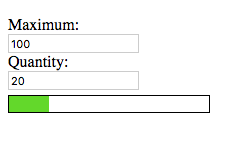", align="center"]
image::images/tutorial4/snap4.png["Maximum: 100, Quantity: 40, [Almost empty dull green meter]", align="center"]

The meter is mostly empty and displayed in a green color.

Now increase the quantity such that it is greater than half the maximum.

image::images/tutorial4/snap5.png["Maximum: 100, Quantity: 60, [Half full yellow meter]", align="center"]
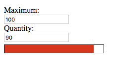", align="center"]

The meter is more than half full and its color approaches red as the
quantity approaches the maximum.

== Subnodes ==

You've already made use of subnodes in the previous tutorials, when
binding to attributes of HTML elements. Now we'll explores subnodes in
depth.

A subnode is a node which references a value out of a dictionary of
values stored in a parent node.

.Subnode Syntax
--------------------------------------------------
parent.key
--------------------------------------------------

The left hand side of the subnode `.` operator is the parent node
expression and the right hand side is the key identifying the
dictionary entry.

NOTE: `key` is interpreted as a literal symbol rather than a node
identifier.

A dictionary can be created in a node by binding to a subnode of the
node.

.Example
--------------------------------------------------
"John" -> person.name
"Smith" -> person.surname
--------------------------------------------------

In this example, the value of the node `person` is a dictionary with
two entries

[horizontal]
`name`:: Bound to the string constant ``John''.
`surname`:: Bound to the string constant ``Smith''.

=== Example: Color Object ===

The meter application developed during the previous tutorial was a bit
of mess with the various color components scattered through the code.

To change the colors you'd first have to change the hue components, in
the following code:

--------------------------------------------------
hue <- lerp(120, 0, scale)
--------------------------------------------------

It isn't clear what the numbers `120` and `0` are supposed to be or
which number corresponds to the hue component of which color.

To change the luminance and saturation components, you'd have to
modify the following:

--------------------------------------------------
self.meter.style.backgroundColor <-
    make-hsl(hue, 90, 45)
--------------------------------------------------

There is also no interpolation of the saturation or luminance
components.

The code can be made significantly more readable and maintainable by
making use of a dedicated 'color object'.

We'll create a meta-node `Color` which takes the three color
components as arguments and returns a dictionary storing the
components under the entries: `hue`, `saturation` and `luminance`.

How are we going to return a dictionary from a meta-node? We can
create a dedicated local node, in which the dictionary is created,
such as the following:

--------------------------------------------------
Color(hue, saturation, luminance) : {
    hue -> color.hue
    saturation -> color.saturation
    luminance -> color.luminance

    color
}
--------------------------------------------------

Or we can simply bind to subnodes of the `self` node.

.Meta-Node `Color`
--------------------------------------------------
Color(hue, saturation, luminance) : {
    hue -> self.hue
    saturation -> self.saturation
    luminance -> self.luminance
}
--------------------------------------------------

The dictionary returned by `Color` is how colors will be represented
in our application. Let's create color objects for the two colors and
bind them to nodes:

--------------------------------------------------
color-empty <- Color(120, 90, 45)
color-full  <- Color(0, 90, 45)
--------------------------------------------------

TIP: `color-empty` and `color-full` are examples of constant nodes as
their values are not dependent on other nodes and are thus effectively
constant.

Rather than interpolating between the components of `color-empty` and
`color-full` in the global scope, we can create a meta-node that takes
two colors and the alpha coefficient, and returns the interpolated
color.

.Meta-Node `lerp-color`
--------------------------------------------------
lerp-color(c1, c2, alpha) :
    Color(
        lerp(c1.hue, c2.hue, alpha),
        lerp(c1.saturation, c2.saturation, alpha),
        lerp(c1.luminance, c2.luminance, alpha)
    )
--------------------------------------------------

The `lerp-color` meta-node simply creates a new color, using the
`Color` meta-node, with each component interpolated between the two
colors, using `lerp`.

We can use this to easily interpolate between the colors:

--------------------------------------------------
color <- lerp-color(color-empty, color-full, scale)
--------------------------------------------------

To convert the Color object to a CSS color string we have to pass each
component to `make-hsl` as an individual argument like so:

--------------------------------------------------
make-hsl(color.hue, color.saturation, color.luminance)
--------------------------------------------------

However, the internal representational details of the color are
leaking into the application logic. All it takes is to accidentally
pass a single component twice or pass the components in the wrong
order and there is a bug.

To rectify this we can rewrite `make-hsl` to take a Color object or we
can bind a subnode of the Color object to the CSS color string.

Modify `Color` to the following:

--------------------------------------------------
Color(hue, saturation, luminance) : {
    hue -> self.hue
    saturation -> self.saturation
    luminance -> self.luminance

    make-hsl(hue, saturation, luminance) -> self.hsl-string
}
--------------------------------------------------

We've added a new declaration to `Color` which binds the `hsl-string`
subnode of `self` to the CSS HSL color string, created using
`make-hsl`. Since the values of nodes are only evaluated if they are
used, and subnodes are no different, the value of the subnode
`hsl-string` will only be computed for the final `color` object, not
the `color-empty` and `color-full` objects.

TIP: If you'd like to make the code even neater you can move the
definition of the `make-hsl` meta-node inside the `Color` meta-node.

The interpolated color can be bound to the meter's background color
with the following:

--------------------------------------------------
 color.hsl-string -> self.meter.style.backgroundColor
--------------------------------------------------

We now have a new more readable and maintainable version of the meter
application. Replace the Tridash code tag with the following:

--------------------------------------------------
<?
 /import(core)

 # Utilities

 lerp(a, b, alpha) : a + alpha * (b - a)

 clamp(x, min, max) :
     case (
         x < min : min,
         x > max : max,
         x
     )

 make-hsl(h, s, l) :
     format("hsl(%s,%s%%,%s%%)", h, s, l)

 Color(hue, saturation, luminance) : {
     hue -> self.hue
     saturation -> self.saturation
     luminance -> self.luminance

     make-hsl(hue, saturation, luminance) -> self.hsl-string
 }

 lerp-color(c1, c2, alpha) :
     Color(
         lerp(c1.hue, c2.hue, alpha),
         lerp(c1.saturation, c2.saturation, alpha),
         lerp(c1.luminance, c2.luminance, alpha)
     )

 # Application Logic

 color-empty <- Color(120, 90, 45)
 color-full  <- Color(0, 90, 45)

 scale <- clamp(quantity / maximum, 0, 1)

 color <- lerp-color(color-empty, color-full, scale)

 color.hsl-string -> self.meter.style.backgroundColor

 format("%s%%", scale * 100) -> self.meter.style.width
?>
--------------------------------------------------

Compared to the previous version, this version has a number of benefits:

. It is clearly visible where the two colors are defined, and thus can
be changed easily.

. The color components are kept in a single place rather than being
scattered throughout the code.

. All components of the colors are interpolated.

== Error Handling with Failure Values ==

Up till this point we have completely ignored the issue of what
happens if the user provides invalid input. In this tutorial, failure
values and their use in handling errors will be introduced.

=== Invalid Input ===

First let's investigate more closely what happens when an invalid
value is entered by the user. Let's try it out with the sum
application we wrote in <<_functional_bindings>>.

You may have noticed that nothing happens if a number is only entered
in one of the fields:

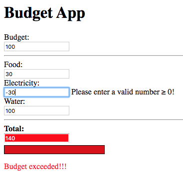

Let's enter an invalid value for 'B', and see what happens:

image::images/tutorial6/snap2.png["A: 1, B: foo, A + B = &lt;blank&gt;", align="center"]

Again nothing. Is there something wrong with application?

Let's change 'B' to a valid number:

image::images/tutorial6/snap3.png["A: 1, B: 2, A + B = 3", align="center"]

Now we get the result of the addition, `3`. The application resumed
its normal operation when valid input is entered.

What will happen if we change one of the fields to an invalid value,
let's try changing 'A' this time:

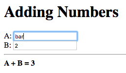

No change in the result of `3`. It appears the application does not
change the result if invalid input was entered. This demands an
explanation.

=== Failure Values ===

What's really going on under the hood is that when a value, which is
not a valid number, is entered in one of the input fields, the node
bound to that field is set to a 'failure value'.

A failure value is a special type of value which, when evaluated,
terminates the evaluation of the node, by which it was evaluated, and
the node's value is set to the failure value. Failure values represent
the failure of an operation, the absence of a value or special classes
of values.

In the sum application, a failure value is returned by the `to-int`
meta-node, when the argument is a string which does not contain a
valid integer. Thus `to-int(a)` evaluates to a failure value if the
value entered in the input field for 'A' does not contain a valid
integer.

NOTE: Remember that `to-int(a)` is bound, as the target, to the value
entered in the text input field.

The observer of `to-int(a)` is `a`, and is thus set to the failure
value returned by `to-int`. Node `a + b` evaluates node `a`, thus
evaluating the failure value. This results in the computation of the
sum (`a + b`) being terminated and node `a + b`, and its observer
`sum`, being set to the failure value.

By default when a node, bound to a user interface element, evaluates
to a failure value, the user interface is not updated. As a result the
application appears to be doing nothing.

=== Handling Failures ===

Whilst the current behaviour of the application is a step up from
crashing or producing garbage results, it does not provide any
indication to the user that the input entered was invalid. This is
confusing to the user as the application appears to not be working
properly. Proper error handling should be in place.

The `core` module provides a handy utility meta-node `fails?`, which
returns true if its argument node evaluates to a failure, and false
otherwise. This can be used to detect failures in our application and
display an appropriate error message.

TIP: A related utility meta-node `?`, also from the `core` module,
returns true if its argument does not evaluate to a failure.

We need to detect failures in the `a` and `b` nodes which are bound to
the values of the input fields for 'A' and 'B', respectively. This can
be achieved using the expression `fails?(a)` for `a` and `fails?(b)`
for `b`.

We would like to display a message, indicating that the input entered
was invalid, next to the field where invalid input was entered. This
can be achieved using a `case` expression. The following is the `case`
expression for `a`:

--------------------------------------------------
case(
    fails?(a) : "Not a valid number!",
    ""
)
--------------------------------------------------

The `case` expression returns the constant string ``Not a valid
number!'', if `fails?(a)` is true, that is `a` evaluates to a failure,
otherwise it returns the empty string. To display the error message
next to the field for 'A', we can simply place the entire `case`
expression in an inline node declaration, between `<?@ ... ?>` next to
the field. We can do the same for 'B', substituting `a` with `b`, to
get an error indication for 'B' as well.

That's it we have added error handling to an existing application
without having to make fundamental changes to our application
logic. In-fact the addition of error handling was as simple as adding
new UI elements.

Let's try it out. Build and run the application and enter an invalid
value in one of the input fields:

image::images/tutorial6/snap5.png["A: 1, B: foo, Not a valid number!; A + B = ", align="center"]

The message ``Not a valid number!'' is displayed next to the field
containing the invalid value, 'B' in this case.

Now correct the invalid value, to a valid number:

image::images/tutorial6/snap6.png["A: 1, B: 6; A + B = 7", align="center"]

The message disappears and the sum is computed.

==== Cleaning Up ====

The error handling logic, added in the previous section, can do with
some cleaning up.

- The error message is duplicated next to both fields. If we'd like to
change the message we'd have to make sure we've changed it in both
places.

- The `case` expression is identical for both fields with the only
difference being the node. If we change the error handling logic, to
display a different message, we'd have to edit both the `case`
expressions.

The case expression can be extracted into a
meta-node, let's call it `error-message` which takes the node as input
and returns the appropriate error message.

.Meta-Node `error-message`
--------------------------------------------------
error-message(value) :
    case(
        fails?(value) : "Not a valid number!",
        ""
    )
--------------------------------------------------

_Add this definition to the top of the Tridash code tag._

We can now replace the `case` expressions, inside the inline node
declarations with the following for field 'A':

--------------------------------------------------
error-message(a)
--------------------------------------------------

and the following for field 'B':

--------------------------------------------------
error-message(b)
--------------------------------------------------

Changes to the error message and error handling logic are now much
easier to implement as only the definition of the `error-message`
meta-node needs to be changed.

=== Initial Values ===

You may have noticed that the error messages are not displayed
initially, when the input fields are empty. Similarly no visible
result is observed until a value is entered in both fields. You're
probably wondering why this is so, as an empty string is certainly not
a valid integer. In-fact, if you first enter a valid integer in a
field, and then change its value to empty, the error message will be
displayed.

The problem is that the nodes `a` and `b` are not given initial
values. As a result the value of the `error-message(a)` node, and the
corresponding node for `b`, is not computed until `a` is given its
first value. But then what happens when the node `a + b` is updated
after a value is entered in the first field, 'A', only? Since only the
dependency `a`, of `a + b` has been given a value, `a + b` does not
have a value for `b` and thus the value it uses for `b` defaults to a
failure. To solve this problem we can give initial values to `a` and
`b`.

An explicit binding in which the 'source' is a literal constant and
the 'target' is a node is interpreted as giving the node an initial
value, equal to the constant.

The following assigns an initial value of 1 to `a` and 2 to `b`:

.Example
--------------------------------------------------
1 -> a
2 -> b
--------------------------------------------------

The setting of the initial values is treated as an ordinary value
change from the default failure value to the given initial value,
which occurs immediately after the application is launched. As a
result, the values of the node's observers are updated. In this case
the nodes: `a + b`, `error-message(a)` and `error-message(b)` will be
updated.

In our application, let's give both `a` and `b` an initial value of
`0`. Add the following to the Tridash code tag at the top of the file:

--------------------------------------------------
0 -> a
0 -> b
--------------------------------------------------

Build and run the application:

image::images/tutorial6/snap7.png["A: 0, B: 0, A + B: 0", align="center"]

Both fields are initialized to `0` and the sum of `0` is
displayed.

Experiment with changing the node's initial values and even try
setting them to invalid integers.

NOTE: You may be wondering how it is that giving an initial value to
the nodes `a` and `b` affects the values of the text input
fields. This is due to the fact that there is a two-way binding
between `a` and the value of the input element for 'A', and between
`b` and the value of the input element for 'B'.

=== Exercise ===

As an exercise make the color of the border, or alternatively the
background color, of the input element change to red when an invalid
value is entered in it.

Try to achieve something similar to the following:

image::images/tutorial6/snap8.png["A: foo, Not a number, B: 0, A + B = 0", align="center"]

NOTE: Some CSS styling rules have also been added to change the text
color of the error messages to red, this is not part of the exercise.

TIP: To change the border color of an element bind to the
`style.borderColor` attribute of the element node.

== Failure Types ==

The error handling tools we've seen so far have one serious
shortcoming, there is no means for identifying the cause of the
error. In the application, which we augmented with error handling in
the previous tutorial, we don't check at all what the cause of the
failure is. Instead, we simply assumed that a failure value means
invalid input was entered. Whilst this is the case in our simple
application, it is not the case for more complex real world
applications where there are many potential sources of errors.

=== Identifying the cause of Failures ===

Each failure value has an associated type, which is a value that
identifies the cause of the failure. The 'failure type' can be
obtained using the `fail-type` meta-node from the `core` module. If
the argument of `fail-type` evaluates to a failure, the meta-node
returns its type, otherwise if the argument does not evaluate to a
failure or evaluates to a failure without a type, the meta-node
returns a failure.

The meta-node `fail-type` is a bit clunky to use as it, itself,
returns a failure if the argument does not evaluate to a failure
value. The utility `fail-type?` meta-node, also from the `core`
module, takes two arguments, a value and a failure type, and returns
true if the value evaluates to a failure of that type.

A value used as a failure type is generally bound to a constant node,
which is used in place of the raw value. An accompanying node, with
the same identifier but with a trailing `!` is bound to a failure of
the type.

=== Example: Checking Failure type in 'Adding Numbers' Application ===

The type of the failure returned by `to-int`, when given a string that
does not contain a valid integer, is designated by the node
`Invalid-Integer`, from the `core` module. The node `Invalid-Integer!`
is bound to a failure of type `Invalid-Integer`.

We can use the `fail-type?` meta-node to explicitly check whether the
failure is of the type `Invalid-Integer`. Simply replace
`fails?(value)` with `fail-type?(value, Invalid-Integer)` in the
definition of the `error-message` meta-node.

.Improved `error-message` Meta-Node
--------------------------------------------------
error-message(value) :
    case(
        fail-type?(value, Invalid-Integer) : "Not a valid number!",
        ""
    )
--------------------------------------------------

The new implementation returns the string ``Not a valid number!'' only
for errors caused by invalid input being entered. It returns the empty
string for errors of any other type.

=== Creating Failure Values ===

Failures are limited in use if they can only be created by builtin
meta-nodes. You can create your own failure values using the `fail`
meta-node, which takes one optional argument -- the type of the
failure. If the type argument is not provided, a failure without a
type is created.

.Example
--------------------------------------------------
# Creates failure with no type
fail()

# Creates a failure with type `My-Type`
fail(My-Type)
--------------------------------------------------

==== Example: Positive Numbers Only ====

Suppose for some reason, we'd like to limit the numbers being added,
in the 'Adding Numbers' application, to positive numbers. It could
be that the numbers represent amounts for which negative values do not
make sense in the context of the application.

Let's write a meta-node, `validate`, which takes an integer value and
returns that value if it is greater than or equal to zero. Otherwise
it returns a failure of a user-defined type designated by the node
`Negative-Number`.

.Meta-Node `validate`
--------------------------------------------------
validate(x) :
    case(
        x >= 0 : x,
        fail(Negative-Number)
    )
--------------------------------------------------

If the argument `x` is greater than or equal to zero it is returned
directly, otherwise a failure, created using the `fail` meta-node, of
type designated by `Negative-Number` is returned.

Now let's bind the `Negative-Number` node to a value, which uniquely
identifies the failure. For now let's choose the value `-1`. While
we're at it let's also define the `Negative-Number!` meta-node which
is simply bound to a failure of type `Negative-Number`.

.Failure Type `Negative-Number `
--------------------------------------------------
Negative-Number  <- -1
Negative-Number! <- fail(Negative-Number)
--------------------------------------------------

We can simplify `validate` by substituting `fail(Negative-Number)`
with `Negative-Number!`:

.Simplified `validate` Meta-Node
--------------------------------------------------
validate(x) :
    case(
        x >= 0 : x,
        Negative-Number!
    )
--------------------------------------------------

NOTE: It does not matter whether you place the binding declarations of
the nodes `Negative-Number` and `Negative-Number!` before or after the
definition of `validate`.

To incorporate this in our application, we have to change the nodes,
to which the input fields are bound, from `a` and `b` to `input-a` and
`input-b`.

Replace `a` with `input-a`, in the text field for 'A', and `b` with
`input-b` in the text field for 'B'.

--------------------------------------------------
...
<label>A: <input value="<?@ to-int(input-a) ?>"/></label>
...
<label>B: <input value="<?@ to-int(input-b) ?>"/></label>
...
--------------------------------------------------

Also change the setting of initial values such that they are set on
nodes `input-a` and `input-b` rather than `a` and `b`.

--------------------------------------------------
0 -> input-a
0 -> input-b
--------------------------------------------------

Now we're going to bind `a` to the result of `validate` applied on
`input-a` and we're going to bind `b` to the result of `validate`
applied on `input-b`.

--------------------------------------------------
a <- validate(input-a)
b <- validate(input-b)
--------------------------------------------------

Finally let's update the `error-message` meta-node to return ``Number
must be greater than or equal to 0!'' in the case that the failure
is of type `Negative-Number`.

.Updated `error-message` Meta-Node
--------------------------------------------------
error-message(value) :
    case(
        fail-type?(value, Invalid-Integer) :
            "Not a valid number!",
        fail-type?(value, Negative-Number) :
            "Number must be greater than or equal to 0!",
        ""
    )
--------------------------------------------------

Build and run the application and enter a positive number in one field
and a negative number in the other:

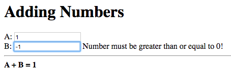

The error message, explaining that a positive number (or zero) must be
entered, is displayed next to the field where the negative number was
entered, 'B' in this case. The result of the addition with the new
numbers entered is not displayed, instead the previous result is
retained, as expected.

Change the negative number to an invalid number:

image::images/tutorial7/snap2.png["A: 1, B: foo, Not a valid number!, A + B = 1", align="center"]

The error message changes to ``Not a valid number!'' and the displayed
sum is unchanged, as in the previous versions.

Now change the value to a valid positive number:

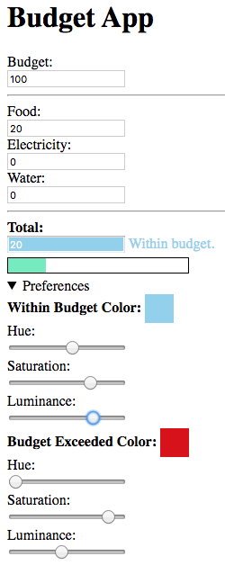

The error message disappears and the new sum is displayed.

=== Proper Failure Types ===

There is one issue with the application we've just developed. There is
no guarantee that the arbitrary constant `-1` uniquely represents a
failure of type `Negative-Number`. If all failure types used arbitrary
integer constants, there is no guarantee that `-1` doesn't already
represent a builtin failure type, such as `Invalid-Integer`. Whilst it
so happened to work, it is certainly not robust, especially when
bringing in third party libraries.

A value, which is guaranteed to be unique, can be obtained by taking a
reference to the 'raw node object' of `Negative-Number`.

References to the raw node object, of a node, can be obtained using
the `&` special operator, which takes the identifier of the node as an
argument. Raw node references are mostly useful when writing macros,
which you'll learn about in a later tutorial. For now all that you
need to know is that this value can serve as the failure type,
i.e. can be compared using `=`, and is guaranteed to be unique.

Replace the binding declaration for `Negative-Number` with the
following:

.Proper `Negative-Number` Failure Type
--------------------------------------------------
Negative-Number  <- &(Negative-Number)
--------------------------------------------------

And now we have a robust way of distinguishing between failures
originating from `to-int`, due to the input fields not containing
valid integers, and errors originating from our own application logic.

== Target Node Transforms ==

Wow, we had to make so many fundamental changes to our code just to
implement a minor change in the input accepted by the application. We
had to:

1. Add the nodes `input-a` and `input-b`, for which we had to come up
with meaningful identifiers.

2. Change the input fields to be bound to `input-a` and `input-b`
rather than `a` and `b`.

3. Change the initial values to be assigned to `input-a` and `input-b`
rather than `a` and `b`.

4. Bind `a` to `validate(input-a)` and `b` to `validate(input-b)`.

This is contrary to ``simply adding new UI elements'' which was the
case when we introduced error handling. We can do better.

Notice that a lot of the code we added was simply repetitive binding
boilerplate code, which is the same for both `a` and `b`. It would be
nice if we could somehow abstract it away and not have to write the
same code for both nodes. Luckily, there is a way.

Remember, from the second tutorial, that some meta-nodes, such as
`to-int`, are special in that a two-way binding is established between
the meta-node instance and the argument node. This allows instances of
the meta-node to also appear as targets of bindings.

.Refresher Example
--------------------------------------------------
# The following
a -> to-int(b)

# Is equivalent to
to-int(a) -> b
--------------------------------------------------

It turns out `to-int` is not so special as we can do the same for our
own meta-nodes by setting the `target-node` attribute.

=== Node Attributes ===

Node attributes are simply key-value pairs associated with a node,
which control various compilation options. Attributes are set using
the special `/attribute` operator:

.`/attribute` Operator Syntax
--------------------------------------------------
/attribute(node, key, value)
--------------------------------------------------

This sets the attribute of `node` with key `key` to the value `value`.

.Examples
--------------------------------------------------
# Set value of attribute `my-attribute` to 1
/attribute(a, my-attribute, 1)

# Set value of attribute `akey` to literal symbol `raw-id`
/attribute(b, "akey", raw-id)
--------------------------------------------------

IMPORTANT: `key` and `value` are interpreted as literal symbols rather
than references to the values of nodes. Attribute keys are case
insensitive and there is no difference between raw symbols and string
keys. The following keys `key`, `Key`, `"key"` and `"kEy"` all refer
to the same attribute.

IMPORTANT: Node attributes do not form part of a runtime node's state.

=== Attribute `target-node` ===

The `target-node` attribute determines, when set, the meta-node which
is used as the binding function of the binding in the reverse
direction, from a meta-node instance to the meta-node arguments.

As an example, a meta-node `f` with its `target-node` attribute set to
`g` results in the following:

.Example
--------------------------------------------------
/attribute(f, target-node, g)

# The following
a -> f(b)

# Is equivalent to
g(a) -> b
--------------------------------------------------

In the example above the `target-node` attribute of `f` is set to
`g`. Thus the declaration `f(b)` also results in the binding `g(f(b))
-> b` being created.

The meta-node `to-int` simply has its `target-node` attribute set to
itself, which is why it performs the same function, when it appears as
the target of a binding, as when it appears as the source of a
binding.

TIP: The `to-int` meta-node performs the same function as the `int`
meta-node however the difference is that when an instance of `int`
appears as the target of a binding, pattern matching (which will be
introduced in a later tutorial) is performed, whereas `to-int` simply
performs the same function. `int` has not been mentioned till this
point to avoid creating confusion as to what's the difference between
it and `to-int`.

[[target-node-own-meta-nodes]]
=== Target-Node for own Meta-Nodes ===

Our code can be simplified considerably by allowing a meta-node, which
performs the additional input validation, to be bound (as the target)
to the values in the input field. Let's first write that meta-node,
called `valid-int` which is responsible for converting an input string
to an integer and ensuring that the resulting integer is greater than
or equal to zero. In essence this meta-node combines `to-int`, we'll
use `int` this time, and `validate`.

.Meta-node `valid-int`
--------------------------------------------------
valid-int(value) : {
    x <- int(value)
    validate(x)
}
--------------------------------------------------

In order to allow the node to appear as the target of a binding, and
still perform the same function, let's set its `target-node` attribute
to itself:

--------------------------------------------------
/attribute(valid-int, target-node, valid-int)
--------------------------------------------------

Now we can bind the contents of the input fields directly to an
instance of the `valid-int` meta-node. In-fact, we can place the
`valid-int` instance directly in an inline node declaration.

Replace `to-int(input-a)` with `valid-int(a)`, and the same for `b`,
in the input fields as follows:

--------------------------------------------------
<label>A: <input value="<?@ valid-int(a) ?>"/></label>
<label>B: <input value="<?@ valid-int(b) ?>"/></label>
--------------------------------------------------

The nodes `input-a` and `input-b` can be removed, as well as the
following declarations:

--------------------------------------------------
 a <- validate(input-a)
 b <- validate(input-b)
--------------------------------------------------

The initial values of `0` can once again be given to the nodes `a` and
`b` rather than `input-a` and `input-b`.

--------------------------------------------------
 0 -> a
 0 -> b
--------------------------------------------------

The following is the full content of the Tridash code tag.

--------------------------------------------------
/import(core)

# Error Reporting

error-message(value) :
    case(
        fail-type?(value, Invalid-Integer) :
            "Not a valid number!",
        fail-type?(value, Negative-Number) :
            "Number must be greater than or equal to 0!",
        ""
    )

# Input Validation

Negative-Number  <- &(Negative-Number)
Negative-Number! <- fail(Negative-Number)

validate(x) :
    case(
        x >= 0 : x,
        Negative-Number!
    )

valid-int(value) : {
    x <- int(value)
    validate(x)
}

/attribute(valid-int, target-node, valid-int)

# Initial Values

0 -> a
0 -> b
--------------------------------------------------

Compared to the previous version, the only modifications are in the
`error-message` meta-node, the inline bindings in the input fields and
the addition of the `validate` and `valid-int` meta-nodes along with
the `Negative-Number` failure type. This version, however, did not
require the addition of new nodes or modifying the bindings comprising
the core application logic. Changing the input validation logic was
simply a matter of substituting `to-int` with `valid-int` in the
bindings to the input field values.

[[contexts]]
== Contexts ==

Throughout these tutorials, we've glossed over two-way bindings
without going into much detail of how they work, yet they were a vital
component of every application as the bindings to the UI elements have
all been two-way bindings.

Each node has a number of 'contexts' which store information about how
to compute the node's value, i.e. what function to use and what
dependencies are operands to the function. The 'active' context of a
node, at a given moment in time, is the context which is used to
compute the node's value. In general, a context is 'activated' when
the value of an operand node of the context changes. By default, a
node context is created for each dependency of a node which was added
by an explicit binding.

.Example
--------------------------------------------------
a -> x # Context created for dependency `a`
b -> x # Context created for dependency `b`
c -> x # Context created for dependency `c`
--------------------------------------------------

In this example node `x` has three contexts one for each of its
dependency nodes, `a`, `b` and `c`, to which it is bound explicitly.

An implicit binding between a meta-node instance and the meta-node
arguments does not result in the creation of a context for each
operand.

--------------------------------------------------
a + b
--------------------------------------------------

Nodes `a` and `b` are implicitly added as dependencies of `a + b`
however they are added as operands to the same context with the `+`
function.

The following application demonstrates how different contexts are
activated, when the values of their operand nodes change.

[source, html]
.`ui.html`
--------------------------------------------------
<?
 x -> node
 y -> node
 z -> node
?>
<!doctype html>
<html>
    <head>
        <title>Node Contexts</title>
    </head>
    <body>
      
<label>X: <input value="<?@ x ?>"/></label>

      
<label>Y: <input id="b" value="<?@ y ?>"/></label>

      
<label>Z: <input value="<?@ z ?>"/></label>

      

      
<strong>Last value entered: <?@ node ?></strong>

    </body>
</html>
--------------------------------------------------

This is a simple application consisting of three text input fields
bound to nodes `x`, `y` and `z`. Nodes `x`, `y` and `z` are each
explicitly bound to `node`, the value of which is displayed below the
fields.

Let's enter a value in each field and see what happens. Observe the
value displayed below the fields after each change:

image::images/tutorial9/snap1.png["X: 1, Y: _, Z: _, Last value entered: 1", align="center"]
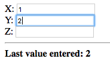
image::images/tutorial9/snap3.png["X: 1, Y: 2, Z: 3, Last value entered: 3", align="center"]

Notice that after each change, the value that was just entered is
displayed.

Now let's try changing the values of the fields which were edited
previously:

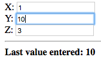

In this case the value of the second field, 'Y', was changed to 10 and
that value was immediately displayed below the fields.

The value of the field that was changed last is displayed. To
understand why this is so, let's examine the sequence of steps taken
when a value is entered in the 'X' field.

1. The value of `x`, which is bound to the value in the 'X' field, is
updated.

2. The context corresponding to the binding `x -> node` is activated
due to the value of `x` being updated.

3. The value of `node` is updated to the value of `x`.

Contexts make two-way bindings possible:

.Example
--------------------------------------------------
input1 -> a

# Two-way binding
a -> b; a -> b

input2 -> b
--------------------------------------------------

TIP: The `;` character separates multiple declarations written on a
single line.

`a` has two contexts corresponding to dependency nodes `input1` and
`a` (which is also an observer). `b` has two contexts corresponding to
dependency nodes `input2` and `a`.

When `input1` is changed, the contexts corresponding to the bindings
in the following direction are activated:

- `input1 -> a`
- `a -> b`

When `input2` is changed, the contexts corresponding to the bindings
in the following direction are activated:

- `input2 -> b`
- `b -> a`

=== Explicit Contexts ===

The context of a binding can be set explicitly to a named context,
using the `@` operator from the `core` module.

--------------------------------------------------
a -> b @ context-id
--------------------------------------------------

The binding `a -> b` is established in the context, of `b`, with
identifier `context-id`.

When multiple bindings are established to the same explicit context,
the observer node takes on the value of the first operand which does
not evaluate to a failure. The operands are ordered by the order in
which the explicit bindings are declared in the source file. If all
the operands evaluate to failures, the node evaluates to the failure
value of the last operand.

This is better explained with an example application:

[source, html]
.`ui.html`
--------------------------------------------------
<?
 /import(core)

 x -> node @ context
 y -> node @ context
 z -> node @ context
?>
<!doctype html>
<html>
    <head>
        <title>Explicit Contexts</title>
    </head>
    <body>
      
<label>X: <input value="<?@ to-int(x) ?>"/></label>

      
<label>Y: <input value="<?@ to-int(y) ?>"/></label>

      
<label>Z: <input value="<?@ to-int(z) ?>"/></label>

      

      
<strong>Value: <?@ node ?></strong>

    </body>
</html>
--------------------------------------------------

This application is similar to the previous application except the
bindings from nodes `x`, `y` and `z`, to `node` are established in an
explicit context with identifier `context`. Additionally the input
fields are bound to `to-int` instances, of `x`, `y` and `z` which
results in `x`, `y` and `z` being bound to the values entered in the
fields converted to integers. If a non-integer value is entered in a
field, the corresponding node is bound to a failure value.

Let's try it out. Enter some integer values in each of the fields:

image::images/tutorial9/snap5.png["X: 1, Y: 2, Z: 3, Value: 1", align="center"]

The value entered in the first field, 'X', was displayed. Since a
valid integer was entered, node `x` evaluates to the integer value
1. The binding `x -> node` was established first, as the declaration
occurs first in the source file, and since `x` does not evaluate to a
failure, `node` takes on the value of `x`. The values of `y` and `z`
are ignored.

Now let's change `x` to a non-integer value:

image::images/tutorial9/snap6.png["X: foo, Y: 2, Z: 3, Value: 2", align="center"]

The value entered in the second field, 2, is displayed. Since a
non-integer value was entered in the first field, `x` evaluates to a
failure. `node` thus takes on the value of the next dependency, bound
to the explicit context, which does not evaluate to a failure. The
dependency is `y` which evaluates to the integer entered in the second
field, 2.

Let's see what happens if we enter a non-integer value in the third
field:

image::images/tutorial9/snap7.png["X: foo, Y: 2, Z: bar, Value: 2", align="center"]

The displayed value is unchanged since the second dependency, node
`y`, already evaluates to a value which is not a failure value. The
value of the third dependency `z`, corresponding to the value entered
in the third field, is ignored, regardless of whether it evaluates to
a failure or not.

=== Handling Failures with Explicit Contexts ===

Explicit contexts are a useful tool for handling failures. In the
previous application a failure originating from the first input field,
was handled by taking the value of the node bound to the second
field. Similarly a failure originating from the second input field is
handled by taking the value entered in the third field.

The `@` operator also allows a binding to be activated only if the
result of the previous binding(s), in the same context, is a failure
value with a given type. When the context identifier is of the form
`when(context, type)` the binding is only activated if the result of
the previous binding(s) is a failure of type `type`.

.Example
--------------------------------------------------
x -> node @ context
y -> node @ when(context, Invalid-Integer)
z -> node @ when(context, Negative-Number)
--------------------------------------------------

Three bindings to `node` are established in the explicit context
`context`.

`node` is primarily bound to the value of `x` if it does not evaluate
to a failure. If `x` evaluates to a failure of type `Invalid-Integer`,
`node` is bound to the value of `y`. If `x`, or `y` evaluate to a
failure of type `Negative-Number`, then `node` is bound to the value
of `z`.

To try this out replace the binding declarations, in the application
from the previous section, with the declarations in the example
above. Also copy over the definition of the meta-nodes `valid-int`,
`validate` and the `Negative-Number` failure type from
<<target-node-own-meta-nodes>>, into the Tridash code tag. Replace
`to-int` with `valid-int` in the inline node declarations within the
input field values.

Enter a non-integer value in the first field, and an integer value in
the second and third fields:

image::images/tutorial9/snap8.png["X: foo, Y: 1, Z: 2, Value: 1", align="center"]

The value of the second field is displayed, since `node` is bound to
it when the value in the first field is not an integer.

Now change the value of the second field to a negative integer, or
alternatively enter a negative integer value in the first field:

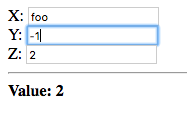
image::images/tutorial9/snap10.png["X: -1, Y: 1, Z: 2, Value: 2", align="center"]

The value of the third field is displayed in both cases, even when the
value of the second field is a valid positive integer. This is due to
`node` being bound to the value of the third field when either the
value of the first field or second field is a negative number.

[TIP]
==================================================
`when` is registered as an infix operator thus the following:

--------------------------------------------------
a -> b @ when(context, type)
--------------------------------------------------

can be rewritten as:

--------------------------------------------------
a -> b @ context when type
--------------------------------------------------
==================================================

[[adding-numbers-improved-error-handling]]
=== Improved Error Handling in 'Adding Numbers' ===

Whilst the error handling logic in the 'Adding Numbers' application,
from <<_target_node_transforms>>, is adequate and correct, the
definition of the `error-message` meta-node, responsible for selecting
an appropriate error message, can be improved using explicit
contexts. The current definition repeatedly checks whether the failure
type of the `value` argument is of a given type using the `fail-type?`
meta-node. This is repetitive and does not convey the intent that this
is error handling/reporting logic.

The `error-message` meta-node returns:

- The empty string if the `value` argument does not evaluate to a
  failure.

- The string ``Not a valid number!'' when `value` evaluates to a
  failure of type `Invalid-Integer`.

- The string ``Number must be greater than or equal to 0!'' when
  `value` evaluates to a failure of type `Negative-Number`.

We can re-implement this logic using bindings to the `self` node with
explicit contexts.

The `self` node should primarily be bound to the empty string, if the
`value` argument does not evaluate to a failure. There is a handy
utility meta-node, `!-`, in the `core` module, which returns the value
of its second argument if the first argument does not evaluate to a
failure. If the first argument evaluates to a failure value, it is
returned. This meta-node is registered as an infix operator thus can
be placed between its arguments.

The primary binding can thus be written as follows:

--------------------------------------------------
value !- "" ->
    self @ context
--------------------------------------------------

If this binding results in a failure of type `Invalid-Integer`, `self`
should be bound to the constant string ``Not a valid number!''. This
is achieved with the following:

--------------------------------------------------
"Not a valid number!" ->
    self @ context when Invalid-Integer
--------------------------------------------------

Finally `self` should be bound to ``Number must be greater than or
equal to 0!'', if the previous bindings resulted in a failure of type
`Negative-Number`.

--------------------------------------------------
"Number must be greater than or equal to 0!" ->
    self @ context when Negative-Number
--------------------------------------------------

Putting it all together we have the following definition of
`error-message` re-implemented using explicit contexts:

.New implementation of `error-message`
--------------------------------------------------
error-message(value) : {
    value !- "" ->
        self @ context

    "Not a valid number!" ->
        self @ context when Invalid-Integer

    "Number must be greater than or equal to 0!" ->
        self @ context when Negative-Number
}
--------------------------------------------------

The advantage of this implementation is that it more explicitly
conveys the intent that this is error handling logic. As such it can
be optimized more effectively, e.g. if `self` evaluates to a failure
of type `Negative-Number`, the check for whether the failure type is
`Invalid-Integer` can be skipped altogether.

An additional advantage of this implementation is that the third
binding is activated on failures of type `Negative-Number` originating
both from the first and second bindings whereas the previous
implementation only handled failures originating in `value`. In this
case it doesn't make a difference as the second binding cannot result
in a failure of type `Negative-Number`. However this does make a
difference, in more complex error handling logic, where the handling
of an error may itself result in a new error.

This implementation does, however, have a difference from the previous
implementation in that if `value` evaluates to a failure of a type
other than `Invalid-Integer` or `Negative-Number` it returns a
failure, whereas the previous implementation returned the empty
string. In this application it doesn't make a difference as the
arguments passed to `error-message` do not evaluate to failures of
other types.

=== Concise Syntax ===

Coming up with a context identifier and typing it out repeatedly can
become tiresome. The original reason for having an identifier for
explicit contexts is to distinguish them from the remaining contexts
which are implicitly created and to allow for multiple explicit
contexts. However, there is usually only a single explicit context
used for handling failures.

To shorten the syntax for binding to an explicit context, a default
identifier, such as `_` can be given to all explicit contexts which
are used only for handling failures. Alternatively, the `@` operator
can take a single argument, the node, in which case it is a shorthand
for the explicit context with identifier `default`.

--------------------------------------------------
# The following:
x -> y @ default

# Is equivalent to:
x -> @(y)
--------------------------------------------------

When the context identifier is of the form `when(type)`, that is
omitting the context identifier and leaving only the failure type, the
explicit context with identifier `default` is, once again, assumed.

--------------------------------------------------
# The following:
x -> y @ default when type

# Is equivalent to:
x -> y @ when(type)
--------------------------------------------------

== Node States ==

So far, we've seen that Tridash is good at producing an output, which
is a function of a given input, and ensuring that it is always
synchronized with the input. What we haven't seen, however, is mapping
a previous output to a new output. In-fact, with the tools introduced
so far, this is impossible.

To be able to map a previous output to a new output, a binding has to
be established in which the 'source' is a function of the 'target'
node. As an example, to implement a counter, intuitively we might do
the following:

--------------------------------------------------
# This does not work!!!
counter + 1 -> counter
--------------------------------------------------

The problem here is that a change in the value of `counter` triggers a
change in the value of `counter`, which triggers a further change in
the value of `counter` 'ad infinitum'. What we require is a way to
tell Tridash, that when the value of `counter` is updated to `counter
+ 1`, it should not trigger another update to the value of `counter +
1`. We also need a way to specify when we would like the value of
`counter` to be updated to `counter + 1`, as updating it only once is
hardly useful.

=== Stateful Bindings ===

Node states allow us to control when the value of a node is updated,
beyond the simple rule of 'whenever the value of one of its dependency
nodes changes'. The target of a binding can have an explicit 'state'
associated with it, using the `::` operator. In this case the binding
is referred to as a 'stateful binding'.

.Explicit state using `::` operator
--------------------------------------------------
a -> b :: state-id
--------------------------------------------------

The left-hand side of the `::` operator is the node and the right hand
side is the state identifier, which is a symbol identifier (similar to
a context identifier). The result of this is that the binding `a -> b`
only takes effect when `b` *'switches'* to the state with identifier
`state-id`. The emphasis is on 'switches' as a change in the value of
`a` will not automatically trigger a change in the value of `b`. Only
a change in the 'state' of `b` will trigger a change in its
value. This may seem counter-intuitive at first, however if `b` was
updated on every change in the value of `a`, and instead of `a` we
have `b + 1` we'll end up with the same problem in the previous
section.

IMPORTANT: Stateful bindings declared later in the source take
priority over those declared earlier.

A node's state is determined by the value of the special node
`/state(node)`. Binding to it allows us to control a node's state.

.Example: Counter
--------------------------------------------------
counter + 1 -> counter :: increment

/state(counter) <-
    case(
        should-increment? : '(increment),
        '(default)
    )
--------------------------------------------------

TIP: The `'` operator returns its argument as a literal symbol.
`'(id)` returns the literal symbol `id`, whereas `id` on its own is a
reference to the value of the node with identifier
`id`. footnote:[This performs a similar function to Lisp's `quote` or
`'` operator]

In this example, a binding `counter + 1 -> counter` is established
which only takes effect when `counter` switches to the `increment`
state.

The second declaration binds a `case` expression to the
`/state(counter)` node, thus controlling the state of `counter`. When
`should-increment?` is true the value of the `case` expression, and
thus the state of `counter` is `increment`, otherwise it is `default`.

The result is that when the value of `/state(counter)` (the state of
`counter`) is updated to `increment`, the value of `counter` is
updated to it's previous value incremented by 1.

=== Interfacing with JavaScript ===

To provide a runnable example, we have to interface with JavaScript in
order to hook into its event system. In the next major release of
Tridash, this wont be necessary.

This section will go over only the basics of interfacing with
JavaScript, which are necessary for completing this tutorial. A full
in-depth tutorial on interfacing with JavaScript, will follow.

Tridash nodes are compiled to runtime node objects, which store the
node's value and information about its dependencies, observers,
contexts, etc. To be able to reference a runtime node object, from
JavaScript, the node has to be given an identifier with which it can
be referenced. The `public-name` attribute, if given, determines the
name of this identifier.

Once an identifier is given, it can be accessed as a member of the
`Tridash.nodes` object. `Tridash` is the object/module storing the
Tridash runtime library functions. The `nodes` member of Tridash is an
object storing references to all nodes which have been given a
`public-name` identifier.

CAUTION: Currently Tridash does not check whether multiple nodes are
given the same `public-name`.

.Example: Setting `public-name` identifier
--------------------------------------------------
/attribute(node, public-name, "aNode")
--------------------------------------------------

.Example: Referencing the runtime node object in JavaScript
[source, javascript]
--------------------------------------------------
var node = Tridash.nodes["aNode"];

// or equivalently if the public-name is a valid JS variable name
var node = Tridash.nodes.aNode;
--------------------------------------------------

Once a reference is obtained to the runtime node object, the node's
value can be set using the `set_value` method, which takes the value
as an argument.

.Example: Setting Node Value from JavaScript
--------------------------------------------------
node.set_value(1);
--------------------------------------------------

It is important, however, that if `set_value` will be called on a
runtime node object, the node is marked as an 'input' node, by setting
its `input` attribute to true.

--------------------------------------------------
/attribute(node, input, 1)
--------------------------------------------------

NOTE: Currently an attribute is set to `true` when it is given the
value `1` and set to `false` when it is given the value `0`. In the
next release, you'll be able to use the symbols 'True' and 'False'
instead.

CAUTION: Not every Tridash node corresponds to an actual runtime node
object, due to some intermediate nodes being optimized out by the
compiler. The only nodes, for which it is guaranteed that a runtime
node object is created, are 'input' nodes and nodes with no observers,
which are assumed to represent 'output' nodes.

=== Example: Counter Application ===

In this section we'll build a very simple application consisting of a
counter which is incremented when a button is pressed.

Let's start off with the Tridash binding declarations. We've in-fact
already written the bulk of the code in the previous example, which we
can simply copy into our new application.

--------------------------------------------------
counter + 1 -> counter :: increment

/state(counter) <-
    case(
        should-increment? : '(increment),
        '(default)
    )
--------------------------------------------------

The node `counter` stores the value of the counter which is
incremented when `should-increment?` is true. We'll add the attributes
which are necessary in order to be able to set the value of
`should-increment?` from JavaScript, namely we need to set a
`public-name` identifier and mark it as an `input` node.

--------------------------------------------------
/attribute(should-increment?, input, 1)
/attribute(should-increment?, public-name, "should_increment")
--------------------------------------------------

We'll allow the user to set/reset the value of the counter by binding
a `start` node to an input field. We'll bind `start` directly to
`counter` and give it an initial value of `0`.

--------------------------------------------------
start -> counter
0 -> start
--------------------------------------------------

Now let's define the user interface. We need a text input field for
entering the initial value for the counter, which will be bound to
`start` and an 'increment' button. The value of the counter will be
displayed below the counter.

.`ui.html`
--------------------------------------------------
...

<label>Start: <input value="<?@ to-int(start) ?>"/></label>

<button id="increment">Increment</button>

<strong>Counter: <?@ counter ?></strong>

...
--------------------------------------------------

NOTE: The HTML boilerplate is not shown.

We've given the 'Increment' button the ID `increment` so that we can
attach an event listener to its 'click' event. We'll do so using the
following JavaScript code, in a script tag which should be added below
the element where the counter is displayed:

--------------------------------------------------

--------------------------------------------------

The first line obtains a reference to the HTML element with ID
`increment`.

The second line obtains a reference to the `should-increment?` node
which was given a `public-name` of `should_increment`.

The remainder of the code attaches a listener, for the 'click' event,
on the 'Increment' button. In that listener we first set the value of
the `should-increment?` node to true, then immediately afterwards we
set it to false again.

Setting the value of `should-increment?` to true, causes the state of
`counter` to change to `increment`. Setting it back to false again
causes the state to change to `default`.

NOTE: In a future release, when the HTML library is complete, a
subnode `clicked?`, of the element node, will be available which will
automatically be set to true when the button is clicked and to false
when it is released. Thus the above JavaScript code wont be necessary.

Build and run the application, and press the increment button a few
times:

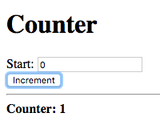
image::images/tutorial10/snap2.png["Start: 0, Counter: 2", align="center"]

The displayed value, for the counter, is incremented after each press.

Now enter a value in the 'Start' field to reset the counter, and then
press the increment button again:

image::images/tutorial10/snap3.png["Start: 5, Counter: 5", align="center"]
image::images/tutorial10/snap4.png["Start: 5, Counter: 6", align="center"]

The counter is reset to the value entered in the 'Start'
field. Pressing increment afterwards increments the new counter value.

=== State Transitions ===

Let's do a little experiment, comment out the line, in the 'click'
event handler, which sets the value of the 'should-increment?' node to
'false', i.e. comment out the following:

--------------------------------------------------
node_increment.set_value(false);
--------------------------------------------------

What do you expect to happen? Initially, we might think that since the
`should-increment?` node is not being reset to false, the state of
`counter` is not being reset to `default`. The state of `counter` will
thus switch to `increment` once, after which, there are no further
state changes. The result is that the counter will only be incremented
the first time the increment button is pressed.

Let's try it. Build and run the application and press the increment
button twice.

image::images/tutorial10/snap5.png["Start: 0, Counter: 2", align="center"]

What happened? The counter carries on incrementing after the first
button press. Why?

The declaration:

--------------------------------------------------
counter + 1 -> counter :: increment
--------------------------------------------------

states that the binding should only take effect when the state of
`counter` switches to the `increment` state. Switching from the
`increment` state to the `increment` is still considered as switching
to the `increment` state, even though the new state is identical to
the previous state. This is due to the fact that each time we're
setting the value of the `should-increment?` node to `true`, we're
triggering a change in the value of the node `/state(counter)` and
thus the state of `counter`, even though the new value of
`should-increment?` is identical to its previous value.

The above declaration should thus be thought of as declaring a binding
which takes effect whenever `counter` switches from any state,
including `increment`, to the `increment` state.

To fix this issue we can specify an explicit 'from' state. When
specified, the binding only takes effect when the state of the node
changes from the 'from' state to the 'to' state. This is specified
using the following syntax:

.Node State Binding with Explicit From State
--------------------------------------------------
a -> b :: previous => next
--------------------------------------------------

When the state identifier is a functor of the form `previous => next`,
`previous` is interpreted as the identifier of the 'from' state and
'next' is interpreted as the identifier of the 'to' state.

To achieve the intuitive behaviour we can limit the binding `counter +
1 -> counter` to only take effect when the state of counter
transitions from `default` to `increment`. Replace the binding
declaration of `counter` with the following:

--------------------------------------------------
counter + 1 -> counter :: default => increment
--------------------------------------------------

This implementation will, however, require two initial button presses
before the counter starts incrementing. This is due to the fact that
we haven't given `counter` an initial state. The first press causes it
to change to `increment`, and then back to default, however since it
is not a change from `default` to `increment`, the binding does not
take effect. We can fix this by giving `/state(counter)` an initial
value of `default`.

.Setting Initial State
--------------------------------------------------
'(default) -> /state(counter)
--------------------------------------------------

Now the counter starts incrementing after the first press.

Let's repeat the experiment on this new implementation, comment out
the line, in the JavaScript script tag, which sets the value of
`should-increment?` to `false`. The counter should only increment the
first time the 'Increment' button is pressed.

This example served to demonstrate the difference between a stateful
binding with and without a 'from' state. However, in this example,
there is no value in specifying a from state, as the previous example,
without a from state, was simpler and performed the same function.

=== Example: Alternating Increment Button ===

In this example, we'll build a silly application in which the
'Increment' button, the button which actually increments the counter,
alternates between two buttons. The goal of this example is to
demonstrate what can be done with stateful bindings with a 'from'
state that cannot be done with stateful bindings without a 'from'
state.

We'll start off with a similar interface to the previous counter
application, however with two increment buttons.

[source, html]
.`ui.html`
--------------------------------------------------
<h1>Counter</h1>

<label>Start: <input value="<?@ to-int(start) ?>"/></label>

  <button id="increment1">Increment 1</button>
  <button id="increment2">Increment 2</button>

<strong>Counter: <?@ counter ?></strong>

--------------------------------------------------

Both button's have been given ID's as we'll need to attach event
listeners to both buttons, in JavaScript.

We'll need two nodes `clicked1?` and `clicked2?` which change to true
when the first and second buttons are clicked, respectively. The
values of these nodes will have to be set via JavaScript, thus we'll
have to mark them as input nodes and set their `public-name`
attributes:

--------------------------------------------------
/attribute(clicked1?, input, 1)
/attribute(clicked1?, public-name, "clicked1");

/attribute(clicked2?, input, 1)
/attribute(clicked2?, public-name, "clicked2");
--------------------------------------------------

The following JavaScript code attaches event listeners for the
'clicked' events, of both buttons, which simply set the value of the
corresponding 'clicked?' node to true and them immediately to false,
again.

[source, javascript]
--------------------------------------------------
var increment1 = document.getElementById('increment1');
var increment2 = document.getElementById('increment2');

var clicked1 = Tridash.nodes.clicked1;
var clicked2 = Tridash.nodes.clicked2;

increment1.addEventListener('click', function() {
    clicked1.set_value(true);
    clicked1.set_value(false);
});

increment2.addEventListener('click', function() {
    clicked2.set_value(true);
    clicked2.set_value(false);
});
--------------------------------------------------

We'll need two states for the `counter` node:

`increment1`:: Corresponds to the first button being clicked last.
`increment2`:: Corresponds to the second button being clicked last.

The value of `counter` should be incremented only when its state
switches from one state to the other, i.e. the button, which was
clicked, is different from the previous button to be clicked. This can
be achieved using two stateful bindings which take effect during the
state transitions `increment1 => increment2`, `increment2 =>
increment1`.

--------------------------------------------------
counter + 1 -> counter :: increment1 => increment2
counter + 1 -> counter :: increment2 => increment1
--------------------------------------------------

TIP: `counter + 1` can be refactored into a separate node to avoid
having to type it out twice.

`counter` will retain its previous value during any other state
transition.

We need to set `counter`\'s state, to `increment1` or
`increment2`, based on which button was clicked last. To achieve that
we can exploit the fact that each explicit binding to a node, without
an explicit context, results in the creation of a new context. When
the value of the 'source' node, of the binding, changes, the binding
context is activated.

We know that the value of `clicked1` changes to true, and then to
false, again, when the first button is clicked. The same is true for
`clicked2` when the second button is pressed. We want the state of
`counter` (`/state(counter)`) to be bound to the literal symbol
`increment1`, when the value of `clicked1` changes regardless of what
that value is. For that, we can use the utility `!-` meta-node,
introduced in <<adding-numbers-improved-error-handling>>, which
returns the value of its second argument if its first argument does
not evaluate to a failure.

The following are the binding declarations which set the state of
`counter`.

--------------------------------------------------
clicked1? !- '(increment1) -> /state(counter)
clicked2? !- '(increment2) -> /state(counter)
--------------------------------------------------

NOTE: The sole purpose of the `!-` operator is to force the value of
`/state(counter)` to be updated whenever the value `clicked1` or
`clicked2` changes.

To make it obvious which button should be clicked, we'll make the
button which increments the counter change to green. We'll bind each
button's background color to `"green"` if the other button was the
last button to be pressed, and `"gray"` if it was the last button to
be pressed. This is achieved with the following:

--------------------------------------------------
increment1 <- /state(counter) = '(increment1)
increment2 <- /state(counter) = '(increment2)

case (increment2 : "green", "gray") ->
    self.increment1.style.backgroundColor
case (increment1 : "green", "gray") ->
    self.increment2.style.backgroundColor
--------------------------------------------------

NOTE: We're comparing the state of counter directly to determine which
button was pressed last.

Finally, let's make the initial state of `counter`, `increment2` so
that pushing on the first button, increments the counter.

Build and run the application. Initially you should see something
similar to the following:

image::images/tutorial10/snap6.png["Start: 0, Increment 1 (green), Increment 2, Counter: 0", align="center"]

Click on the green 'Increment 1' button:

image::images/tutorial10/snap7.png["Start: 0, Increment 1, Increment 2 (green), Counter: 1", align="center"]

The counter is incremented by one, and the button changes to grey with
the other button changing to green. Clicking on the same, now grey,
button will not affect the value of the counter.

Click on the green 'Increment 2' button:

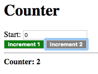

The counter is incremented once again, and button 'Increment 1'
changes back to green with button 'Increment 2' changing back to
'grey'.

Just to make sure everything works properly let's reset the counter
and push the green button to increment it.

image::images/tutorial10/snap9.png["Start: 10, Increment 1 (green), Increment 2, Counter: 10", align="center"]

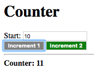

Everything works as expected. The state of `counter` does not affect
the binding `start -> counter` as it is a 'stateless', without an
explicit state specified, binding.

=== Exercises ===

Try out the following as an exercise:

- Change the previous application such that clicking on the grey
  button, i.e. the button which does not increment the counter,
  decrements the counter.

- Implement a toggle button of which the background color, and text,
  changes when pressed.

== List Processing ==

This tutorial is an introduction on processing lists of data. Lists
are 'conceptually' represented as a linked list of nodes in which the
'head' of the node stores the list element and the 'tail' stores the
next node, i.e. the remainder, of the list. The meta-nodes `head` and
`tail`, from the `core` module, return the `head` and `tail` of a list
node respectively.

NOTE: This is only a conceptual view as not all lists are necessarily
implemented as linked lists. Some lists are actually implemented as
contiguous arrays which provide a linked list interface. In the
current release, only linked lists can be created explicitly, however
functionality for creating arrays will be added in a future release.

The empty list is represented by a failure of type `Empty`. The `tail`
of the last node in a list is thus a failure of type `Empty`.

TIP: The node `Empty!` is bound to a failure of type `Empty`.

=== Creating Lists ===

The `cons` meta-node creates a list node, taking the value for the
`head` and the `tail` as arguments. This can be used to append to the
front of an existing list:

--------------------------------------------------
# Create a list of 1 element, by appending to the front of the empty
# list
l1 <- cons(a, Empty!)

# Append to front of l1, creating a list of 2 elements
l2 <- cons(b, l1)
--------------------------------------------------

The `list` meta-node takes a variable number of arguments and returns
a list containing the values of the arguments as elements.

--------------------------------------------------
# Create list with elements: 1, 2, 3
l <- list(1, 2, 3)
--------------------------------------------------

The `list*` meta-node, also taking a variable number of arguments, is
used to prepend a number of elements to the front of a list. The last
argument is interpreted as a list with the remaining arguments
prepended to the front of it.

--------------------------------------------------
# Create list with 1 and 2 prepended to the front of l1
l2 <- list*(1, 2, l1)
--------------------------------------------------

=== Higher-Order Meta-Nodes ===

Meta-Nodes can be passed to other meta-nodes as arguments, or bound to
ordinary nodes, in which case the function of the meta-node is
referenced.

A node can appear as the operator in a functor node in which case the
function, of which the reference is stored in the node's value is
applied on the arguments. If the node's value is not a reference to
function or the function is applied on an incorrect number of
arguments, the result is a failure value.

.Example
--------------------------------------------------
call(f, arg) : f(arg)
func(x) : x

f <- func
result <- call(f, y)
--------------------------------------------------

In this example the `call` meta-node takes two arguments and returns
the result of applying the first argument `f` on the second argument
`arg`. The node `f` is bound to a reference to the function of the
meta-node `func`, which is then passed to the `call` meta-node.

==== Outer Node References ====

An interesting aspect of higher-order programming in Tridash is that
when referencing a meta-node as a value, which references the values
of nodes declared in the global scope, a binding is established
between the referenced nodes and meta-node reference. A binding is
also established between the default values of optional arguments, in
the case that they are references to other nodes, and the meta-node
reference.

.Example
--------------------------------------------------
# Increment `x` by the value of the global node `delta
increment(x) : x + delta

call(f, arg) : f(arg)

result <- call(increment, n)
--------------------------------------------------

The `increment` meta-node references the value of the global `delta`
node. The function of the `increment` meta-node is referenced by the
node `call(increment, n)`, thus a binding is established between
`delta` and `call(increment, n)`. The result is that whenever the
value of `delta` is changed, the value of `call(increment, n)` is
updated.

Let's demonstrate this with a simple application. Create a `ui.html`
file containing the above code in a Tridash code tag and the following
interface in the HTML body.

--------------------------------------------------

<label>N: <input value="<?@ to-int(n) ?>"/></label>

<label>Delta: <input value="<?@ to-int(delta) ?>"/></label>

Result: <?@ result ?>

--------------------------------------------------

Build and run the application and enter a value for 'N' and
'Delta'.

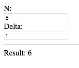

The result of the value entered for 'N' plus 'Delta' is
displayed, nothing new here.

Now change the value for 'Delta':

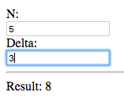

The result is updated even though there is no direct instance of
`increment` but rather a reference to the function of `increment`,
which is passed to the `call` meta-node. This demonstrates that an
implicit binding `delta -> call(increment, n)` is created due to
`increment` referencing the value of `delta` in its definition.

==== Higher-Order Meta-Nodes in List Processing ====

Higher-order meta-nodes are extremely useful for processing
lists. There are many list processing utility meta-nodes, in the
`core` module which take a reference to a meta-node as an argument,
and perform an operation on the list using the meta-node. Here are few
examples:

.`map(f, list)`
The `map` meta-node takes a function `f` and a list as arguments and
returns a new list with the result of the applying the function on
each element of the list.

.Example: `map`
--------------------------------------------------
l <- list(1, 2, 3)

1+(n) : n + 1
map(1+, l)    # Result: list(2, 4, 6)
--------------------------------------------------

The meta-node `1+` returns its argument plus one. `1+` is applied on
each element of list `l`, containing the elements 1, 2, 3, using the
`map` meta-node. The result is the list containing the elements 2, 4,
6, which is each element of the original list plus one.

.`foldl(f, list)`
The `foldl` meta-node reduces a list to a single value by
applying a function on the first two elements of the list, and then
applies the function again on the result of the previous application
and the next element. This is repeated until there are no more
elements in the list.

.Example: `foldl`
--------------------------------------------------
l <- list(1, 2, 3)
foldl(+, l)  # Result ((1 + 2) + 3) = 6
--------------------------------------------------

In this example the `+` function is applied on the list containing the
elements 1, 2, 3. `foldl` first applies `+` on the first two elements
of the list (1, 2) producing the result 3. The `+` function is then
applied on the result 3 and the next element of the list 3, producing
the result 6.

The `foldl'(x, f, list)` function is similar to `foldl` except the
function `f` is first applied on `x` and the first element of the
list, rather than the first two elements of the list.

The `foldr(f, list)` function is similar to `foldl` except the
reduction starts from the last two elements of the list and proceeds
backwards until the first element.

Some other useful functions are:

`filter(f, list)`:: Returns a list containing only those elements of
`list` for which `f` returns true.

`every?(f, list)`:: Returns true if `f` returns true for every element
of `list`.

`some?(f, list)`:: Returns true if `f` returns true for at least one
element of `list`.

`not-any?(f, list)`:: Returns true if `f` returns false for all elements
of `list`.

`not-every?(f, list)`:: Returns true if `f` returns false for at least
one element of `list`.

=== Example: Message List ===

We'll create a simple application consisting of an input field and an
'Add Message' button. When the 'Add Message' button is pressed, the
message entered in the input field is appended to the list of
messages, which are displayed below the button.

Start off with the following user interface:

[source, html]
.`ui.html`
--------------------------------------------------

<label>New Message: <input value="<?@ new-message ?>"/></label>

<button id="add">Add Message</button>

<pre><?@ messages ?></pre>
--------------------------------------------------

The value of the 'New Message' input field is bound to the node
`new-message`. The value of the `messages` node is bound to the
contents of a `pre` tag. This node will store the list of messages in
a single formatted string.

The button is given the id `add` so that we can attach an event
listener for its click event, in JavaScript:

Add the following code, which is similar to the code seen in
<<_node_states>>, to a `script` tag below the `pre` tag:

--------------------------------------------------
var add = document.getElementById('add');
var clicked = Tridash.nodes.clicked;

add.addEventListener('click', function() {
    clicked.set_value(true);
    clicked.set_value(false);
});
--------------------------------------------------

The value of the node with the public identifier `clicked`, which is
the `add-clicked?` node, is set to true and the immediately to false
when the button is clicked. Add the following attribute declarations
for the `add-clicked?` node:

--------------------------------------------------
/attribute(add-clicked?, input, 1)
/attribute(add-clicked?, public-name, "clicked")
--------------------------------------------------

We'll need a node to store the list of messages. Let's call it
`message-list` and set its initial value to the empty list.

--------------------------------------------------
message-list <- Empty!
--------------------------------------------------

The new message entered, bound to `new-message`, has to be added to
the end of `message-list`. The `append` meta-node takes two lists and
appends the second list at the end of the first list. Thus to append a
single item, we'll pass a list of that one item to `append`.

--------------------------------------------------
append(message-list, list(new-message))
--------------------------------------------------

We want the value of `new-message` to be appended to `message-list`
when the 'Add Message' button is clicked. This can be achieved with a
stateful binding to `message-list` in the `add-new` state.

--------------------------------------------------
append(message-list, list(new-message)) ->
    message-list :: add-new
--------------------------------------------------

The state of `message-list` should be set to `add-new` when the 'Add
Message' Button is pressed. The `add-clicked?` node is true when the
button is being pressed and false otherwise, thus the state of
`message-list` can be set with the following `case` expression:

--------------------------------------------------
case(
    add-clicked? : '(add-new),
    '(default)
) -> /state(message-list)
--------------------------------------------------

We have completed the functionality for adding a message to the end of
the Messages list. All that remains is to format that list into a
string which is displayed to the user.

We need a single string containing each message followed by a
newline. We'll write a `format-message` meta-node which appends a line
break to a message.

.Meta-Node `format-message`
--------------------------------------------------
format-message(message) :
    format("%s\n", message)
--------------------------------------------------

`format-message` uses the `format` meta-node, introduced in
<<functions>>, to produce a string containing the message, replacing
the `%s` placeholder, followed by a line break.

TIP: `\n` in a string is an escape sequence for a line break. Other
escape sequences are: `\r` -- carriage return, `\t` -- tab and
`\u{<code>}` -- Unicode character with code `<code>`.

To format each message, we'll apply `format-message` on each message
in `message-list` using `map`.

--------------------------------------------------
formatted-messages <- map(format-message, message-list)
--------------------------------------------------

Finally, to concatenate the formatted messages into a single string,
we'll use the `string-concat` meta-node, which takes two strings as
arguments and returns the concatenation of both strings. We'll need to
apply `string-conat` on each element in `formatted-messages` in turn,
accumulating the result in a single string. We can do that using the
`foldl` node, passing in `string-concat` as the reduction function:

--------------------------------------------------
messages <- foldl(string-concat, formatted-messages)
--------------------------------------------------

The resulting string is bound to `messages` which is displayed in the
`pre` (preformatted) tag, below the 'Add Message' button.

Build and run the application. Enter a message and press the 'Add
Message' button.

image::images/tutorial11/snap3.png["Hello World!", align="center"]

The message is displayed.

Now enter a new message and click the 'Add Message' button.

image::images/tutorial11/snap4.png["Hello World!, Hi there, how you doing?", align="center"]

The message is displayed below the old message.

== Modules And Organization ==

Up till this point we haven't given much thought as to how our source
code is organized. Instead we've crammed all our code in a Tridash
code tag inside a single `ui.html` file. This strategy obviously wont
scale for larger applications. Ideally we'd like to have 'separation
of concerns' with our application divided into multiple source files,
each containing the code implementing a separate component of the
application. The `ui.html` should ideally contain a minimal amount of
Tridash code, limited only to inline node references and, possibly,
bindings directly related to the presentation logic. The core
application logic should be in a separate source file.

In this tutorial we'll take the 'Adding Numbers' application, as it is
at the end of <<contexts>>, and reorganize its source code.

=== Multiple Source Files ===

The simplest form of code organization is splitting up the application
into multiple source files. Source files containing only Tridash code
are given the extension `trd`.

Let's extract the validation logic in a separate `validation.trd`
file. This includes the meta-nodes `validate`, `valid-int` and the
`Negative-Number` failure type.

.`validation.trd`
--------------------------------------------------
/import(core)

Negative-Number  <- &(Negative-Number)
Negative-Number! <- fail(Negative-Number)

validate(x) :
    case(
        x >= 0 : x,
        Negative-Number!
    )

valid-int(value) : {
    x <- int(value)
    validate(x)
}

/attribute(valid-int, target-node, valid-int)
--------------------------------------------------

NOTE: We've kept the `/import(core)` declaration at the top of the
file.

The application logic simply consists of the definition of the
`error-message` meta-node, which is responsible for choosing an
appropriate error message, the computation of the sum, and the setting
of the initial values for `a` and `b`.

Let's place this in a separate source file called `app.trd`

.`app.trd`
--------------------------------------------------
/import(core)

error-message(value) : {
    value !- "" ->
        @(self)

    "Not a valid number!" ->
        self @ when(Invalid-Integer)

    "Number must be greater than or equal to 0!" ->
        self @ when(Negative-Number)
}

sum <- a + b

0 -> a
0 -> b
--------------------------------------------------

NOTE: We've kept the `/import(core)` declaration at the top of the
file in case we want this file to be processed first by the
compiler. If we know this file will be processed after
`validation.trd`, which already contains an `/import(core)`,
declaration we can omit it.

NOTE: We've bound the sum of `a` and `b` to node `sum`, in order to
avoid placing application logic in inline node declarations.

All that's left in the `ui.html` file is the user interface elements
and the inline bindings to the nodes `a`, `b`, `sum` and the
`error-message` instances, which display the error messages.

.`ui.html`
[source, html]
--------------------------------------------------
<!doctype html>
<html>
    <head>
        <title>Adding Numbers</title>
    </head>
    <body>
      <h1>Adding Numbers</h1>
      

        <label>A: <input id="a" value="<?@ valid-int(a) ?>"/></label>
        <?@ error-message(a) ?>
      

      

        <label>B: <input id="b" value="<?@ valid-int(b) ?>"/></label>
        <?@ error-message(b) ?>
      

      

      
<strong>A + B = <?@ sum ?></strong>

    </body>
</html>
--------------------------------------------------

==== Building ====

To build an application consisting of multiple source files, the
source files are simply listed, under the `sources` entry, of the
build configuration file. Modify the `build.yml` file to the
following:

.`build.yml`
--------------------------------------------------
sources:
  - validation.trd
  - app.trd
  - path: ui.html
    node-name: ui

output:
  path: app.html
  type: html
  main-ui: ui
--------------------------------------------------

NOTE: The source files are processed in the order they are listed.

Since there are no processing options for `validation.trd` and
`app.trd`, we've listed the paths to the files directly rather than in
the `path` entry of a dictionary.

[TIP]
==================================================
To build entirely from the command-line, simply list the files, in the
order they are to be processed, after `tridashc`.

The following is equivalent to the build configuration file

--------------------------------------------------
tridashc validation.trd app.trd path : node-name=ui.html \
    -o path.html -p type=html -p main-ui=ui
--------------------------------------------------
==================================================

=== Modules In Depth ===

Whilst separating the application into multiple source files, grouping
related components in a single file, is a significant cleanup, it
would be even better if the nodes could be grouped into different
namespace based on their purpose, for example 'utility', 'application
logic' and 'ui'. This would allow us to use only the nodes from the
'utility' namespace, without having the rest of the 'utility' nodes
clash (i.e. have the same identifiers) with the 'application logic'
nodes. Whilst in this application there are no clashes, keeping the
nodes in separate namespaces allows us to use the same
`validation.trd` file in another application without the fear that
some node is going to clash with other nodes in the application.

Modules are a means of separating nodes into different namespaces,
where each module is a namespace in which nodes are contained. A node
with identifier `x` in module `mod1` is a distinct node from the node
`x` in `mod2`, even though the two nodes share the same identifier.

NOTE: We've already made use of the `core` module throughout these
tutorials.

==== Creating Modules ====

Modules are created with the `/module` operator which has the
following syntax:

.`/module` Operator Syntax
--------------------------------------------------
/module(module-name)
--------------------------------------------------

This indicates that all node references, in the declarations following
the `:module` declaration, will occur in the module with identifier
`module-name`. Remember that nodes are created the first time they are
referenced, thus if a node is referenced which is not in the module,
it is created and added to the module.

.Example
--------------------------------------------------
/module(mod1)
x -> node1

/module(mod2)
x -> node2
--------------------------------------------------

The first reference to the node `x` occurs in module `mod1` thus a
node `x` is added to `mod1`. The second referenced occurs in module
`mod2` thus the node is added to `mod2`. The two nodes are distinct
even though they share the same identifier.

If no module is specified the node references occur in a nameless
'init' module. The current module is reset to the 'init' module prior
to processing each source file.

IMPORTANT: Module identifiers are distinct from node identifiers, thus
a node `mod` will not clash with a module `mod` unless the module is
added as a node to the module containing the node `mod`.

==== Using Modules ====

This is great but it is of little use if you can't reference a node
that is declared in a different module from the current module.

The `/use` operator allows nodes in a module to be referenced as
subnodes of a node with same identifier as the module identifier.

.`/use` Operator Syntax
--------------------------------------------------
/use(mod1)
--------------------------------------------------

This adds a node `mod1` to the module in which the declaration
occurs. Then you can reference a node `x` in `mod1` as a subnode of
`mod1`, `mod1.x`. `mod1` is, however, a pseudo-node as its value
cannot be referenced nor can bindings involving it be established. It
only serves as a means to reference nodes in the module `mod1`.

TIP: To use a meta-node `f` declared in `mod1`, simply reference it as
a subnode of `mod1`, `mod1.f(a, b)`.

This greatly increases the functionality of modules however sometimes
it may become annoying to have to type out the full name of the module
over and over again, for each node. You can try keeping the module
names short however then you run the risk of module name
collisions. The `/use-as` operator allows you to control the
identifier of the pseudo-node, that is created in the current module,
with which nodes in the module can be referenced.

.`/use-as` Operator Syntax
--------------------------------------------------
/use-as(mod1, m)
--------------------------------------------------

This creates a pseudo-node with identifier `m`, with which nodes in
`mod1` can be referenced. Nodes in `mod1` can then be referenced as
subnodes of `m`.

NOTE: Both `/use` and `/use-as` will trigger a compilation error if
the pseudo-node identifier already names a node in the current module.

==== Importing Nodes ====

Sometimes you would like to explicitly add a node in another module to
the current module, so that you don't have to reference it as a
subnode of the module. The `/import` operator allows you to do this.

It has two forms:

- A short form taking only the module as an argument, in which case
  all nodes exported from the module are added to the current module.

- A long form in which the first argument is the module and the
  following arguments are the individual nodes to import from the
  module. Only the nodes listed are imported.

.Example
--------------------------------------------------
# Short form: Import all nodes exported from mod1
/import(mod1)

# Long form: Only import nodes x, y, z
/import(mod1, x, y, z)
--------------------------------------------------

IMPORTANT: The short form only imports those nodes which are exported
from the module not all nodes.

NOTE: The long form allows you to choose which nodes are imported into
the current module. You can list any node in the module, not just an
exported node.

`/import` also has a side-effect in that if an imported node, whether
imported by the long or short form, is registered as an infix
operator, its entry in the operator table is copied over to the
operator table of the current module so that it can also be written in
infix position in the current module.

.Example
--------------------------------------------------
# @ is a meta-node that is registered as an infix operator
/import(mod1, @)

# It can be also be placed in infix position in the current module
x @ y
--------------------------------------------------

You cannot place a node in infix position if it is referenced as a
subnode of the module.

--------------------------------------------------
/use(mod1)

# The following will not compile as you cannot place a subnode in
# infix position.

x mod1.@ y

# Instead you have to write it in prefix notation:
mod1.@(x, y)
--------------------------------------------------

==== Exporting Nodes ====

We mentioned that the short form of the `/import` operator imports all
nodes which are exported from the module. Nodes are exported from the
current module using the `/export` operator.

--------------------------------------------------
/module(mod1)

# Exports nodes x, y and z from the current module
/export(x, y, z)
--------------------------------------------------

Importing `mod1` by the short form, `/import(mod1)`, will import nodes
`x`, `y` and `z` into the module.

`/export` can take any number of arguments and multiple `/export`
declarations will result in the nodes listed in each declaration being
exported.

==== Directly Reference Node in Another Module ====

The `/in` operator references a node in another module, for which a
symbol has not been created in the current module using `/use` or
`/use-as`.

.`/in` Operator Syntax
--------------------------------------------------
/in(module, node)
--------------------------------------------------

where `module` is the name of the `module`, as declared by the
`/module` operator, and `node` is the node expression which is
processed in `module`.

This operator is most useful when writing macros, however there is
rarely a need for it when writing code directly as whatever can be
achieved with `/in` can be achieved in a more readable manner with
`/use`, `/use-as` or `/import`.

=== Adding Modularity to 'Adding Numbers'

Let's group the nodes declared in the `validation.trd` file, i.e. the
nodes related to the input validation logic into a module called
`validation`. To do that simply add the declaration
`/module(validation)` to the top of the file.

We mainly require the `valid-int` meta-node and `Negative-Number`
failure type node to be referenced outside the `validation` module,
thus we'll export those nodes using the declaration
`/export(valid-int, Negative-Number)`.

NOTE: We haven't exported `validate` and `Negative-Number!` as those
are only used in the implementation of `valid-int`, and are not used
outside the `validation.trd` file.

.`validation.trd`
--------------------------------------------------
/module(validation)
/import(core)
...
/export(valid-int, Negative-Number)
--------------------------------------------------

We'll group the main application logic into a `sum-app` module, by
adding the declaration `/module(sum-app)` to the top of the `app.trd`
file. The nodes exported from the `validation` module have to be
imported in this module, by adding an import declaration for the
module after the import declaration for the `core` module. We'll
contain the user interface in this module, thus we wont be needing to
export any nodes from it.

.`app.trd`
--------------------------------------------------
/module(sum-app)

/import(core)
/import(validation)

...
--------------------------------------------------

Finally, we have to add a Tridash code tag to the top of the `ui.html`
file, which changes the module to `sum-app`, since the `sum` and
`error-message` nodes are contained in it.

.`ui.html`
--------------------------------------------------
<? /module(sum-app) ?>
<!doctype html>
<html>
    <head>
        <title>Adding Numbers</title>
    </head>
    <body>
      <h1>Adding Numbers</h1>
      

        <label>A: <input id="a" value="<?@ valid-int(a) ?>"/></label>
        <?@ error-message(a) ?>
      

      

        <label>B: <input id="b" value="<?@ valid-int(b) ?>"/></label>
        <?@ error-message(b) ?>
      

      

      
<strong>A + B = <?@ sum ?></strong>

    </body>
</html>
--------------------------------------------------

We've successfully divided our source code into multiple modules,
based on the purpose of the nodes defined in it. However, the node
which references the contents of the `ui.html` file is still added to
the 'init' module. Whilst in this application it doesn't pose a
problem as there is no other node with identifier `ui` in the 'init'
module, it may become a problem if there is a need to reference HTML
elements from within the `app.trd` file. Remember HTML elements can
only be referenced as subnodes of `self`, within the HTML file
itself. Outside the file they have to be referenced as subnodes of the
node which references the contents of the HTML file.

In order for the `ui` node to be created in a module other than
'init', the `node-name` option has to be of the following form
`module.name`, where `module` is the module in which the node should
be created and `name` is the name of the node. The same syntax applies
in the `main-ui` output option.

Change the `build.yml` file to the following:

.`build.yml`
--------------------------------------------------
sources:
  - util.trd
  - app.trd
  - path: ui.html
    node-name: sum-app.ui

output:
  path: app.html
  type: html
  main-ui: sum-app.ui
--------------------------------------------------

With this you can now reference HTML elements, from `app.trd`, as
subnodes of the `ui` node.

Build and run the application. You wont see any new features however
we've significantly improved the organization of the code and thereby
improved the maintainability of the application.

TIP: You wouldn't typically divide an application this small into
multiple modules, however we've done so here in order to demonstrate
how it is done.

=== Infix Operators ===

We have referred to some meta-nodes as being 'registered as infix
operators'. This allows them to be placed in infix position instead of
prefix position. It turns out you can do the same for your own
nodes. This section describes how.

==== Precedence and Associativity Basics ====

Each module has an operator table, which contains the identifiers of
all nodes which can be placed in infix position as well as their
precedence and associativity. The precedence is a number which
controls the priority with which operands are grouped with infix
operators, in an expression containing multiple different infix
operators. Higher numbers indicate greater precedence.

The multiplication `*` operator has a greater precedence (200), than
the addition `+` operator (100) thus arguments will be grouped with
the multiplication operator first and then the addition operator.

The following infix expression:

--------------------------------------------------
x + y * z
--------------------------------------------------

is parsed to the following expression in prefix notation:

--------------------------------------------------
+(x, *(y, z))
--------------------------------------------------

Notice that the `*` operator is grouped with the operands `y` and `z`
first, and then `x` and `*(y, z)` are grouped with the `+`
operator. This is due to `*` having a greater precedence than `+`.

To achieve the following grouping:

--------------------------------------------------
*(+(x, y), z)
--------------------------------------------------

enclose `x + y` in parenthesis:

--------------------------------------------------
(x + y) * z
--------------------------------------------------

Associativity controls the grouping of operands in an expression
containing multiple instances of the same infix operator. The `+`
operator has left associativity.

Thus the following infix expression:

--------------------------------------------------
x + y + z
--------------------------------------------------

is parsed to the following expression in prefix notation:

--------------------------------------------------
+(+(x, y), z)
--------------------------------------------------

i.e. it is equivalent to

--------------------------------------------------
(x + y) + z
--------------------------------------------------

If the `+` operator were to have right associativity, the expression
would be parsed to the following:

--------------------------------------------------
+(x, +(y, z))
--------------------------------------------------

Below is a table showing the precedence and associativity of some of
the builtin operators.

[cols="<,>,<", options="header"]
|====================
| Operator | Precedence | Associativity

| `->`      | 10         | right
| `<-`      | 10         | left
| `!-`      | 15         | right
| `or`      | 20         | left
| `and`     | 25         | left
| `+`       | 100        | left
| `-`       | 100        | left
| `*`       | 200        | left
| `/`       | 200        | left
|====================

TIP: Visit the `modules/core/operators.trd` file of your Tridash
installation to see the full list.

==== Registering your own infix operators ====

Node identifiers can be registered as infix operators with the special
`/operator` declaration.

.`/operator` Syntax
--------------------------------------------------
/operator(id, precedence, [left | right])
--------------------------------------------------

The first argument is the identifier, the second argument is the
operator precedence as a number and the final argument is the symbol
`left` or `right` for left or right associativity. If the third
argument is omitted it defaults to `left`.

This declaration adds an infix operator to the operator table of the
current module. In the declarations, following the `/operator`
declaration, `id` can be placed in infix position.

NOTE: `id` can be any valid identifier, not just an identifier
consisting only of special symbols. However, as a result, a space is
required in between the operator and its operands.

It is not checked whether `id` actually names an existing
node, however using it in infix position only makes sense if
`id` names a meta-node.

If the node with identifier `id` is imported into another module, its
entry in the operator table, of the module from which it is imported,
is copied into the operator table of the module into which it is
imported.

The precedence and associativity of existing operators can be changed
by an `/operator` declaration, however only the operator table of the
current module is changed even if the operator is an imported node.

==== Example: Infix `add` Operator ====

To demonstrate how you would go about registering a meta-node as an
infix operator, we'll write an `add` meta-node which computes the sum
of two numbers, register it as an infix operator and replace `a + b`
with `a add b` in the 'Adding Numbers' Application.

NOTE: There is no value in writing a new meta-node which is simply a
wrapper over a builtin meta-node and registering it as an infix
operator. The purpose of this tutorial is simply to demonstrate how
you would register your own meta-node as an infix operator.

We'll first define `add` and then register as an infix operator with
precedence 100 and 'left' associativity which is the same as the
builtin `+` operator.

Add the following somewhere near the top in `app.trd`:

--------------------------------------------------
add(a, b) : a + b

/operator(add, 100, left)
--------------------------------------------------

Now change the binding declaration to `sum` with the following:

--------------------------------------------------
sum <- a add b
--------------------------------------------------

That's it you've now added your own infix operator to the language.

== What's Next? ==

You've completed the introductory tutorials which introduce the
features of the language. More tutorials will follow shortly, on
more advanced topics such as the following:

* Pattern Matching
* String processing
* Writing your own Macros
* Foreign Function Interface
* Controlling Optimizations

Tridash is still in the proof of concept phase, but is slowly
advancing to the point where it is fully usable for real-world
applications. There are still corner cases which need to be cleaned
up, and features, necessary for real world applications, to implement.
The next major release will feature the following:

* A complete HTML library allowing for directly hooking into events,
  from Tridash, and DOM manipulation

* Standard library with more math functions, string manipulation
  functions and other data structures besides lists.
