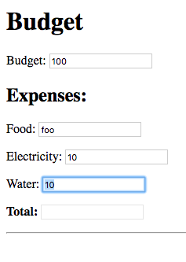
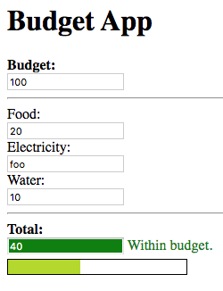
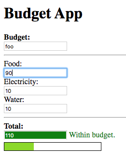

= Tridash Tutorials =
Alexander Gutev <alex.gutev@gmail.com>
:compat-mode: 1
:toc: preamble
:toclevels: 1

These set of tutorials cover the basics of the Tridash programming
language.

Prior programming experience is not strictly necessary however is
helpful.

TIP: The full source code for these tutorials is available at
https://github.com/alex-gutev/tridash-tutorials.

[[tutorial1]]
== Hello Node ==

=== Nodes ===

A Tridash program is made up of a number of components called nodes,
which are loosely analogous to variables in other languages. Each node
holds a particular value, at a given moment in time, which comprises
the node's state.

Nodes are created the first time they are referenced. Most nodes are
explicitly referenced by their identifiers, which can consist of any
sequence of Unicode characters excluding whitespace, parenthesis `(`,
`)`, braces `{`, `}`, quotes `"` and the following special characters:
`;`, `,`, `.`, `#`. A node identifier must consist of at least one
non-digit character otherwise it is interpreted as a number.

The following are examples of valid node identifiers:

- `name`
- `full-name`
- `node1`
- `1node`

TIP: There are few restrictions on the characters allowed in node
identifiers, meaning node identifiers may even contain symbols such as
`-`, `+`, `=`, `>`, `?`, etc.

=== Bindings ===

A node can be bound to another node in which case its value is
automatically updated when the value of the node, to which it is
bound, changes. Bindings can be established explicitly using the `->`
operator, or implicitly (_more on this in the next section_).

.Example
--------------------------------------------------
a -> b
--------------------------------------------------

In the example, above, a binding is established between node `a` and
node `b`. The result is that when the value of `a` changes, the value
of `b` is automatically updated to match the value of `a`. This kind
of binding is known as a simple binding since a node is simply set to
the value of another node. Node `a` is referred to as a 'dependency'
node of `b`, since `b`'s value depends on the value of `a`, and `b` is
referred to as an 'observer' node of `a` since it actively observes its
value.

The binding established in the example, above, is one-way since data
flows only from `a` to `b` and not from `b` to `a`. This means that
the value of `b` is updated when the value of `a` changes however the
value of `a` is not updated when the value of `b` changes.

If a binding in the reverse direction is also established:

--------------------------------------------------
b -> a
--------------------------------------------------

the binding becomes a two-way binding and the value of each node is
updated when the value of the other node changes.

IMPORTANT: The spaces between the node identifiers and the bind `->`
operator are mandatory since `a->b` is interpreted as a single node
identifier.

=== First Application ===

In this tutorial we will build a simple application which asks for the
user's name and displays a personalized ``Hello'' message.

This tutorial targets the JavaScript backend and makes use of HTML for
the user interface.

NOTE: Some knowledge of the basics of HTML, i.e. what tags, elements
and attributes are, is necessary to complete this tutorial.

We'll start off by creating an HTML file, called `hello-ui.html`, with
the following contents:

.hello-ui.html
[source,html]
--------------------------------------------------
<!doctype html>
<html>
    <head>
        <title>Hello Node</title>
    </head>
    <body>
        <h1>Tutorial 1: Hello Node</h1>
        <label>Enter your name: <input id="input-name"/></label>
        
Hello 

    </body>
</html>

<?
 self.input-name.value -> name
 name -> self.span-name.textContent
?>
--------------------------------------------------

Most of the file is HTML boilerplate, the interesting part is within
the `<? .. ?>` tag. The content of this tag is interpreted as Tridash
code. Tridash code tags can be placed almost anywhere in the file,
we've just chosen to place it at the bottom.

The Tridash code consists of two explicit binding
declarations. Declarations are separated by a line break or a
semicolon `;`.

.Tridash Code
--------------------------------------------------
self.input-name.value -> name
name -> self.span-name.textContent
--------------------------------------------------

The first declaration (the first line) binds the
`self.input-name.value` node to the `name` node.

The node `self.input-name` is a special node that references the
`input` element, with id `input-name`, in the HTML file. HTML elements
can be referenced from within Tridash code, in the same HTML file,
using the expression `self.<id>` where `<id>` is substituted with the
id of the element.

The `.` operator is a special operator for referencing subnodes of
nodes, these will be explained in detail later. The subnode identifier
is the identifier which appears to the right of the operator. When a
subnode of a node, that references an HTML element, is referenced, the
HTML attribute, of the element, with the same name as the subnode
identifier is referenced. Referencing attributes of HTML elements,
from Tridash, allows the values of attributes to be bound to Tridash
nodes.

The node `self.input-name.value`, which references the `value`
attribute of the HTML element with ID `input-name`, is bound to the
node `name`. Thus whenever the value of `input-name.value` changes,
the value of `name` is set to it. In other words, whenever text is
entered in the input element, the value of `name` is automatically set
to the text entered.

In the second declaration, the `name` node is bound to the
`self.span-name.textContent` node. `self.span-name` references the
HTML `span` element with ID `span-name`, with the node
`self.span-name.textContent` referencing the `textContent` attribute,
i.e. the content, of the element. The result of this binding is that
whenever the value of the `name` node changes, its value is displayed
in the `span` element. As mentioned earlier, the value of the `name`
node is automatically set to the text entered in the `input` element,
thus the value entered in the `input` element is displayed in the
`span` element.

The application we've just written, simply prompts the user for
his/her name and displays ``Hello'' followed by the user's name
directly below the prompt. Let's try it out to see if it works.

==== Building ====

Run the following command to build the application:

--------------------------------------------------
tridashc hello-ui.html : node-name=ui -o hello.html -p type=html -p main-ui=ui
--------------------------------------------------

That looks complicated, let's simplify it a bit.

The `tridashc` executable compiles one or more Tridash source files,
generating a single output file. The source files are simply listed,
after the command `tridashc`. In this case there is one source file,
`hello-ui.html`. The name of the output file is given by the `-o` or
`--output-file` option, in this case `hello.html`.

The syntax `: <option>=<value>` is used to set options which affect
how the last source file, listed before the `:`, is
processed. Multiple options can be set by separating the options with
a comma `,`. In the command, above, `: node-name=ui` sets the
`node-name` option to `ui` for the source file `hello-ui.html`. The
`node-name` option sets the identifier of the node, with which, the
contents of the HTML file can be referenced later. In effect, a
special HTML component node `ui` is created, which serves to reference
the HTML contents of the file.

NOTE: The `self` node, when occurring within an HTML file, references
the HTML component node of the current file.

The `-p option=value` command-line options sets various options
related to the compilation output. The first option `type`, sets the
type of output generated. In this case it is set to `html` in order to
generate an `html` file, with the generated JavaScript code embedded
in it. If the option is omitted, the output is simply a JavaScript
file containing only the raw generated code. The second option
`main-ui`, sets the name of the HTML component node, the contents of
which, become the contents of the output HTML file. In this case it is
set to `ui` which is the node name, given earlier in the `node-name`
option, of the HTML component node containing the contents of the
`hello-ui.html` file.

If all went well a `hello.html` file should have been created in the
same directory, after running the command.

==== Running The Application ====

Open the `hello.html` file in a web-browser with JavaScript
enabled. You should see something similar to the following:

image::images/tutorial1/snap1.png["Snapshot: Name Prompt", align="center"]

Try entering some text in the text field, and press enter afterwards:

image::images/tutorial1/snap2.png["Snapshot: &quot;John&quot; entered in text field.\"Hello John\" displayed below the prompt.", align="center"]

Notice that the text entered appears next to the ``Hello'' message
underneath the text field. This is due to the binding of the text
field to the `name` node and the binding of the `name` node to the
contents of the `span` element placed adjacent to the ``Hello'' text.

Now try changing the text entered in the text field:

image::images/tutorial1/snap3.png["Snapshot: \"John Doe\" entered in text field. \"Hello John Doe\" displayed below the prompt.", align="center"]

The text next to ``Hello'' changes to match the contents of the text
field. This demonstrates the automatic updating of a node's state when
the state of its dependency nodes changes.

When the state (the contents) of the text field changes, the state of
the `name` node is updated to the text entered in the field, and the
state of `span` element is updated to match the state of the `name`
node.

=== Inline Node Declarations ===

The application in this tutorial can be implemented much more
succinctly using implicit bindings and inline node declarations.

.hello-ui.html
[source,html]
--------------------------------------------------
<!doctype html>
<html>
    <head>
        <title>Hello Node</title>
    </head>
    <body>
        <h1>Tutorial 1: Hello Node</h1>
        <label>Enter your name: <input value="<?@ name ?>"/></label>
        
Hello <?@ name @>

    </body>
</html>
--------------------------------------------------

Implicit bindings between an HTML node and a Tridash node can be
established using the `<?@ declaration ?>` tag. This is similar to the
Tridash code tag, seen earlier, however an implicit binding is
established between the nodes appearing in the tag and the HTML node
in which the tag appears.

If the tag is placed within an attribute of an element, an implicit
two-way binding is established between the element's attribute and the
node, appearing in the tag. If the tag appears outside an attribute,
an HTML element is created in its place, and a binding is established
between the node appearing in the tag, and the content of the element
(referenced as `textContent` from Tridash).

With inline declarations it is not necessary to give the HTML elements
unique ID's unless they will be referenced from within Tridash
code. In the example, above, they have been omitted.

== Functional Bindings ==

The bindings in the previous tutorial were pretty boring and
limited. Whatever was entered in the text field was simply displayed
below it, verbatim. In-fact, this functionality is already offered by
many web frameworks and GUI toolkits. The real power of the Tridash
language comes from the ability to specify arbitrary functions in
bindings which are dependent on the values of more than a single
node. Moreover these bindings can be established in Tridash itself
without having to implement "transformer" or "converter"
interfaces/subclasses in a lower-level language.

=== Simple Budgeting Application ===

In this tutorial, and the following tutorials, we'll be implementing a
very basic budgeting application with the following desired features:

  - Allocate amounts to spend on a number of predefined expense
    categories.

  - Compute the total amount allocated.

  - Specify a limit (the budget) on the total amount spent on expenses.

  - Indicate whether the total amount allocated exceeds the limit,
    with some visual cues such as the total amount turning red if it
    exceeds the limit.

We'll start with a very basic version and incrementally add features
and improve it.

==== First Version ====

In the first version we'll focus on the first two features, allocating
an amount of money to different expenses and computing the total
amount allocated.

Begin with the following `ui.html` file:

.ui.html
[source, html]
--------------------------------------------------
<?
 :import(core)

 food + electricity + water -> total
?>

<!doctype html>
<html>
    <head>
        <title>Budget App</title>
    </head>
    <body>
      <h1>Budget App</h1>
      

	<label for="food">Food:</label>
	
<input id="food" value="<?@ to-real(food) ?>" />

      

      

	<label for="electricity">Electricity:</label>
	
<input id="electricity" value="<?@ to-real(electricity) ?>" />

      

      

	<label for="water">Water:</label>
	
<input id="water" value="<?@ to-real(water) ?>" />

      

      

      

	<label for="total"><strong>Total:</strong></label>
	
<input id="total" value="<?@ total ?>" readonly/>

      

    </body>
</html>
--------------------------------------------------

A lot is going on here, lets focus on the body of the HTML file for
now.

The body defines an interface with three text input fields for
entering the amounts allocated to ``Food'', ``Electricity'' and
``Water'' expenses, and a fourth readonly text field for displaying
the total amount allocated. Each field is bound, using implicit
bindings, to the nodes `to-real(food)`, `to-real(electricity)`,
`to-real(water)` and `total` respectively.

The `total` node is a simple node, similar to the nodes seen in the
previous tutorial.

The remaining nodes are examples of `functor` nodes. A functor node
consists of an expression comprising an operator applied to zero or
more arguments.

--------------------------------------------------
operator(argument1, argument2, ...)
--------------------------------------------------

A binding is established between each of the arguments and the functor
node. Whenever the value of one of the arguments changes, the
expression is reevaluated and the value of the functor node is
updated.

In the functor node `to-real(food)` the operator is `to-real`, which
simply converts its single argument, the node `food`, to a real
(floating-point) numeric value. With the `to-real` operator a two-way
binding is established between the argument and the functor node. The
result of this is that if another node (not the argument) is bound to
the functor node, `node -> to-real(argument)`, its value is converted to
a real value and the value of the argument node is updated to it.

The value of the input element, in which the amount allocated to food
is entered, is implicitly bound to `to-real(food)`. Thus when text is
entered in the input element, the value of the `food` node is set to
the value in text field converted to a real value. The same is true
for the electricity and water fields.

The bulk of the application logic is specified in the Tridash code tag
at the beginning of the file.

The first line, `:import(core)`, is a special declaration which imports
all the nodes from the `core` module into the current module, _more on
modules later_. The only nodes we use from the `core` module are the
addition `+` operator and `to-real` operator.

The line `food + electricity + water -> total` is in effect
responsible for computing the total amount allocated and displaying it
in the ``Total'' field. Lets break it down bit by bit.

A binding is established between the node `food + electricity + water`
and the node `total`. The former is a functor node with the `+`
operator.

The `+` operator is an infix operator, which means it can be placed
between its two arguments (infix notation), instead of being placed
before its arguments (prefix notation). The spaces between the infix
`+` operator and its argument nodes are mandatory as
`food+electricity+water` is a valid node identifier and is thus
interpreted as a single node. The infix notation is transformed to the
prefix notation `+(+(food, electricity), water)`. Both notations are
equivalent and either one can be written in the source file, provided
the operator is registered as an infix operator (_more on this
later_).

The `+` operator computes, you guessed it, the sum of the values of
its argument nodes. The first argument is the functor node `+(food,
electricity)` which computes the sum of the amount allocated to `food`
and `electricity`, and the second argument is `water`, thus the
functor node computes the total sum.

The total sum is bound to the `total` node which, recall, is bound to
the text field displaying the total amount allocated to all
expenses. Thus whenever the total amount allocated changes, the new
total is displayed in the text field next to ``Total:''. The total
amount, itself, is updated, whenever the amount in one of the
``Food'', ``Electricity'' or ``Water'' text fields is changed by
the user.

==== Build Configuration File ====

To simplify the build command, the build options will be specified in
a build configuration file.

The build configuration file contains the list of sources, along with
the source-specific options, and the output options in YAML syntax
_(see <https://yaml.org> for details)_.

Create the following `build.yaml` file:

.build.yml
--------------------------------------------------
sources:
  - path: ui.html
    node-name: ui

output:
  path: app.html
  type: html
  main-ui: ui
--------------------------------------------------

The outer structure of the file is a dictionary with two entries
`sources` and `output`.

The `sources` entry contains the list of source files. Each item in
the list is either the path to the source file or is a dictionary with
the path in the `path` entry and the source-specific options in the
remaining entries. In this application there is one source file
`ui.html` with one source processing option `node-name` set to `ui`.

The `output` entry is a dictionary containing the output options. The
`path` entry specifies the `path` to the output file, in
this case `app.html`. The remainder of the entries are output
options. In this case, the output options are the same as in the
previous tutorial, `type=html` and `main-ui=ui`.

To build from a build configuration file run the following command:

--------------------------------------------------
tridashc -b build.yml
--------------------------------------------------

The `-b` option specifies the path to the build configuration file
containing the build options. All other command line options are
ignored when this option is specified.

==== Running the Application ====

Open the `app.html` file in a web browser, and enter some
numbers in the text fields:

image::images/tutorial2/snap1.png["Snapshot: 100, 300, 500 entered in expense fields. 900 displayed in total.", align="center"]

Notice that the total is computed and displayed in the ``Total:''
field.

NOTE: You will only see a total computed once you have entered a valid
number in each field.

Now try changing some of the amounts allocated (_remember to press
enter after you've changed a value_):

image::images/tutorial2/snap2.png["Snapshot: Electricity changed to 350. New total 950 displayed.", align="center"]

Notice that the total amount allocated is automatically recomputed and
the new total is displayed in the ``Total'' field.

=== Inline Functional Bindings ===

The application built in this tutorial can be implemented more
succinctly by replacing the `total` node with `food + electricity +
water` in the inline node declaration within the `value` attribute of
the total `input` element.

[source, html]
--------------------------------------------------
<label for="total"><strong>Total:</strong></label>

<input id="total" value="<?@ food + electricity + water ?>" readonly/>

--------------------------------------------------

This shows that inline node declarations can contain any valid node
declaration not just a simple node.

=== Summary ===

In this tutorial you learned how to create bindings involving a
function of the values of two or more nodes. Whenever the value of one
of the argument nodes changes, the expression is re-evaluated to
compute the node's new value.

== Conditional Bindings ==

In this tutorial we'll implement the third feature of our simple
budgeting application, namely specifying the budget and displaying a
message, indicating whether the budget was exceeded. In essence this
tutorial demonstrates conditional bindings.

=== Case Operator ===

Conditions are specified using the special `case` operator. The `case`
operator is special in that it has a special syntax to make it more
readable.

TIP: The `case` operator is actually a macro-node, implemented in
Tridash, which expands to a series of nested `if` functor
expressions. You can see its source in the `modules/core/macros.trd`
file of your Tridash installation.

The syntax of the case operator is as follows:

--------------------------------------------------
case(
  condition-1 : value-1,
  condition-2 : value-2,
  ....
  default-value
)
--------------------------------------------------

Each argument is of the form `condition : value` where `condition` is
the condition node and `value` is the corresponding value node. The
last argument may also be of the form `value`, that is there is no
condition node, in which case it becomes the default or else value.

The `case` functor node evaluates to the value of the value node
corresponding to the first condition node which has a 'true' value
(any non-zero value), or the value of the default node, if any, when
all condition nodes have a 'false' (zero) value.

.Example
--------------------------------------------------
case(
  a > b : a - b
  b > a : b - a
  0
)
--------------------------------------------------

If the node `a > b` evaluates to true, the `case` node evaluates to
the value of `a - b`, otherwise if `b > a` evaluates to true, the
`case` node evaluates to the value of `b - a`. If neither `a > b` nor
`b > a` evaluate to true, the `case` node evaluates to `0`.

If the default value node is omitted and no condition node evaluates
to 'true', the `case` node evaluates to a failure value (_you will
learn about failure values in a later tutorial which introduces error
handling_).

=== Budget Application Version 2.0 ===

The feature we would like to implement is the ability to specify the
budget and display an appropriate message indicating whether the
budget was exceeded.

We'll need a new input field for specifying the budget and a node in
which to store it, lets call it `budget`. Add a new text input element
with its value attribute bound to `to-real(budget)`, in order to
convert the string in the text input field to a real numeric
value. The input element should be something similar to the following,
if inline declarations are used:

[source, html]
--------------------------------------------------
<input id="total" value="<?@ to-real(budget) @>"/>
--------------------------------------------------

Next we'll need to display the status message somewhere. Let's place
it next to the total `input` element. We'll use inline declarations to
make the code more succinct, however the logic can be placed in a
Tridash code tag as well.

Add the following next to the `input` element in which the total is
displayed:

[source, html]
--------------------------------------------------

  <?@
    case(
      total < budget : "Within budget.",
      "Budget exceeded!!!"
    )
  @>

--------------------------------------------------

To simplify the code the node `total` is bound to the total sum
allocated. Alternatively the functor node `food + electricity + water`
could have been used directly instead of the node `total`.

NOTE: There is no difference in efficiency between using the `total`
node or using the functor node directly. The value of a node is only
computed once, whenever one of its arguments changes, even if it is
referenced in more than one location. Moreover the value of a node is
not computed if it is not used anywhere.

Ensure that there is a Tridash code tag at the top of the file with
the following contents:

--------------------------------------------------
:import(core)

food + electricity + water -> total
--------------------------------------------------

And modify the input element next to ``Total:'', to be bound to the
node `total` instead of `food + electricity + water`.

[source, html]
--------------------------------------------------
<input value="<?@ total @>"/>
--------------------------------------------------

Now we have a working application which should display the message
``Within budget.'', if the total is within the budget, and ``Budget
exceeded!!!'', if the budget has been exceeded.

Full `ui.html` source code:

.ui.html
[source, html]
--------------------------------------------------
<?
 :import(core)

 food + electricity + water -> total
?>

<!doctype html>
<html>
    <head>
        <title>Budget App</title>
    </head>
    <body>
      <h1>Budget App</h1>
      

	<label for="budget"><strong>Budget:</strong></label>
	
<input id="budget" value="<?@ to-real(budget) ?>"/>

      

      

      

	<label for="food">Food:</label>
	
<input id="food" value="<?@ to-real(food) ?>" />

      

      

	<label for="electricity">Electricity:</label>
	
<input id="electricity" value="<?@ to-real(electricity) ?>" />

      

      

	<label for="water">Water:</label>
	
<input id="water" value="<?@ to-real(water) ?>" />

      

      

      

	<label for="total"><strong>Total:</strong></label>
	

	  <input id="total" value="<?@ total ?>" readonly/>
	  
            <?@
             case(
                 total < budget : "Within budget.",
                 "Budget exceeded!!!"
             )
             ?>
	  
	

      

    </body>
</html>
--------------------------------------------------

==== Let's try it out ====

Build the application, using the same build configuration file,
`build.yml`, and build command from the previous tutorial.

Open the `app.html` file in a web browser, and enter some initial
numbers in the budget and expenses fields:

image::images/tutorial3/snap1.png["Snapshot: 100 entered in budget and all expense fields. Total 300, Budget Exceeded!!! displayed.", align="center"]

Notice that the status message, next to the total, says ``Budget
Exceeded!!!''  since the total of 300 did indeed exceed the budget of
100, with the numbers in the snapshot above.

Now try increasing the budget:

image::images/tutorial3/snap2.png["Snapshot: Budget increased to 400. Within Budget displayed.", align="center"]

The message changes to ``Within Budget.''. This demonstrates that the
value of a `case` functor node is recomputed if the values of any of
the condition nodes change.

Now try increasing some of the expenses, in order for the total to
exceed the budget again:

image::images/tutorial3/snap3.png["Snapshot: Expense total increased to 500. Budget Exceeded displayed.", align="center"]

The message changes back to ``Budget Exceeded!!!''.

=== Improvements ===

Whilst the application we've implemented so far demonstrates the power
of functional bindings, it is rather lacking in that whether the
budget has been exceeded or not is only indicated by text. The text
has to be read in full to determine whether the budget was exceeded,
and changes from 'within budget' to 'budget exceeded', and vice versa,
are hard to notice. Some visual indications, such as the background of
the total changing color, when the budget is exceeded, would be
helpful.

As an improvement of the application, we would like the background
color of the element, which displays the total, and the text color of
the status message to change to [red]#red# if the total exceeds the
budget, and change to [green]#green# if it is within the budget.

Let's start off by giving an id to the `input` element, which displays
the total, and the `span` element, which displays the status message,
so that they can be referenced from Tridash code. The `input` element,
next to ``Total:'', is given the id `total` and the `span`
element, in which the status message is displayed, is given the id
`status`.

Let's create a node `color` to store the background color of the total
and text color of the status message. It should have the value
`"green"` when the total is within the budget and the value `"red"`
when the total exceeds the budget. This can be achieved by binding to
a `case` functor node.

NOTE: The values `"green"` and `"red"` are strings, storing CSS color
names.

Add the following to the Tridash code tag.

--------------------------------------------------
case(
  total < budget : "green",
  "red"
) -> color
--------------------------------------------------

The value of the `case` functor node is `"green"` if `total` is less
than `budget` and `"red"` otherwise. The case functor node is bound to
the `color` node.

The `color` node somehow has to be bound to the background color of
the `total` `input` element and the text color of the `status` `span`
element. The text and background colors are style attributes of the
elements. All style attributes are grouped under a single subnode
`style` of the HTML element node (as is done when referencing style
attributes from JavaScript). The background color is controlled by the
`backgroundColor` attribute, referenced using `style.backgroundColor`
and the text color is controlled by the `color` style attribute,
referenced using `style.color`.

The `color` node is bound to the style attributes of the elements with
the following (add to the Tridash code tag):

--------------------------------------------------
color -> self.total.style.backgroundColor
color -> self.status.style.color
--------------------------------------------------

Additionally we would like the text, in the `total` element, to be
displayed in white in order to be legible. We can achieve this using
inline CSS or CSS classes, however we can also bind the text color of
the element to the constant `"white"`. This is useful if later on, we
would like the text color to change dynamically as well.

Full `ui.html` code:

.ui.html
[source, html]
--------------------------------------------------
<?
 :import(core)

 food + electricity + water -> total

 case(
     total < budget : "green",
     "red"
 ) -> color

 color -> self.total.style.backgroundColor
 color -> self.status.style.color

 "white" -> self.total.style.color
?>

<!doctype html>
<html>
    <head>
        <title>Budget App</title>
    </head>
    <body>
      <h1>Budget App</h1>
      

	<label for="budget"><strong>Budget:</strong></label>
	
<input id="budget" value="<?@ to-real(budget) ?>"/>

      

      

      

	<label for="food">Food:</label>
	
<input id="food" value="<?@ to-real(food) ?>" />

      

      

	<label for="electricity">Electricity:</label>
	
<input id="electricity" value="<?@ to-real(electricity) ?>" />

      

      

	<label for="water">Water:</label>
	
<input id="water" value="<?@ to-real(water) ?>" />

      

      

      

	<label for="total"><strong>Total:</strong></label>
	

	  <input id="total" value="<?@ total ?>" readonly/>
	  
            <?@
             case(
                 total < budget : "Within budget.",
                 "Budget exceeded!!!"
             )
             ?>
	  
	

      

    </body>
</html>
--------------------------------------------------

==== Let's try it out ====

Enter some values for the expenses and budget such that the total
exceeds the budget.

image::images/tutorial3/snap4.png["Snapshot: 100 entered in budget and expense fields. Total and Budget Exceeded!!! displayed in red.", align="center"]

The status message and total are now shown in red which provides an
immediate visual indication that the budget has been exceeded.

Now increase the budget, or decrease the expenses:

image::images/tutorial3/snap5.png["Snapshot: Budget increased to 400. Total and Within Budget displayed in green.", align="center"]

The color of the message and total is immediately changed to green,
which provides a noticeable indication that the budget has no longer
been exceeded.

=== Summary ===

In this tutorial you learned how to create conditional bindings using
the `case` operator which allows the value of a node to be
conditionally bound to the value of another node based on whether a
condition node evaluates to true.

[[tutorial4]]
== Writing your own Functions ==

In this tutorial you'll learn how to create your own functions, which
can be used in functional bindings. Another feature which distinguishes
Tridash from frameworks/toolkits, which offer bindings, is that new
functions can be written in the same language, as the language in
which the bindings are declared, rather than having to be implemented
in a lower-level language.

=== Definition Operator ===

New functions, referred to as meta-nodes, are defined using the
special `:` operator, which has the following syntax:

--------------------------------------------------
function(arg1, arg2, ...) : {
   declarations...
}
--------------------------------------------------

The left-hand side contains the function name (`function`) followed by
the argument list in brackets, where each item (`arg1`, `arg2`, ...)
is the name of the local node to which the argument at that position
is bound.

The right-hand side, of the `:` operator, contains the declarations
making up the body of the function, which may consist of any Tridash
node declaration.

Nodes created within the body of a meta-node are local to the
meta-node, meaning they can only be referenced from within it even if
the same node identifier occurs in an expression in the global
scope. Local nodes are created for each of the arguments, and for
nodes which appear as the target of a binding. Node expressions which
appear in source position primarily reference local nodes, however if
no local node is found, the enclosing scope of the meta-node is
searched. This differs from global node expressions, in which nodes
are automatically created if no node with that identifier exists.

Meta-nodes return the value of the last node in the `declarations`
list comprising the body. The curly braces `{` and `}` are optional if
the meta-node body consists of a single declaration.

Alternatively an explicit binding to the `self` node, can be
established. In that case, the return value of the meta-node, is the
value of the `self` node, rather than the last node in the body.

==== Examples ====

--------------------------------------------------
# Add two numbers <1>

add(x, y) : x + y
--------------------------------------------------

<1> This is a comment. Comments begin with a `#` character and extend
till the end of the line. All content within a comment is discarded.

In the example, above, a meta-node `add` is defined which takes two
arguments, bound to the local nodes `x` and `y`. The function body
consists of a single node declaration, hence the curly braces were
omitted, `x + y` which is a functor node that computes the sum of `x`
and `y`. The meta-node returns the value of `x + y` since it is the
last node in the body.

The following example demonstrates recursive meta-nodes:

--------------------------------------------------
# Computes the factorial of n

factorial(n) : {
  case(
    n > 1 : n * factorial(n - 1),
    1
  )
}
--------------------------------------------------

The following example demonstrates that meta-nodes may themselves
contain nested meta-nodes, which are local to the meta-node and can
only be referenced within it.

--------------------------------------------------
# Tail recursive factorial

factorial(n) : {
  iter(n, acc) : {
    case(
      n > 1 : iter(n - 1, n * acc),
      acc
    )
  }

  iter(n, 1)
}
--------------------------------------------------

=== Budget Meter ===

Our current application displays some nice visual indications, in the
form of color, which allow us to see, at a glance, whether the budget
has been exceeded. However the visual indications are still quite
limited, giving only a binary indication of whether the budget was
exceeded or not. It would be nice if there is also a visual indication
of how close the total is to the budget.

In this tutorial we'll enhance the budget application by displaying a
meter, which directly indicates how close the total is to the
budget. Additionally we'd also like the meter to be displayed in a
color that is between green and red proportional to how much the total
is between zero and the budget.

==== Color Interpolation ====

Let's first begin with computing the color of the meter. Our goal is
to linearly interpolate a color between green and red depending on
where the total amount allocated lies between zero and the
budget. This is where meta-nodes will come in handy.

We'll start off by writing a linear interpolation meta-node `lerp`.

--------------------------------------------------
lerp(a, b, alpha) : lo + alpha * (b - a)
--------------------------------------------------

The value returned by the meta-node is the fractional value, at the
fraction `alpha`, between `a` and `b`.

Let's write another handy meta-node for creating a CSS `hsl` color
string out of hue, saturation and luminance components.

TIP: Interpolation is done in the HSL color space, rather than the RGB
color space as it provides better results.

--------------------------------------------------
make-hsl(h, s, l) :
    format("hsl(%s,%s%%,%s%%)", h, s, l)
--------------------------------------------------

TIP: The `format` meta-node takes a format string, followed by a
variable number of arguments, and returns the format string with all
`%s` placeholders replaced by the arguments. `%%` is replaced with a
literal `%` character.

The next step is to compute the interpolation coefficient `alpha`
based on where the total sum lies between zero and the budget.

To make sure that the interpolation coefficient is between 0 and 1,
we'll write a `clamp` meta-node, for clamping a value to a given
range:

--------------------------------------------------
clamp(x, min, max) :
   case (
      x < min : min,
      x > max : max,
      x
   )
--------------------------------------------------

Using the `clamp` meta-node, we compute the `alpha` coefficient
clamped to the range [0, 1]:

--------------------------------------------------
clamp((total + 1) / (budget + 1), 0, 1) -> scale
--------------------------------------------------

NOTE: `1` was added to the total and budget to prevent division by
zero in the case that `budget` is equal to `0`. This obviously does
not work if `budget` is equal to `-1` however this will be handled in
the following tutorials.

And now finally we'll compute the color making use of the `lerp`
meta-node we implemented earlier:

--------------------------------------------------
make-hsl(
   lerp(120, 0, scale),
   90,
   45
) -> meter-color
--------------------------------------------------

The hue is linearly interpolated between [green]#green# `120` and
[red]#red# `0`, depending on where the total lies between `0` and the
`budget`.

==== Creating the Meter ====

Now we'll actually create the meter. We need two block elements, one
which displays a border containing the meter and another element which
displays the portion of the meter that is filled.

Add the following HTML elements below the ``Total'' field.

[source, html]
--------------------------------------------------

  

--------------------------------------------------

Add the following `style` tag, which contains the style attributes of
the `meter-box` and `meter-bar` classes, within the `<head>...</head>`
tag:

[source,html]
--------------------------------------------------

--------------------------------------------------

The `meter-box` class, applied to the block element which serve as the
container, gives the element a width, height and a border. The
`meter-bar` class, applied to the element which displays the filled
portion, specifies that the filled portion should take up `100%` of
the vertical space within the container.

The meter should be filled proportionally to how close the value of
`total` is to the value of `budget`. The proportion is already given
by the value of the `scale` node. To implement the 'filling' of the
meter, we simply need to bind the `scale` node to the `width` style
attribute of the `meter` element.

This is achieved with the following:

--------------------------------------------------
format("%s%%", scale * 100) -> self.meter.style.width
--------------------------------------------------

The `scale` is multiplied by `100` to convert it to a percentage, and
`format` is used to convert the numeric value to a string with a `%`
appended to it. This specifies that the width of the meter should be a
percentage, given by `scale`, of the width of its parent container.

Finally we need to bind `meter-color`, which stores the interpolated
color, to the background color of the meter.

--------------------------------------------------
meter-color -> self.meter.style.backgroundColor
--------------------------------------------------

This is the full code that needs to be added to the Tridash code tag,
to implement the meter:

--------------------------------------------------
lerp(a, b, alpha) : a + alpha * (b - a)

clamp(x, min, max) :
    case (
        x < min : min,
        x > max : max,
        x
    )

make-hsl(h, s, l) :
    format("hsl(%s,%s%%,%s%%)", h, s, l)

clamp((total + 1) / (budget + 1), 0, 1) -> scale

make-hsl(
    lerp(120, 0, scale),
    90,
    45
) -> meter-color

format("%s%%", scale * 100) -> self.meter.style.width
meter-color -> self.meter.style.backgroundColor
--------------------------------------------------

==== Let's try it out ====

Build the application and open the resulting `app.html` file in a web
browser.

Enter some initial values for the budget and expense totals. Start off
with low expense totals such that the total expenses are well within
the budget:

image::images/tutorial4/snap1.png["Snapshot: Budget 100, Total 30. Meter 1/3 filled, displayed in bright green.", align="center"]

The filled portion is roughly a third of the meter and is displayed in
a bright green.

Now start increasing the expenses to bring the total closer to the
budget:

image::images/tutorial4/snap2.png["Snapshot: Total 50. Meter half filled, displayed in yellow.", align="center"]

image::images/tutorial4/snap3.png["Snapshot: Total 70. Meter more than half filled, displayed in orange.", align="center"]

The meter gradually fills up and starts changing to red the closer the
total expenses are to the budget.

Now finally increase the expenses till the total exceeds the budget:

image::images/tutorial4/snap4.png["Snapshot: Total, 120. Meter filled, displayed in bright red.", align="center"]

The mete is fully filled and displayed in a bright red color.

=== Summary ===

In this tutorial you learned how to create your own functions,
referred to as meta-nodes, which can be used in functor node
expressions.

TIP: Functions are referred to as meta-nodes since they are nodes,
themselves, which describe how the values of other nodes, referred to
as meta-node instances, are computed, hence the term meta-nodes.

== Error Handling ==

In all the tutorials, till this point, we've completely ignored the
issue of invalid data being entered in the text fields, such as
non-numeric data and negative numeric values.

Let's try entering some non-numeric data in our existing application
and see what happens.

If an invalid value is initially entered in one of the ``food'',
 ``electricity'', or ``water'' fields, no total is computed, the meter
 is filled, and no status message is displayed.

If the value of one of the fields is changed from a valid to an
invalid numeric value, such as ``Electricity'' in the snapshot above,
the total is not recomputed, with the old total being displayed in the
text field. Likewise the meter and status message are unchanged, even
if the values of the ``Budget'' or other fields are changed. The new
total is only computed when the invalid numeric value is replaced with
a valid numeric value.

Now let's try entering a non-numeric value for the budget, however
keeping the values of the other fields valid:

Changing the budget to a non-numeric value does not result in the
total, color or message being changed. However changing the values of
the expense fields does result in the new total being computed and
displayed. The meter and status message, however, remain unchanged.

Whilst the application is still functioning when non-numeric values
are entered in the text fields, and can quickly resume its normal
operation when the invalid values are replaced with valid numeric
values, there is no indication to the user that an invalid value has
been entered. This can be misleading, as in the last snapshot, no
matter how large of the total is entered, ``Within Budget'' is always
displayed.

Negative values are treated as ordinary numeric values. Obviously
these don't make sense in our application, thus an error message
should be displayed as well if a negative value is entered.

The following functionality has to be implemented:

   . Check whether data entered in the text fields is actually
      numeric data. If not print an appropriate error message.
   . Validate the numeric data, checking that the numbers entered are
      positive.

=== Failures ===

A failure is a special type of value which indicates the absence of a
value, or the failure to compute a value. If a meta-node expects one
of its argument nodes to evaluate to a value, but it evaluates to a
failure, the failure is returned immediately.

The `to-real` meta-node returns a failure if its argument cannot be
converted to a real number. In this case, each of the instance nodes
`to-real(budget)`, `to-real(food)`, `to-real(electricity)` and
`to-real(water)`, evaluate to failures if the argument is a string,
from which a real-number cannot be parsed.

The `+`, `-`, `*`, `<`, and `>` meta-nodes return failures if any of
their arguments evaluate to failures. As a result if at least one of
`food`, `electricity` or `water` evaluate to failures the node `food +
electricity + water`, and likewise the node `total`, evaluates to a
failure.

When an HTML attribute is bound to a node, which evaluates to a
failure, the value of the attribute is simply left as is. Thus, if the
node `total` evaluates to a failure, due to an invalid value being
entered for 'Food', 'Electricity' or 'Water', the `value` attribute of
the 'Total' input field is not changed.

Similarly, if the `budget` node evaluates to a failure, due to an
invalid value for 'Budget' being entered, the `color` node, `scale`
node and the node storing the status message evaluate to failures. As
a result the status message and meter is not updated.

=== Handling Failures ===

Failures can be handled using explicit contexts. A node context is the
information about how a node's value is computed, and which of the
dependency nodes' values are required. Each binding to a node, whether
explicit or implicit creates a context.

The context to which a binding is established, can be set explicitly
using the `@` macro footnote:[The `@` macro expands to a functor
expression with the special `:context` operator], from the `core`
module.

.`@` Macro Syntax
--------------------------------------------------
node @ context-id
--------------------------------------------------

`node` is the node expression and `context-id` is the identifier of
the explicit context, which can be any identifier. When this
expression appears as the target of a binding, the binding is
established in that context. When it appears as the source of a
binding, it has no effect.

Multiple bindings can be established in the same explicit context. The
value of the node is bound to the value of the source node of the
first binding that is declared in the source code. However, if the
source node evaluates to a failure, the value of the node is set to
the value of the source node of the second binding. If the source node
of the second binding evaluates to a failure, the node value is set to
the value of source node of the third binding and so on. If the source
nodes of all the context's bindings evaluate to failures, the node
evaluates to the failure value of the last binding's source node.

.Example
--------------------------------------------------
a -> x @ ctx
b -> x @ ctx
c -> x @ ctx
--------------------------------------------------

In the example, above, `x` primarily evaluates to the value of
`a`. However, if `a` evaluates to a failure, `x` evaluates to the
value of `b`. If `b` evaluates to a failure, `x` evaluates to the
value of `c`.

Using explicit contexts we can write a meta-node which returns true if
its argument node evaluates to a failure, otherwise returns false.

.Meta-Node: `fails?`
--------------------------------------------------
fails?(x) : {
    x and 0 -> self @ catch-failure
    1 -> self @ catch-failure
}
--------------------------------------------------

The first declaration, in the function's body, establishes the primary
binding to the `self` node, if you recall from the previous
tutorial it's value is returned by the meta-node when an
explicit binding to it is established. The primary binding ensures
that the value of the `self` node is 'false' (`0`) if `x` does not
evaluate to a failure.

The second declaration binds the `self` node to 'true' (`1`) if the
previous binding evaluates to a failure. As a result, the `fails?`
meta-node returns 'false' when `x` does not evaluate to a failure and
'true' when `x` evaluates to a failure.

It turns out we don't need to write our own `fails?` meta-node, as the
`core` module already provides a `fails?` meta-node which performs the
same function. However, the implementation provided in this section
serves as an introduction to 'failure' values and 'explicit contexts'.

=== Error Feedback ===

The first improvement to we'd like to make, is to display an error
message indicating when a non-numeric value is entered in the budget
or expense text fields.

The first step is to detect failures in the nodes storing the budget
and expense categories. For that, we'll write a utility meta-node,
`error-prompt` which returns an error message if its argument node evaluates
to a failure.

.Meta-Node `error-prompt`
--------------------------------------------------
error?(thing) : {
    error-message <- "Please enter a valid number"
    if (fails?(thing), error-message, "")
}
--------------------------------------------------

The first declaration simply creates a local `error-message` node and
binds it to the error message string. The expression in the last line
of the body, which serves as the return value of the meta-node,
evaluates to the error message (value of the `error-message` node) if
the argument `thing` evaluates to a failure, determined using the
`fails?` meta-node from the `core` module. Otherwise the expression
evaluates to the empty string.

[TIP]
.Meta-Node `if`
==================================================
The `if` meta-node from the `core` module returns:

 - its second argument if its first argument is true.
 - its third argument if the first argument is false.
==================================================

We'd like to display the error messages next to each text field, which
has an invalid value, thus we'll change the body of the HTML file to
the following:

[source,html]
--------------------------------------------------
<label for="budget"><strong>Budget:</strong></label>

  <input id="budget" value="<?@ to-real(budget) ?>"/>
  <?@ error-prompt(budget) ?>

  <label for="food">Food:</label>
  

    <input id="food" value="<?@ to-real(food) ?>" />
    <?@ error-prompt(food) ?>
  

  <label for="electricity">Electricity:</label>
  

    <input id="electricity" value="<?@ to-real(electricity) ?>" />
    <?@ error-prompt(electricity) ?>
  

  <label for="water">Water:</label>
  

    <input id="water" value="<?@ to-real(water) ?>" />
    <?@ error-prompt(water) ?>
  

--------------------------------------------------

We've added an `error-prompt` meta-node instance next to each text
input field. Each instance evaluates to the error message if the node,
bound to the field's value, evaluates to a failure. Recall, the nodes
bound to the value attributes evaluate to failures if the `to-real`
meta-node fails to parse a real number from the string value.

==== Let's try it out ====

Build and run the application. Enter some non-numeric value in some of
the text input fields.

image::images/tutorial5/snap1.png["Snapshot: Error message displayed next to food and electricity fields, with invalid numeric values.", align="center"]

Notice the error messages displayed next to the input fields with
non-numeric values.

Now try changing the input fields back to numeric values.

image::images/tutorial5/snap2.png["Snapshot: All fields changed to valid numbers. Total recomputed.", align="center"]

The error messages disappear and the application resumes its normal
operation, computing the new total and adjusting the meter.

This fixes the first issue with our application. As an exercise you
can try to make the text color of the input fields change to "red" if
non-numeric values are entered in them.

=== Initial Values ===

The issue with no feedback being displayed, in case of non-numeric
values being entered in the text input fields, is fixed, however until
a value is entered in each field, no total or status message is
displayed. The nodes `budget`, `food`, `electricity` and `water` have
not been given initial values. When a node is not given an initial
value, its initial value is a failure. This results in the node
`total` evaluating to a failure.

A node may be given an initial value, which is set as soon as the
application is launched. The setting of the initial value is treated
as an ordinary value change from the node's previous value, which is a
'failure' value. Binding a node to a constant value, without an
explicit context, is interpreted as setting its initial value.

--------------------------------------------------
0 -> x
--------------------------------------------------

In the example, above, node `x` is given the initial value `0`. Nodes
can also be given initial values which involve more complex
expressions and even reference other nodes, provided they are constant
nodes. Constant nodes are nodes with a constant value, that does not
change throughout the execution of the application. In-effect constant
nodes only have an initial value and do not depend on the values of
other non-constant nodes.

NOTE: The `error-message` node, seen earlier in <<_error_feedback>>,
is an example of a constant node.

Let's give each of the `budget`, `food`, `electricity` and
`water` nodes an initial value of `0`.

Add the following to the Tridash code tag in the `ui.html` file:

--------------------------------------------------
0 -> budget
0 -> food
0 -> electricity
0 -> water
--------------------------------------------------

When running the application all text fields will be initialized to
the value `0`.

image::images/tutorial5/snap3.png["Initial State Snapshot: All fields initialized to 0. Total (0) and Budget Exceeded displayed in red", align="center"]

Since we gave initial values to all the nodes, and there is an
implicit two-way binding between these nodes and the contents of the
text fields, the contents of the text input fields are immediately
initialized to `0`. This demonstrates that the setting of the initial
node values is treated the same as any other node value change.

=== Summary ===

In this tutorial you were introduced to 'failure' values and how to
handle failures with explicit contexts. Additionally you also learned
how to give nodes initial values.

== Failures of your own ==

You've been introduced to failure values in the previous tutorial and
how to handle them using explicit contexts. In this tutorial you'll
learn how to create your own failure values, which will be used to fix
the second issue with our budgeting application, namely ensuring that
only positive numeric values are entered in the budget and expense
text input fields.

=== Conditional Bindings ===

Conditional bindings allow a binding between two nodes to be active
only if a 'condition' node evaluates to true. Conditional bindings are
declared by declaring a binding with the bind expression as the target
of the binding.

.Conditional Binding Declaration
--------------------------------------------------
condition -> (a -> b)
--------------------------------------------------

A conditional binding `a -> b` is declared, which is conditioned on
the node `condition`. If `condition` evaluates to true, the binding `a
-> b` is active and thus node `b` evaluates to the value of `a`. If,
however, `condition` evaluates to 'false', `b` evaluates to a failure
value.

NOTE: A conditional binding declaration may follow the main binding
declaration, `a -> b`, in the source code.

NOTE: When a conditional binding is declared, a node `a -> b` is
created which may be used to reference the status of the binding,
i.e. is it active or inactive.

TIP: The `->` operator has right associativity thus the parenthesis in
the previous example are optional, however were added for clarity.

.Example: Simple Conditional Binding
--------------------------------------------------
a < 0 -> (a -> b)
--------------------------------------------------

In this example `b` is only bound to `a` if `a` is less than `0`,
otherwise `b` evaluates to a failure value.

.Example: A `min` Meta-Node
--------------------------------------------------
min(a, b) : {
    a < b -> (a -> self @ ct)
    b -> self @ ct
}
--------------------------------------------------

This example combines conditional bindings and explicit contexts. If
`a` is less than `b`, `self` is bound to the value of `a` and thus the
`min` meta-node returns the value of `a`. Otherwise, `b >= a`, `self`
is bound to the value of `b`, since the first binding resulted in a
failure value, and thus the value of `b` is returned from the
meta-node.

=== Simple Validation ===

To fix the second issue, we need the `budget`, `food`, `electricity`
and `water` nodes to evaluate to failures not only if non-numeric data
is entered in the text fields but also if negative numbers are
entered.

We'll create a simple `valid-amount` meta-node which converts its
argument to a real number and checks that the real value is greater
than or equal to `0`. For this we'll use conditional bindings.

.Meta-Node `valid-amount`
--------------------------------------------------
valid-amount(value) : {
    x <- real(value)
    x >= 0 -> x -> self
}
--------------------------------------------------

The first declaration binds the local node `x` to the argument `value`
converted to a `real` number.

NOTE: `x` is a local node as it appears as the target of a binding.

TIP: The `real` meta-node performs the same function as the `to-real`
meta-node.

TIP: `<-` is the same as `->` only with arguments reversed, that is
the target of the binding is on the left hand side and the source on
the right hand side.

The second declaration conditionally binds `x` to the `self` node if
`x` is greater than or equal to `0` (`x >= 0`). As a result the return
value of the meta-node is its argument converted to a real number, if
it is greater than `0`. If the real value is less than `0`, or the
argument cannot be converted to a real value, a failure is returned.

A simple way, to incorporate this in our application is to create new
nodes which are bound directly to the string values entered in the
text input fields. Let's call them `in-budget`, `in-food`,
`in-electricity` and `in-water`. Change the HTML code, where the input
fields are created to the following:

[source, html]
--------------------------------------------------

  <label for="budget">Budget:</label>
  

    <input id="budget" value="<?@ in-budget ?>"/>
    <?@ error-prompt(budget) ?>
  

  <label for="food">Food:</label>
  

    <input id="food" value="<?@ in-food ?>" />
    <?@ error-prompt(food) ?>
  

  <label for="electricity">Electricity:</label>
  

    <input id="electricity" value="<?@ in-electricity ?>" />
    <?@ error-prompt(electricity) ?>
  

  <label for="water">Water:</label>
  

    <input id="water" value="<?@ in-water ?>" />
    <?@ error-prompt(water) ?>
  

--------------------------------------------------

Also make sure that the initial values are given to the `in-...` nodes
rather than the nodes which stored the parsed numeric values. Change
the section of the Tridash code tag, responsible for setting the
initial values, to the following:

--------------------------------------------------
# Initial Values

0 -> in-budget
0 -> in-food
0 -> in-water
0 -> in-electricity
--------------------------------------------------

Now we need to bind `valid-amount` instances of those nodes to the
`budget`, `food`, `electricity` and `water` nodes.

Add the following to the Tridash code tag:

--------------------------------------------------
# Validation

valid-amount(in-budget) -> budget
valid-amount(in-food) -> food
valid-amount(in-electricity) -> electricity
valid-amount(in-water) -> water
--------------------------------------------------

Additionally let's change the error message to indicate that negative
numbers are invalid. Change the `error-prompt` meta-node to the
following:

--------------------------------------------------
error-prompt(thing) : {
    error-message <- "Please enter a valid number \u{2265} 0!"
    if (fails?(thing), error-message, "")
}
--------------------------------------------------

NOTE: `\u{2265}` represents the unicode character with code 2265 which
is the character `≥`.

==== Let's try it out ====

Build and run the application, and enter negative values in some of
the fields:

image::images/tutorial6/snap1.png["Snapshot: -30 entered in Electricity. Error message displayed next to it.", align="center"]

The error message was displayed next to the field where a negative
value was entered, in this case electricity. The total, status message
and meter were left unchanged.

=== Meta-Node Instances as Targets ===

Whilst we've fixed the second issue with our application, we had to
make a lot of changes to our code:

 - New nodes had to be created to store the raw string input values.
 - We had to change which nodes are given initial values.
 - The `valid-amount` instances had to be explicitly bound to the nodes
   which store the parsed numeric values.

Most of the new code we've added is repetitive boilerplate, we're
creating an instance of the `valid-amount` meta-node for each input
field's value and binding it to the corresponding node storing the
parsed value. Recall that we didn't have to do this when converting
the field values to real-numbers, we could simply write `to-real(...)`
in the inline node expressions, within the value attributes, and be
done with it. It was mentioned `to-real` was a special meta-node in
that an instance of it can also appear as the target of a binding,
whereas ordinarily that would trigger a compilation error. It turns
out we can also make the `valid-amount` node special by setting a
`target-node` attribute.

Node attributes are arbitrary key-value pairs associated with each
node, which control certain compilation properties. Attributes are set
using the special `:attribute` operator which has the following
syntax:

--------------------------------------------------
:attribute(node, attribute, value)
--------------------------------------------------

  `node`:: The node of which to set the attribute. Can be any node
  expression including a functor node.

  `attribute`:: The attribute key. Interpreted as a literal symbol
  rather than a node expression.

  `value`:: The value to set the attribute to. Like `attribute` this
  is interpreted as a literal rather than a node expression.

IMPORTANT: Attributes do not form part of a node's runtime state thus
cannot be bound to the values of other nodes.

The `target-node` attribute, when set on a meta-node `m`, stores a
meta-node which is used as the binding's function, when an instance of
`m` appears as the target of a binding. When an instance of the
meta-node `m`, with the `target-node` attribute set, is processed, a
binding between the instance, as the source, and each argument node,
as the target, is established with the function of the binding being
the meta-node stored in the `target-node` attribute.

.Example: `to-real`
--------------------------------------------------
:attribute(to-real, target-node, real)

# results in a binding equivalent to the following
# real(x) -> y

x -> to-real(y)
--------------------------------------------------

In the example above, the `target-node` attribute of `to-real` is set
to the meta-node `real`. The binding declaration, in the last line,
results in the node `to-real(y)` being bound to `y`, with the function
`real` being the function of the binding. As a result `y` is bound to
the value of `x` converted to a `real` value.

NOTE: `to-real` performs the same function as `real`, however a
separate node is created in order to give it a different `target-node`
attribute. The behaviour of the `real` meta-node, when an instance of
it appears as the target of a binding, is to perform pattern matching
on the argument, _pattern matching will be introduced in a later
tutorial_.

To apply this to our application, we'll give the `valid-amount`
meta-node a `target-node` attribute so that it can be used directly
inline, in the value attributes of the HTML input fields. We need the
`valid-amount` meta-node to perform the same function, when it appears
as a binding target thus we'll simply set the `target-node` attribute
of `valid-amount` to itself.

NOTE: This section builds on the code from the previous tutorial, with
the definition of `valid-amount` added to it, and the modifications to
the `error-prompt` meta-node. It does not include the remaining
modifications made in <<_simple_validation>>.

Add the following after the definition of `validate` in the Tridash code tag.

--------------------------------------------------
:attribute(valid-amount, target-node, valid-amount)
--------------------------------------------------

NOTE: When the `target-node` attribute is set, the meta-node is looked
up as the `:attribute` declaration is processed.

As a result we can simply replace `to-real(...)` with `valid-amount(...)`
in the inline declarations, within the value attributes of the HTML
input elements. This will be equivalent to the code we wrote at the
end of <<_simple_validation>>.

Change the text input fields HTML code to the following:

[source, html]
--------------------------------------------------

  <label for="budget">Budget:</label>
  

    <input id="budget" value="<?@ valid-amount(budget) ?>"/>
    <?@ error-prompt(budget) ?>
  

  <label for="food">Food:</label>
  

    <input id="food" value="<?@ valid-amount(food) ?>" />
    <?@ error-prompt(food) ?>
  

  <label for="electricity">Electricity:</label>
  

    <input id="electricity" value="<?@ valid-amount(electricity) ?>" />
    <?@ error-prompt(electricity) ?>
  

  <label for="water">Water:</label>
  

    <input id="water" value="<?@ valid-amount(water) ?>" />
    <?@ error-prompt(water) ?>
  

--------------------------------------------------

That is all that is necessary to add the new validation logic to our
application. There is no need for creating new nodes, coming up with
new node names and changing which nodes are given initial values.

=== Summary ===

In this tutorial you learned how to create your own failure
values. This was used to add further input validation to the budgeting
application, thus fixing the second issue. Furthermore you learned how
to use `target-node` attributes to reduce the amount of binding
boilerplate code that needs to be written.

== Outer Node References ==

This tutorial shows how nodes declared in an outer scope can be
referenced from inside a meta-node.

=== Referencing Non-Local Nodes ===

Recall from <<tutorial4>> that node expressions, within the body of a
meta-node, primarily refer to local nodes. However if no local node is
found, the enclosing scope of the meta-node is searched. Local nodes
are only created when a node expression appears as the target of a
binding. Referencing a node with the same identifier as a node
declared at the global scope, when there is no local node with the
same identifier, references the global node.

.Example
--------------------------------------------------
x                <1>

addx(y) : x + y  <2>
--------------------------------------------------

<1> Global node `x` declaration.
<2> References global node `x` as there is no local node with that identifier.

What actually happens behind the scenes, when an outer node is
referenced, is that an additional argument is added to the `addx`
meta-node and node `x` is implicitly added to the argument list of
each instance of `addx`. Thus the definition `addx` can be thought of
as the following:

--------------------------------------------------
addx(y, x) : x + y
--------------------------------------------------

and each instance `addx(node)` can be thought of as `addx(node, x)`.

The consequence of this is that the referenced outer-node, `x`, is
treated just like any other argument. This means that a binding is
established between `x` and all instances of the `addx`
meta-node. Changes in the value of `x` will trigger a re-computation
of the values of all instances of `addx`. This implicit argument is
also added to all meta-nodes which contain an instance of `addx` in
their body.

The following example demonstrates referencing an outer node from a
nested meta-node.

--------------------------------------------------
add(x, y) : {
  addx(y) : x + y
  addx(y)
}
--------------------------------------------------

In this example the outer node `x`, referenced from within the `addx`
meta-node is the node `x`, the first argument node, in the scope of
the body of the `add` meta-node.

CAUTION: If no node is found, either local or in enclosing scope, a
compilation error is triggered.

[TIP]
.`..` Operator
==================================================
The `..(x)` operator can be used to explicitly reference a node `x`
from the enclosing scope. This is useful when there is a need to
reference a global node which has the same identifier as a local node.

.Example
--------------------------------------------------
x                   <1>
add(x) : x + ..(x)  <2>
--------------------------------------------------

<1> Global node `x` declaration.
<2> `..(x)` references the global `x` node.
==================================================

=== Global Color Nodes ===

So far we have a basic working budgeting application. However the
colors used to indicate 'within budget' and 'budget exceeded' are
hard-coded. While red and green are good choices in the general case,
the user may prefer different colors or would like to adjust the
saturation and luminance of the colors.

Before we begin let's encapsulate colors in a meta-node, with each of
the components as subnodes.

==== Subnodes ====

We've briefly mentioned subnodes in <<tutorial1>>. A subnode is a node
which references a dictionary entry, of a particular key, out of a
'parent' node containing the dictionary of values. These are referred
to as subnodes since they behave like individual nodes, and are
evaluated separately from their 'parent' nodes.

Subnodes are referenced with the `.` special operator. The parent node
expression is on the left-hand side with the key on the right-hand
side. The key is interpreted as a literal symbol rather than a node
expression.

.Subnode `.` Operator Syntax
--------------------------------------------------
parent.key
--------------------------------------------------

[horizontal]
  `parent`:: The parent `node`, which can be any node expression.
  `key`:: The entry key, which is interpreted as a literal symbol.

NOTE: The `.` operator is lexically special in that spaces are not
required between its arguments.

Meta-Nodes which return dictionary values can be created by binding to
subnodes of the `self` node.

.Example: Meta-Node Returning Dictionary
--------------------------------------------------
Person(first, last) : {
    first -> self.first  <1>
    last -> self.last    <2>
}
--------------------------------------------------

<1> Binding subnode `first` of `self` to argument node `first`. Sets
the value of the entry with key `first` of the dictionary.

<2> Binding subnode `last` of `self` to argument node `last`. Sets the
value of the entry with key `last` of the dictionary.

==== Encapsulating Colors ====

Let's create a `Color` meta-node that takes the hue, saturation and
luminance as arguments and creates a dictionary with three entries
`hue`, `saturation` and `luminance`. This encapsulates colors in a
single value.

--------------------------------------------------
Color(h, s, l) : {
    h -> self.hue
    s -> self.saturation
    l -> self.luminance
}
--------------------------------------------------

Let's create another meta-node `lerp-color` which simply linearly
interpolates all the components of two colors, using the `lerp`
meta-node we implemented in <<tutorial4>>.

--------------------------------------------------
lerp-color(c1, c2, alpha) : {
    Color(
        lerp(c1.hue, c2.hue, alpha),
        lerp(c1.saturation, c2.saturation, alpha),
        lerp(c1.luminance, c2.luminance, alpha)
    )
}
--------------------------------------------------

Finally let's change the `make-hsl` function to take a single
argument, which is expected to be a dictionary of the color
components.

IMPORTANT: If a subnode of a `parent` node, which does not evaluate to
a dictionary, is referenced or the dictionary does not contain an
entry with the subnode key, the subnode evaluates to a failure.

--------------------------------------------------
make-hsl(c) :
    format("hsl(%s,%s%%,%s%%)", c.hue, c.saturation, c.luminance)
--------------------------------------------------

To further clean up the code, the interpolation of the colors will be
performed inside a meta-node rather than having it littered all over
the global scope. We'll create a meta-node `compute-color` which takes
as arguments the total expenses and budget and computes the
interpolated color. The two colors are not passed as arguments, rather
they are stored in the global meta-nodes `in-budget-color`, the
'within budget' color, and `out-budget-color`, the 'budget exceeded'
color.

--------------------------------------------------
compute-color(total, budget) : {
    clamp((total + 1) / (budget + 1), 0, 1) -> scale
    make-hsl(lerp-color(in-budget-color, out-budget-color), scale)
}
--------------------------------------------------

The global nodes are referenced directly from within the meta-node.

NOTE: This a rather contrived example since the two colors could have
easily been passed as arguments, and in-fact it would have resulted in
cleaner and more reusable code. However this example suffices in
demonstrating outer node references.

Finally let's give the `in-budget-color` and `out-budget-color` nodes
initial values:

--------------------------------------------------
# Set initial value of in-budget-color to green
Color(120, 90, 45) -> in-budget-color

# Set initial value of out-budget-color to red
Color(0, 90, 45) -> out-budget-color
--------------------------------------------------

NOTE: The initial value declarations can be placed before or after the
`compute-color` meta-node definition. It makes no difference.

The `in-budget-color` node was given an initial green color value
(Hue = 120) and the `out-budget-color` node was given an initial red
color value (Hue = 0).

==== Let's try it out ====

There is no change in the behavior of the application between this
tutorial and the previous tutorial however there is a change in the
structuring of the code. Try changing the two colors and play around
with the saturation and luminance values. _Remember to recompile after
each change._

--------------------------------------------------
# Set in-budget-color to blue
Color(240, 100, 50) -> in-budget-color
--------------------------------------------------

image::images/tutorial7/snap1.png["Snapshot: Within budget color changed to blue.", align="center"]

This version of the application does not present any new features over
the previous version however presents a significant improvement in the
maintainability of the code. In this version, the location in the
code, in which the colors are defined is clearly visible. Changing the
colors is much easier than in the previous version where you would
have to modify this segment of code:

--------------------------------------------------
make-hsl(
   lerp(120, 0, scale),
   90,
   45
) -> color
--------------------------------------------------

It isn't clear which arguments of the `lerp` meta-node correspond to
the within budget color and the budget exceeded color. Someone who
isn't familiar with the color interpolation logic might not know what
`lerp` is and may accidentally introduce a
bug. Furthermore in the previous version the 'within budget' and
'budget exceeded' colors couldn't have different values for the
saturation and luminance components.

=== Application Preferences Interface ===

Whilst it is easy to change the colors by modifying the code directly,
wouldn't be nice if the colors can be changed directly from the
application itself. This may seem like a lot of work requiring an
infrastructural change to our application. Luckily with Tridash this
can be accomplished easily without modifying the existing code, _only
new code is added_.

Let's first design the UI. We'll create three sliders for the 'hue',
'saturation' and 'luminance' components of both the ``Within Budget''
and ``Budget Exceeded'' colors:

 - Add an `input` element with `type="range"` for each of the three
   components of the two colors. This will create a slider widget.

 - For the 'hue' sliders set the attributes `min="0"` and
   `max="360"`, as hue values are angles in the range `[0, 360]`.

 - For the 'saturation' and 'luminance' sliders set the attributes:
   `min="0"` and `max="100"`, as saturation and luminance values are
   percentages.

Now we need to bind the sliders to the color components. This can be
done by binding to the `value` attribute of the sliders using inline
declarations. For example, this will bind the 'hue' slider to the 'hue'
component of the "Within budget" color:

[source,html]
--------------------------------------------------
<input type="range" min="0" max="360" value="<?@ to-int(in-budget-color.hue) ?>">
--------------------------------------------------

The value of the slider is bound to `to-int(in-budget-color.hue)` in
order to convert its value to an integer.

TIP: The `to-int` meta-node is similar in functionality to the
`to-real` meta-node but converts its argument to an integer.

This interface is enough to allow us to change the colors directly
from the application, however its missing a preview of the
colors. Let's add another two elements and bind their background
colors to the colors.

Add the following two elements somewhere:

[source,html]
--------------------------------------------------

--------------------------------------------------

[source,html]
--------------------------------------------------

--------------------------------------------------

The `display: inline-block` style attribute simply causes the element
to be displayed as a fixed size block inline with text. `width` and
`height` set the size of the block and `vertical-align: middle`
centers the element vertically on the line of text.

Bindings to individual style attributes cannot be established inline,
and thus the elements are given ID's in order to establish the
bindings explicitly:

Add the following to the Tridash code tag:

--------------------------------------------------
make-hsl(in-budget-color) -> self.in-budget-preview.style.backgroundColor
make-hsl(out-budget-color) -> self.out-budget-preview.style.backgroundColor
--------------------------------------------------

This simply binds the ``Within Budget''
color to the `backgroundColor`
style attribute (which controls the background color) of the
`in-budget-preview` element, and likewise the ``Budget Exceeded''
color is bound to the `backgroundColor` attribute of the
`out-budget-preview` element. The `make-hsl` meta-node is used to
convert the dictionary of components to a CSS HSL color string.

The following is the full Preferences UI code (excluding the explicit
binding declarations):

[source,html]
--------------------------------------------------

  
Preferences

  <strong>Within Budget Color:</strong>
  

  

  

    <label for="in-budget-hue">Hue:</label>
    

      <input
        id="in-budget-hue"
        type="range" min="0" max="360"
        value="<?@ to-int(in-budget-color.hue) ?>" />
    

    <label for="in-budget-saturation">Saturation:</label>
    

      <input
        id="in-budget-saturation"
        type="range" min="0" max="100"
        value="<?@ to-int(in-budget-color.saturation) ?>" />
    

    <label for="in-budget-luminance">Luminance:</label>
    

      <input
        id="in-budget-luminance"
        type="range" min="0" max="100"
        value="<?@ to-int(in-budget-color.luminance) ?>" />
    

  

  <strong>Budget Exceeded Color:</strong>
  

  

    <label for="out-budget-hue">Hue:</label>
    

      <input
        id="out-budget-hue"
        type="range" min="0" max="360"
        value="<?@ to-int(out-budget-color.hue) ?>" />
    

    <label for="out-budget-saturation">Saturation:</label>
    

      <input
        id="out-budget-saturation"
        type="range" min="0" max="100"
        value="<?@ to-int(out-budget-color.saturation) ?>" />
    

    <label for="out-budget-luminance">Luminance:</label>
    

      <input
         id="out-budget-luminance"
         type="range" min="0" max="100"
         value="<?@ to-int(out-budget-color.luminance) ?>" />
    

  

--------------------------------------------------

TIP: The `details` element simply allows the user to show and hide the
preferences by clicking on the triangle next to ``Preferences''.

==== Let's try it out ====

image::images/tutorial7/snap2.png["Initial Snapshot: Color preview boxes display colors and color component sliders set to values of color components.", align="center"]

Now try changing some of the color components. Also try this while the
total sum is between 0 and the budget in order to demonstrate that the
color interpolation is performed after each change.

image::images/tutorial7/snap3.png["Snapshot: Color Within budget color changed to blue. Total and message color recomputed.", align="center"]

==== Urgent Attribute ====

You have probably noticed a rather annoying aspect of this
interface. The colors are not updated while the sliders are being
dragged but only after they are released. This is analogous to the
expense input fields: the total is only updated after the enter key
has been pressed or keyboard focus leaves the field, rather than being
updated after each keystroke.

For the expense input fields this is the desired behaviour, however
for the sliders it is desirable that the colors are updated while they
are being dragged. For this to be achieved the `urgent` attribute of
the nodes, referencing the value attributes of the sliders, has to be
set to 'true' (`1`).

The `urgent` attribute of HTML nodes controls whether the node's value
is updated after each change in the element or only after changes are
committed by the user.

To set the `urgent` attribute of the sliders, we have to give each
slider an ID (which has already been down) so that it can be
referenced from Tridash code. The following IDs have been given to the
slider `input` elements.

  - `in-budget-hue` -- Within budget hue.
  - `in-budget-saturation` -- Within budget saturation.
  - `in-budget-luminance` -- Within budget luminance.
  - `out-budget-hue` -- Budget exceeded hue.
  - `out-budget-saturation` -- Budget exceeded saturation.
  - `out-budget-luminance` -- Budget exceeded luminance.

Add the following to the Tridash code tag:

--------------------------------------------------
:attribute(self.in-budget-hue.value, urgent, 1)
:attribute(self.in-budget-saturation.value, urgent, 1)
:attribute(self.in-budget-luminance.value, urgent, 1)

:attribute(self.out-budget-hue.value, urgent, 1)
:attribute(self.out-budget-saturation.value, urgent, 1)
:attribute(self.out-budget-luminance.value, urgent, 1)
--------------------------------------------------

Try it out, the colors will now update while the sliders are being
dragged.

=== Referencing Global Nodes ===

A node defined in an enclosing scope of the meta-node can be
referenced by its identifier, or explicitly with the `..`
operator. However sometimes we would explicitly like to reference a
node that is defined at the global scope, not simply in an enclosing
scope of the meta-node. This can be achieved by 'using' the global
module in the meta-node.

You'll learn about modules in the next tutorial but for now all you
need to know is that the module is set using a `:module(module-name)`
declaration. All node declarations following the `:module` declaration
will be declared inside the module `module-name`. The `:use(module)`
declaration allows nodes in `module` to be referenced from the module
in which the declaration occurs. Node `x` in module `module` can be
referenced, following the `:use` declaration, as a subnode of `module`
(`module.x`).

A global node can be referenced from within a meta-node with the
following:

--------------------------------------------------
:module(mod)

# The node
x

meta-node1(x):
   meta-node2(y):
      :use(mod)

      # Reference global node x
      mod.x  <1>
--------------------------------------------------

<1> References the node `x` defined at the global scope, not the `x`
argument node to `meta-node1`.

=== Summary ===

In this tutorial you learned how to reference nodes declared outside a
meta-node from within the body of the meta-node. Changes in the values
of the referenced nodes result in a re-evaluation of all instance
nodes of the meta-node. In essence outer-node references can be
thought of as hidden arguments.

We used outer-node references to store our color preferences in global
nodes, which are referenced from within the `compute-color`
meta-node. `compute-color` is responsible for computing the
interpolated color. Further on you learned about how the `urgent`
attribute influences when changes in HTML nodes are propagated.

== Modules and Organization ==

Let's face it, cramming the entire application's code inside a single
HTML file is becoming unwieldy. Ideally the HTML file should only
contain the binding declarations which directly involve the HTML
elements in the file. The core application logic should be separated
from the presentation logic.

=== Multiple Source Files ===

We can of course split up the application into multiple source files,
with the extension `trd` for Tridash.

Let's extract the utility meta-nodes in a file called: `util.trd`

.util.trd
--------------------------------------------------
:import(core)

# Utility Meta-nodes

lerp(a, b, alpha) : a + alpha * (b - a)

clamp(x, min, max) :
    case (
        x < min : min,
        x > max : max,
        x
    )

Color(h, s, l) : {
    h -> self.hue
    s -> self.saturation
    l -> self.luminance
}

lerp-color(c1, c2, alpha) : {
    Color(
        lerp(c1.hue, c2.hue, alpha),
        lerp(c1.saturation, c2.saturation, alpha),
        lerp(c1.luminance, c2.luminance, alpha)
    )
}

make-hsl(c) :
    format("hsl(%s,%s%%,%s%%)", c.hue, c.saturation, c.luminance)
--------------------------------------------------

Let's also extract the application logic into another file called `app.trd`:

.app.trd
--------------------------------------------------
### Application Logic

## Input Validation

valid-amount(thing) : {
    x <- real(thing)
    x >= 0 -> x -> self
}

:attribute(valid-amount, target-node, valid-amount)

## Error Handling

error-prompt(thing) : {
    error-message <- "Please enter a valid number \u{2265} 0!"
    if (fails?(thing), error-message, "")
}

## Colour Interpolation

compute-color(total, budget) : {
    clamp((total + 1) / (budget + 1), 0, 1) -> scale
    make-hsl(lerp-color(in-budget-color, out-budget-color, scale))
}

## Initial Values

0 -> budget
0 -> food
0 -> water
0 -> electricity

## Computing Total

food + electricity + water -> total

make-hsl(
    case(
        total < budget : in-budget-color,
        out-budget-color
    )
) -> color

clamp((total + 1) / (budget + 1), 0, 1) -> scale

compute-color(total, budget) -> meter-color
--------------------------------------------------

The only code left inside the `ui.html` file is the binding of the
colors to the various style properties of the elements, the setting of
the default colours and the `urgent` attribute declarations.

Now we need to add these sources to the build configuration file.

TIP: If we are building using the command line directly, we'd simply
list `util.trd` and `app.trd` in the compile command.

.build.yml
--------------------------------------------------
sources:
  - util.trd
  - app.trd
  - path: ui.html
    node-name: ui

output:
  path: app.html
  type: html
  main-ui: ui
--------------------------------------------------

We've added `util.trd` and `app.trd` to the `sources` list. Since
there are no source specific options we've simply listed the paths to
the files.

=== Modules In Depth ===

Whilst this is a significant clean up, it would be even better if we
could group the nodes into different namespaces based on their
purpose, for example 'utility', 'application logic' and 'ui'. This
would allow us to use only the nodes which we actually need, from the
'utility' namespace, without having the rest of 'utility' nodes clash
(i.e. have the same identifiers) with the 'application logic'
nodes. Whilst in this application there are no clashes, keeping the
nodes in separate namespaces allows us to use the same `util.trd` file
in another application without the fear that some node is going to
clash with other nodes in the application.

Modules are means of separating nodes into different namespaces. A
module is a namespace in which nodes are contained. A node with
identifier `x` in module `mod1` is a distinct node from the node `x`
in `mod2`, even though the two nodes have the same identifiers.

NOTE: We've already made use of a builtin module, the `core` module,
which contains the `int`, `real`, `to-real` meta-nodes, as well as
the arithmetic and comparison operators.

==== Creating Modules ====

Modules are created with the `:module` operator which has the
following syntax:

--------------------------------------------------
:module(module-name)
--------------------------------------------------

This indicates that all node references, in the declarations following
the `:module` declaration, will occur in the module with identifier
`module-name`. Remember that nodes are created the first time they are
referenced, thus if a node is referenced which is not in the module,
it is created and added to the module.

.Example
--------------------------------------------------
:module(mod1)
x -> node1

:module(mod2)
x -> node2
--------------------------------------------------

The first reference to the node `x` occurs in module `mod1` thus a
node `x` is added to `mod1`. The second referenced occurs in module
`mod2` thus the node is added to `mod2`. The two nodes `x` are
distinct even though they share the same identifier.

If no module is specified the node references occur in a nameless
`init` module. The current module is reset to the `init` module prior
to processing each source file.

IMPORTANT: Module identifiers are distinct from node identifiers, thus
a node `mod` will not clash with a module `mod` unless the module is
added as a symbol to the module containing the node `mod`. _More on
this in the next section_.

==== Using Modules ====

This is great but it is of little use if you can't reference a node
that is declared in a different module from the current module.

The `:use` operator allows nodes in a module to be referenced as
subnodes of the module identifier.

--------------------------------------------------
:use(mod1)
--------------------------------------------------

This adds the symbol `mod1` to the module in which the declaration
occurs. Then you can reference a node `x` in `mod1` as a subnode of
`mod1`, `mod1.x`. In effect you can think of the `:use` operator as
adding the module as a node to the current module however the values
of modules cannot be referenced, and you cannot bind a module to a
node.

NOTE: This is also true for meta-nodes. To use a meta-node `f`
declared in `mod1`, simply reference it as a subnode of `mod1`:
`mod1.f(a, b)`.

This greatly increases the functionality of modules however sometimes
it may become annoying to have to type out the full name of the module
over and over again, for each node. You can try keeping the module
names short however then you run the risk of module name
collisions. The `:alias` operator allows you to control the symbol
that is created in the current module, with which nodes in the module
can be referenced.

--------------------------------------------------
:alias(mod1, m)
--------------------------------------------------

This adds the symbol `m`, with which nodes in `mod1` can be
referenced. Nodes in `mod1` can then be referenced as subnodes of `m`.

NOTE: Both `:use` and `:alias` will trigger a compilation error if the
symbol, with which the module is referenced, already names a node in
the current module.

==== Importing Nodes from Other Modules ====

Sometimes you would like to explicitly add a node in another module to
the current module, so that you don't have to reference it as a
subnode of the module. The `:import` operator allows you to do
this.

It has two forms:

 - A short form taking only the module as an argument, in which case
   all nodes exported from the module are added to the current module.

 - A long form in which the first argument is the module and the
   following arguments are the individual nodes to import from the
   module. Only the nodes listed are imported.

.Example
--------------------------------------------------
# Short form: Import all nodes exported from mod1
:import(mod1)

# Long form: Only import nodes x, y, z
:import(mod1, x, y, z)
--------------------------------------------------

IMPORTANT: The short form only imports those nodes which are exported
from the module not all nodes.

NOTE: The long form allows you to choose which nodes are imported into
the current module. You can list any node in the module, not just an
exported node.

`:import` also has a side-effect in that if an imported node, whether
imported by the long or short form, is registered as an infix
operator, it can be also be written in infix position in the current
module.

.Example
--------------------------------------------------
# @ is a meta-node that is registered as an infix operator
:import(mod1, @)

# It can be also be placed in infix position in the current module
x @ y
--------------------------------------------------

You cannot place a node in infix position if it is referenced as a
subnode of the module.

--------------------------------------------------
:use(mod1)

# The following will not compile as you cannot place a subnode in
# infix position.

x mod1.@ y

# Instead you have to write it in prefix notation:
mod1.@(x, y)
--------------------------------------------------

==== Exporting Nodes ====

We mentioned that the short form of the `:import` operator imports all
nodes which are exported from the module. Nodes are exported from the
current module using the `:export` operator.

--------------------------------------------------
:module(mod1)

# Exports nodes x, y and z from the current module
:export(x, y, z)
--------------------------------------------------

Importing `mod1` by the short form, `:import(mod1)`, will import nodes
`x`, `y` and `z` (and other nodes listed in other `:export`
declarations) into the module.

`:export` can take any number of arguments and multiple `:export`
declarations will result in the nodes listed in each declaration being
exported.

==== `:in` Operator ====

The `:in` operator references a node in another module, for which a
symbol has not been created in the current module using `:use` or
`:alias`.

The operator has the following syntax:

--------------------------------------------------
:in(module, node)
--------------------------------------------------

where `module` is the name of the `module`, as declared by the
`:module` operator, and `node` is the node expression which is
processed in `module`.

=== Adding Modularity to our Application ===

Let's group the utility meta-nodes in their own `util` module. Add the
following declaration to the top of the `util.trd` file:

--------------------------------------------------
:module(util)
:import(core) <1>
--------------------------------------------------

<1> Imports all nodes from the `core` module into `util`. This
includes the arithmetic and comparison operators as well as the
special operators, `->`, `:`, `.`, which are originally from the
`builtin` module.

Add the following declaration near the bottom of the file to export
the meta-nodes from the module:

--------------------------------------------------
:export(lerp, clamp, Color, lerp-color, make-hsl)
--------------------------------------------------

Lets keep the main application logic in a `budget-app` module.

Add the following to the top of the `app.trd` file:

--------------------------------------------------
:module(budget-app)

:import(core)
:import(util)
--------------------------------------------------

IMPORTANT: We have to import both the `core` module and `util` module.

It doesn't make sense to keep the UI in a separate module from the
application logic, as the UI is designed specifically for this
application, thus we'll add the HTML nodes to the `budget-app`
module. To do so we need to add `:module(budget-app)` to the top of
the Tridash code tag at the beginning of the `ui.html` file. There is
no need to import the `core` or `util` modules again, as they have
already been imported into the `budget-app` module, in the `app.trd`
file, provided this file appears before `ui.html` in the sources list.

This ensures that the HTML nodes processed in the file are added to
the `budget-app` module instead of the `init` module however the HTML
component node of the file, is still added to the `init`
module. Recall from <<tutorial1>>, that an HTML
component node is created for each HTML file processed, with the
identifier of the node given by the `node-name` source processing
option. The node is created in the `init` module. This does not pose a
problem, the application will compile at this point, however in the
interest of modularity let's add the HTML component node to the
`budget-app` module.

In order for the HTML component node to be created in a module other
than `init`, the `node-name` option has to be of the following form
`module.name`, where `module` is the module in which the node should
be created and `name` is the name of the node to create. The same
syntax applies in the `main-ui` output option.

Change the `build.yml` file to the following:

.build.yml
--------------------------------------------------
sources:
  - util.trd
  - app.trd
  - path: ui.html
    node-name: budget-app.ui

output:
  path: app.html
  type: html
  main-ui: budget-app.ui
--------------------------------------------------

Build and run the application. You wont see any new features however
we've significantly improved the organization of the code.

=== Infix Operators ===

_This section contains a detailed explanation of registering your own
infix operators. We will not be making any enhancements to the
budgeting application in this section._

==== Precedence and Associativity Basics ====

Each module has an operator table, which contains the identifiers of
all nodes which can be placed in infix position as well as their
precedence and associativity. The precedence is a number which
controls the priority in which operands are grouped with infix
operators, in an expression containing multiple different infix
operators. Higher numbers indicate greater precedence.

The multiplication `*` operator has a greater precedence (200), than
the addition `+` operator (100) thus arguments will be grouped with
the multiplication operator first and then the addition operator.

The following infix expression:

--------------------------------------------------
x + y * z
--------------------------------------------------

is parsed to the following expression in prefix notation:

--------------------------------------------------
+(x, *(y, z))
--------------------------------------------------

Notice that the `*` operator is grouped with the operands `x` and `y`
first, and then `x` and `*(y, z)` are grouped with the `+`
operator. This is due to `*` having a greater precedence than `+`.

To achieve the following grouping:

--------------------------------------------------
*(+(x, y), z)
--------------------------------------------------

enclose `x + y` in parenthesis:

--------------------------------------------------
(x + y) * z
--------------------------------------------------

Associativity controls the grouping of operands in an expression
containing multiple instances of the same infix operator. The `+`
operator has left associativity:

Thus the following infix expression:

--------------------------------------------------
x + y + z
--------------------------------------------------

is parsed to the following expression in prefix notation:

--------------------------------------------------
+(+(x, y), z)
--------------------------------------------------

i.e. it is equivalent to

--------------------------------------------------
(x + y) + z
--------------------------------------------------

If the `+` operator were to have right associativity, the expression
would be parsed to the following:

--------------------------------------------------
+(x, +(y, z))
--------------------------------------------------

Below is a table showing the precedence and associativity of some of
the builtin operators.

TIP: Visit the file in `<prefix>/share/tridash/modules/core/operators.trd` to see the full
list:

[cols="<,>,<", options="header"]
|====================
| Operator | Precedence | Associativity

| `->`      | 10         | right
| `or`      | 20         | left
| `and`     | 25         | left
| `+`       | 100        | left
| `-`       | 100        | left
| `*`       | 200        | left
| `/`       | 200        | left
|====================

==== Registering your own infix operators ====

Node identifiers can be registered as infix operators using a special
`:op` declaration.

--------------------------------------------------
:op(id, precedence, [left | right])
--------------------------------------------------

The first argument is the identifier. The second argument is the
operator precedence as a number and the final argument is the symbol
`left` or `right` for left or right associativity. If the third
argument is omitted it defaults to `left`.

This declaration adds an infix operator to the operator table of the
current module. In the declarations, following the `:op` declaration,
`id` can be placed in infix position.

NOTE: `id` can be any valid identifier, not just an identifier
consisting only of special symbols. However, as a result, a space is
required in between the operator and its operands.

It is not checked whether `id` actually names an existing
node, however using it in infix position only makes sense if
`id` names a meta-node.

If the node with identifier `id` is imported into another module, its
entry in the operator table, of the module from which it is imported,
is copied into the operator table of the module into which it is
imported.

The precedence and associativity of existing operators can be changed,
using the `:op` operator however only the operator table of the
current module is changed even if the operator is an imported node.

=== Summary ===

In this tutorial you learned how to organize your code into multiple
source files and modules.

Summary of the module operators:

  `:module`:: Create a module. Remaining declarations in file are
    processed in the new module.

  `:use`:: Add the module's name as a symbol to the current
    module. Nodes in the module can be referenced as a subnode of the
    module's name.

  `:alias`:: Same as `:use` however a symbol, which is different from
    the module name, can be specified for referencing nodes in the
    module.

  `:import`:: Import nodes from a module.

  `:export`:: Add nodes to exported nodes of current module.

  `:in`:: reference a node in another module for which there is no
    symbol in the current module.

== Typing Failures ==

We've now implemented a basic application, with error handling and
customization of the user interface.

At a glance the error handling logic of our current application, looks
sufficient. However, the error messages are not very informative as
the same messages are displayed regardless of the cause of the
error. A more informative error message would tell the user that the
value entered is not a number, if a number could not be parsed from
the value or that the number entered was invalid in the case of
negative valued inputs.

This is difficult to achieve with our current error handling logic, as
we only check for failures but have no way of knowing what the cause
of the failure is. All we know is that a failure is returned, by
`real`, if a number could not be parsed from the string value and a
failure is returned by `valid-amount` if the parsed number is
negative. This is where 'failure types' come in handy.

=== Failure Types ===

Each failure value has a type associated with it, which serves to
identify the cause of the failure.

By default failures created by conditional bindings, when the
'condition' node evaluates to false, have no type. The `fail`
meta-node from the `core` module can be used to create a failure value
with a given type, provided as the argument.

.Meta-node `fail`
--------------------------------------------------
fail(type)
--------------------------------------------------

The `type` argument is optional. If it is omitted then a failure with
no type is created.

The type of a failure can be retrieved using the `fail-type` meta-node
from the `core` module.

.Meta-node `fail-type`
--------------------------------------------------
fail-type(x)
--------------------------------------------------

The type of the failure value `x` is returned. If `x` does not
evaluate to a failure or evaluates to a failure with no type, a
failure is returned.

A couple of other utility meta-nodes are:

`fail-type?(x, type)`:: Returns true if `x` is a failure value with a
type equal to `type`.

`fails?`:: Returns true if `x` evaluates to a failure, false
otherwise.

With these meta-nodes a more informative error message can be
produced.

.Example: Creating Failures with Types
--------------------------------------------------
# Checks that a value is within the range [l, h]
check-range(x, l, h) : {
    case(
        x < l : fail(1)
        x > h : fail(2)
        x
    )
}

...

value <- check-range(input, 0, 10)

case(
    fail-type?(value, 1) : "Error: less than 0"
    fail-type?(value, 2) : "Error: greater than 10"
    fails?(value) : "Error: something else"
    ""
) -> error-message
--------------------------------------------------

The `check-range` meta-node checks whether a number is within a given
range. If the number falls below the minimum a failure value with type
`1` is returned. If the number falls above the maximum a failure value
with type `2` is returned, otherwise the value itself is returned.

The `fail-type?` meta-node is used to check whether the node `value`
evaluates to a failure of type `1` or `2`, in which case the
`error-message` node is bound to a message indicating that the number
is below the minimum or above the maximum. The `fails?` meta-node
checks whether `value` evaluates to a failure of another type, in
which case `error-message` is bound to a generic error message. If
`value` does not evaluate to a failure, `error-message` is bound to
the empty string.

=== Improved Error Reporting ===

To improve the error reporting of our application, we first need to
modify the `valid-amount` meta-node to return a failure with a unique
type that indicates when a negative amount is entered in an `input`
element.

Let's assign an integer constant, which will be used as the failure
type to indicate a negative amount. We'll bind the constant `-1` to a
constant node `Negative-Amount`, and we'll also create another node
`Negative-Amount!` which is bound to a failure value with type
`Negative-Amount`.

.Negative Amount Failure Type
--------------------------------------------------
Negative-Amount <- -1
Negative-Amount! <- fail(Negative-Amount)
--------------------------------------------------

Now we need to modify the `valid-amount` meta-node to return a
`Negative-Amount` failure if the parsed value is less than
zero. Currently conditional bindings are used to return the parsed
value only if it is greater than zero, and to return a failure value
otherwise. We can use explicit contexts to return a failure value if
the previous conditional binding resulted in a failure however it is
simpler to use an `if` or `case` expression.

.Improved `valid-amount` meta-node
--------------------------------------------------
valid-amount(thing) : {
    x <- real(thing)

    if(x >= 0, x, Negative-Amount!)
}
--------------------------------------------------

We these modifications it is now possible to distinguish failures
caused by a non-numeric value being entered from failures caused by a
negative value being entered. Thus we can now change `error-prompt` to
return a more informative error message.

There are three cases that need to be handled. The body of
`error-prompt` can be summarized into the following steps:

1. Check whether the value, passed to `error-prompt` is a failure
value with type equal to `Negative-Amount`. If so, return a message
that prompts for a positive number to be entered. This can be done
with the `fail-type?` meta-node.

2. Check whether the value passed to `error-prompt` is a failure
value. If so, the message returned should prompt for a number to be
entered. This can be done with the `fails?` meta-node.

3. Return the empty string indicating no failure.

An implementation of the improved `error-prompt` meta-node can be the
following:

.Improved `error-prompt` meta-node
--------------------------------------------------
error-prompt(thing) : {
    case(
        fail-type?(thing, Negative-Amount) :
            "Please enter a number \u{2265} 0!",
        fails?(thing) :
            "Please enter a valid number!",
        ""
    )
}
--------------------------------------------------

However explicit contexts provide a specialized feature for activating
bindings based on the failure type.

Up till this point we've seen how explicit contexts can be used to
handle failures of any type. We can also use contexts to handle
failures of a specific type.

The `@` macro allows a binding to an explicit context to be
established. This binding is activated only if the source node of the
previous binding evaluates to a failure value. If the identifier is
however an expression of the `when` operator, the binding will only
be activated if the source node of the previous binding evaluates to a
failure with the type given in the second argument.

.Explicit Context `when` Syntax
--------------------------------------------------
source -> target @ when(context-id, type)
--------------------------------------------------

The `context-id` argument to the `when` expression is the explicit
context identifier. The `type` argument is a node expression, of which
the value is interpreted as a failure type. If the source node of the
previous binding evaluates to a failure value with type equal to the
value of `type`, the node `target` is set to the value of
`source`.

[TIP]
--
`when` is registered as an infix operator thus can be placed between
`context-id` and `type`.

--------------------------------------------------
source -> target @ context-id when type
--------------------------------------------------
--

The new improved `error-prompt` meta-node can thus be written using
explicit `when` contexts. The following bindings need to be
established:

1. The `self` node should be bound to the empty string if the argument
`thing` does not evaluate to a failure value. This can be achieved
succinctly using the `!-` meta-node from the `core` module. `!-`
returns the value of its second argument if the first argument does
not evaluate to a failure, otherwise it returns the failure value.
+
--------------------------------------------------
thing !- "" -> self @ default
--------------------------------------------------

2. The `self` node should be bound to a string prompting the user for
a positive number, if `thing` evaluates to a failure with type
`Negative-Amount`. This is where we use explicit `when` contexts.
+
--------------------------------------------------
"Please enter a number \u{2265} 0!" ->
    self @ default when Negative-Amount
--------------------------------------------------

3. The `self` node should be bound to the generic error string,
prompting that a valid number is entered, if `thing` evaluates to a
failure with a type other than `Negative-Amount`.
+
--------------------------------------------------
"Please enter a valid number!" ->
    self @ default
--------------------------------------------------

Putting it all together, the improved implementation of `error-prompt`
is the following:

.Improved Implementation of `error-prompt` with explicit `when` contexts
--------------------------------------------------
error-prompt(thing) : {
    thing !- "" -> self @ default

    "Please enter a number \u{2265} 0!" ->
        self @ default when Negative-Amount

    "Please enter a valid number!" ->
        self @ default
}
--------------------------------------------------

For this small application there is hardly any advantage in
implementing `error-prompt` using explicit `when` contexts rather
than using a `case` expression. However let's imagine that instead of
binding `self` to a constant, in the case of a failure of type
`Negative-Amount`, it is bound to another node `x`. Let's say that `x`
can also evaluate to a failure of type `Some-Type` and we want to
handle this failure as well. With a `case` expression we'd need to
explicitly handle the case when `x` evaluates to a failure of type
`Some-Type`.

--------------------------------------------------
case(
    fail-type?(thing, Negative-Amount) : x,
    fail-type?(x, Some-Type) : y,
    ...
)
--------------------------------------------------

We have to repeat `x` in both cases, in the value expression of the
first case and in the condition expression of the second case. If we
happen to change `x` in the first case, we'd have to update the second
case as well. If `x` is a complex node expression we'd have to either
repeat the whole expression in the second case, which can lead to a
bug if it is not typed out correctly. To avoid the repetition, the
node expression has to be factored out in another node.

With explicit `when` contexts we can implement this error handling
logic with the following bindings:

--------------------------------------------------
...
x -> self @ default when Negative-Amount
y -> self @ default when Some-Type
...
--------------------------------------------------

Notice there is no repetition of `x` in the binding which is
responsible for handling errors of type `Some-Type`. This reduces the
amount of places where bugs can hide. Furthermore, this code is at a
higher level where the emphasis is on handling `Some-Type` failures
regardless of whether those failures originated from `x` or another
node.

=== Proper Failure Types ===

There is a flaw in our implementation of the improved error
reporting. We used an arbitrary integer constant `-1` as the type of
failure which is created when a negative value is entered. Whilst this
works in this case, arbitrary integer constants, of different failure
causes, can very easily clash. For example, it could be the case that
the `real` meta-node returns a failure type of `-1` to indicate that a
number could not be parsed from the input. Integer constants are not
robust identifiers of failure causes, especially when combining
multiple third party components.

Tridash includes a special operator `&` for referencing the raw node
object of a node rather than its value. This operator is used in
meta-programming and macros, _which will be introduced in a later
tutorial_, however it can also be used to obtain a unique value which
can be used as a failure type identifier. To create a unique failure
type identifier, which guarantees that there will be no collisions
with other types, we can simply bind `Negative-Amount` to the raw node
reference of itself.

Replace the line of code, which binds `Negative-Amount` to `-1` with
the following:

--------------------------------------------------
Negative-Amount <- &(Negative-Amount)
--------------------------------------------------

Now we have a robust failure type which uniquely identifies the
failure caused by entering a negative number in an input field.

NOTE: `Negative-Amount` is still a constant node as the node reference
`&(Negative-Amount)` constitutes a reference to the node object of
`Negative-Amount`, which remains constant throughout the duration of
the application, rather than a reference to the value of
`Negative-Amount`.

=== Trying it Out ===

Build and run the application. Enter non-numeric values and negative
amounts in some of the `input` elements.

image::images/tutorial9/snap1.png["Snapshot of informative error messages", align="center"]

The error message, displayed next to the field where non-numeric data
was entered, prompts the user for a valid number. The error message,
next to the field where a negative number was entered, prompts the
user to enter a positive number.

=== Summary ===

In this tutorial you learned how to associate a type with a failure
value in order to identify the cause of the failure. You also learned
how to handle failures of a particular type.

== What's Next? ==

These tutorials have covered most of the basic functionality of the
language. More tutorials will be added, which cover advanced
functionality such as:

    - Macro System
    - Pattern Matching
    - List Data Structure
    - Foreign Function Interface

Tridash is still version 0.x software, and is far from complete. In
the next major release some of the new features which will be added
are:

   - Map Data Structure
   - State transitions via bindings
   - Accumulator nodes
   - Hierarchical Modules

In the meantime if you'd like to learn more about Tridash, you can
explore the manual.
