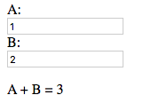
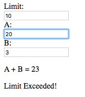

= Tridash =

Tridash is a programming language which aims to make the development
of interactive applications easier and less error-prone.

== How's it Different ==

What sets Tridash apart from the popular languages of today is that it
is designed from the ground up for developing applications which
respond to user interaction and events, whereas most programming
languages, particularly imperative programming languages are
originally designed for developing batch-style applications which
perform their task and then exit without interacting with the user. As
a result developing interactive applications with these languages, is
difficult and prone to bugs.

In Tridash an application is composed of a set of stateful
computational components called nodes. Each node has a particular
value, which is computed from a function of one or more dependency
nodes. When the values of a node's dependency nodes changes, the
node's value is automatically recomputed. Nodes can either be purely
computational components or can be bound to the state of a user
interface element, the network or the file system. For example a node
can be bound to the value of a text field UI element.

With Tridash you can focus on the core logic of your application code,
by expressing the application state as a set of dependencies between
components. This is contrary to the approach taken by most languages
where your application is expressed as a linear sequence of
instructions, in which it is up to the programmer to manually manage
the application state correctly.

Visit link:philosophy.html[Philosophy], if you'd like to read on about
the philosophy of the language.

== Getting Started ==

Visit link:installation.html[Installation] for the download links and
installation instructions for the platform of your choice.

=== Tutorials ===

link:tutorials/[Introductory Tutorials]:: Introduces the core concepts
of the language and gradually moves on to more advanced features

.Alternative Formats
- link:tutorials.pdf[PDF]
- link:tutorials-single.html[Single Page HTML]

== Documentation ==

link:manual[Reference Manual]:: Documents the syntax, semantics,
features and core modules of the language.

.Alternative Formats
- link:tridash.pdf[PDF]
- link:tridash-single.html[Single Page HTML]

== Examples ==

=== Adding Values ===

The following is an example of an application consisting of two text
input fields, which displays the sum of the two numbers below the
fields. The sum is recomputed, whenever the values of one of the text
fields is changed by the user.

In most of today's languages this would require setting up event
listeners, and callback functions for each of the text fields, you'd
then have to update a `sum` variable and manually change displayed
value to the new sum. With Tridash, the entire application can be
implemented with just the following:

--------------------------------------------------
<? /import(core) ?>

<!doctype html>
<html>
  <body>
    
<label>A: <input value="<?@ to-int(a) ?>" /></label>

    
<label>B: <input value="<?@ to-int(b) ?>" /></label>

    
A + B = <?@ a + b ?>

  </body>
</html>
--------------------------------------------------

NOTE: This example targets the JavaScript backend with HTML used for
the user interface, however Tridash is not intended exclusively for
building web apps. Other backends, allowing for desktop applications
to be written, will be added in a future release.

That's all that is necessary. The main application logic is actually
contained in `<?@ a + b ?>` which computes the sum
of the values entered in the two text fields. Whenever the value of
a text field is changed, the sum is automatically recomputed.

=== Sum Limit ===

Let's say you'd like to enhance the previous application, so that the
user is informed when the sum of the numbers exceeds a limit, which is
also given by the user.

--------------------------------------------------
<? 
 /import(core)

 sum <- a + b
?>

<!doctype html>
<html>
    <body>
      
<label>Limit: <input value="<?@ to-int(limit) ?>"/></label>

      
<label>A: <input value="<?@ to-int(a) ?>" /></label>

      
<label>B: <input value="<?@ to-int(b) ?>" /></label>

      
A + B = <?@ sum ?>

      

       <?@
        case(
            sum <= limit : "Within Limit!",
            "Limit Exceeded!"
        )
       ?>
      

    </body>
</html>
--------------------------------------------------

image::images/examples/limit1.png["Limit: 10 A: 2, B: 3, A + B = 5, Within Limit!", align="center"]

Implementing the new functionality was almost as easy as adding new UI
elements. The `case( ... )` expression chooses the message ``Within
Limit!'' or ``Limit exceeded!'' based on whether the sum is less than
or equal to limit.

== Support ==

[small]#If you find this project interesting and would like to ensure
its continued development please consider making a donation via
link:https://www.patreon.com/alexgutev[Patreon]#
